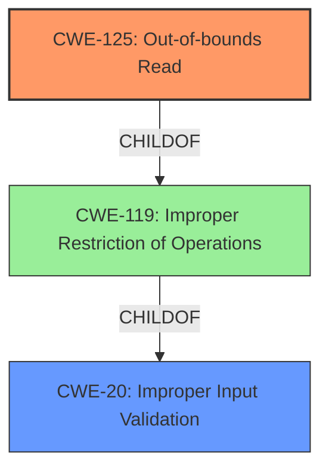

# Analysis Report for CVE-2024-8840

# Vulnerability Analysis Report: CVE-2024-8840

## Description

PDF-XChange Editor JB2 File Parsing **Out-Of-Bounds Read** Remote Code Execution Vulnerability. This vulnerability allows remote attackers to execute arbitrary code on affected installations of PDF-XChange Editor. User interaction is required to exploit this vulnerability in that the target must visit a malicious page or open a malicious file. The specific flaw exists within the parsing of JB2 files. The issue results from the **lack of proper validation of user-supplied data**, which can result in a read past the end of an allocated buffer. An attacker can leverage this vulnerability to execute code in the context of the current process. . Was ZDI-CAN-24420.

## Vulnerability Description Key Phrases

- **Rootcause:** lack of proper validation of user-supplied data
- **Weakness:** Out-Of-Bounds Read
- **Impact:** ['Remote Code Execution', 'execute arbitrary code', 'execute code in the context of the current process']
- **Vector:** malicious page or file
- **Attacker:** remote attackers
- **Product:** PDF-XChange Editor
- **Component:** JB2 File Parsing

## Analysis (with Relationship Data)

# Summary
| CWE ID | CWE Name | Confidence | CWE Abstraction Level | CWE Vulnerability Mapping Label | CWE-Vulnerability Mapping Notes |
|---|---|---|---|---|---|
| CWE-125 | Out-of-bounds Read | 1.0 | Base |  Primary CWE | Allowed |
| CWE-20 | Improper Input Validation | 0.7 | Class | Secondary Candidate | Discouraged |

## Evidence and Confidence

*   **Confidence Score:** 0.9
*   **Evidence Strength:** HIGH

## Relationship Analysis

The primary weakness is an out-of-bounds read (CWE-125). CWE-125 is a base-level CWE, making it a good fit. CWE-20 (Improper Input Validation) is a class-level CWE and a parent of CWE-1284 (Improper Validation of Specified Quantity in Input), and is also considered since the root cause is **lack of proper validation of user-supplied data**. CWE-125 is a more specific child of the class CWE-119 (Improper Restriction of Operations within the Bounds of a Memory Buffer). The relationship analysis shows a clear path from a general input validation issue to a specific out-of-bounds read due to that **lack of validation**.



## Vulnerability Chain

The vulnerability chain starts with **improper input validation** (CWE-20). This leads to an **out-of-bounds read** (CWE-125), which then results in arbitrary code execution. The chain is:

1.  **Improper Input Validation** (CWE-20): The application does not adequately validate user-supplied data.
2.  **Out-of-bounds Read** (CWE-125): Due to the **lack of input validation**, the application reads data past the end of an allocated buffer.
3.  **Remote Code Execution:** The attacker can leverage the out-of-bounds read to execute arbitrary code in the context of the current process.

## Summary of Analysis

The primary finding is CWE-125 (Out-of-bounds Read) due to the application reading past the end of an allocated buffer. This is caused by a **lack of proper validation of user-supplied data**, which can be represented by CWE-20 (Improper Input Validation).

CWE-125 is the most accurate representation of the vulnerability because the description explicitly mentions "read past the end of an allocated buffer". The retriever results also list CWE-125 as the best match based on sparse analysis. The "CWE for similar CVE Descriptions" lists CWE-125 as the Primary CWE match.

CWE-20 is considered because the root cause is the **lack of proper validation of user-supplied data**, but it is a class-level CWE and thus less specific than CWE-125. While CWE-20 represents the root cause, CWE-125 represents the direct weakness.

The relationship graph illustrates that CWE-125 is a child of CWE-119, which is a child of CWE-20, showing the connection between the general input validation issue and the specific out-of-bounds read.

The final decision to prioritize CWE-125 is based on the vulnerability description's explicit mention of the "out-of-bounds read" condition.

Relevant CWE Information:

# Enhanced Context (25 CWEs)
The following CWEs were identified as potentially relevant to this vulnerability:

## CWE-611: Improper Restriction of XML External Entity Reference
**Abstraction Level**: Base
**Similarity Score**: 0.73
**Source**: dense

**Description**:
The product processes an XML document that can contain XML entities with URIs that resolve to documents outside of the intended sphere of control, causing the product to embed incorrect documents into its output.

**Mapping Guidance**:
- Usage: Allowed
- Rationale: This CWE entry is at the Base level of abstraction, which is a preferred level of abstraction for mapping to the root causes of vulnerabilities.

*Not Selected:* Irrelevant to the vulnerability, as it deals with XML external entities, while the vulnerability is related to JB2 file parsing and **lack of input validation**.

## CWE-116: Improper Encoding or Escaping of Output
**Abstraction Level**: Class
**Similarity Score**: 0.72
**Source**: dense

**Description**:
The product prepares a structured message for communication with another component, but encoding or escaping of the data is either missing or done incorrectly. As a result, the intended structure of the message is not preserved.

**Mapping Guidance**:
- Usage: Allowed-with-Review
- Rationale: This CWE entry is a Class and might have Base-level children that would be more appropriate

*Not Selected:* This CWE is not relevant as the vulnerability stems from **lack of input validation** leading to an out-of-bounds read, not encoding or escaping issues.

## CWE-434: Unrestricted Upload of File with Dangerous Type
**Abstraction Level**: Base
**Similarity Score**: 0.72
**Source**: dense

**Description**:
The product allows the upload or transfer of dangerous file types that are automatically processed within its environment.

**Mapping Guidance**:
- Usage: Allowed
- Rationale: This CWE entry is at the Base level of abstraction, which is a preferred level of abstraction for mapping to the root causes of vulnerabilities.

*Not Selected:* This CWE is not relevant as the vulnerability is not about unrestricted file uploads, but about **improper validation** in JB2 file parsing.

## CWE-80: Improper Neutralization of Script-Related HTML Tags in a Web Page (Basic XSS)
**Abstraction Level**: Variant
**Similarity Score**: 0.71
**Source**: dense

**Description**:
The product receives input from an upstream component, but it does not neutralize or incorrectly neutralizes special characters such as "<", ">", and "&" that could be interpreted as web-scripting elements when they are sent to a downstream component that processes web pages.

**Mapping Guidance**:
- Usage: Allowed
- Rationale: This CWE entry is at the Variant level of abstraction, which is a preferred level of abstraction for mapping to the root causes of vulnerabilities.

*Not Selected:* Irrelevant, as the vulnerability is not related to Cross-Site Scripting (XSS).

## CWE-125: Out-of-bounds Read
**Abstraction Level**: Base
**Similarity Score**: 0.71
**Source**: dense

**Description**:
The product reads data past the end, or before the beginning, of the intended buffer.

**Mapping Guidance**:
- Usage: Allowed
- Rationale: This CWE entry is at the Base level of abstraction, which is a preferred level of abstraction for mapping to the root causes of vulnerabilities.

*Selected:* The vulnerability description explicitly states that the issue results in a read past the end of an allocated buffer, directly corresponding to the definition of CWE-125.

## CWE-184: Incomplete List of Disallowed Inputs
**Abstraction Level**: Base
**Similarity Score**: 0.70
**Source**: dense

**Description**:
The product implements a protection mechanism that relies on a list of inputs (or properties of inputs) that are not allowed by policy or otherwise require other action to neutralize before additional processing takes place, but the list is incomplete.

**Mapping Guidance**:
- Usage: Allowed
- Rationale: This CWE entry is at the Base level of abstraction, which is a preferred level of abstraction for mapping to the root causes of vulnerabilities.

*Not Selected:* While there is **lack of validation**, it's not explicitly stated that there is an incomplete list of disallowed inputs, making this CWE less relevant than CWE-125 and CWE-20.

## CWE-131: Incorrect Calculation of Buffer Size
**Abstraction Level**: Base
**Similarity Score**: 0.70
**Source**: dense

**Description**:
The product does not correctly calculate the size to be used when allocating a buffer, which could lead to a buffer overflow.

**Mapping Guidance**:
- Usage: Allowed
- Rationale: This CWE entry is at the Base level of abstraction, which is a preferred level of abstraction for mapping to the root causes of vulnerabilities.

*Not Selected:* The issue is an out-of-bounds read due to a **lack of validation**, not an incorrect calculation of buffer size.

## CWE-73: External Control of File Name or Path
**Abstraction Level**: Base
**Similarity Score**: 0.70
**Source**: dense

**Description**:
The product allows user input to control or influence paths or file names that are used in filesystem operations


## CWE Relationship Analysis

Current CWEs represent these abstraction levels: .


### Vulnerability Chain Analysis

**Chain starting from CWE-1284:**
- 1284 (Improper Validation of Specified Quantity in Input) - ROOT


**Chain starting from CWE-611:**
- 611 (Improper Restriction of XML External Entity Reference) - ROOT


### CWE Relationship Diagram

```mermaid
graph TD
    classDef primary fill:#f96,stroke:#333,stroke-width:2px
    classDef secondary fill:#69f,stroke:#333
    classDef tertiary fill:#9e9,stroke:#333
```


*Report generated on 2025-07-14 04:17:07*
