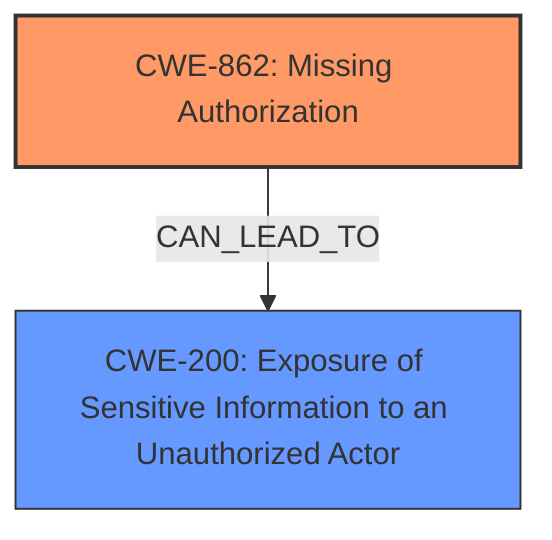

# Raw Analyzer Response for CVE-2024-8902

# Summary
| CWE ID | CWE Name | Confidence | CWE Abstraction Level | CWE Vulnerability Mapping Label | CWE-Vulnerability Mapping Notes |
|---|---|---|---|---|---|
| CWE-862 | Missing Authorization | 0.9 | Class | Primary | Allowed-with-Review |
| CWE-200 | Exposure of Sensitive Information to an Unauthorized Actor | 0.7 | Class | Secondary | Discouraged |

## Evidence and Confidence

*   **Confidence Score:** 0.8
*   **Evidence Strength:** HIGH

## Relationship Analysis
The primary CWE is CWE-862, Missing Authorization, which is a Class-level CWE. It describes a situation where the product does not perform an authorization check when an actor attempts to access a resource or perform an action. This aligns with the vulnerability description where the render_column function does not properly restrict access to template data.

CWE-200, Exposure of Sensitive Information to an Unauthorized Actor, is a Class-level CWE that is a consequence of the missing authorization. An attacker can extract sensitive template data because there's no authorization check in place.

The relationship is that CWE-862 can lead to CWE-200.

## Vulnerability Chain
The vulnerability chain starts with the **missing authorization** (CWE-862) in the `render_column` function, which leads to the **exposure of sensitive information** (CWE-200) such as private, pending, and draft template data. The root cause is the lack of access control on the template data.

## Summary of Analysis
The initial assessment pointed towards **Sensitive Information Exposure**, but further analysis revealed that the root cause is the **missing authorization** check in the `render_column` function. The vulnerability description and CVE reference links clearly indicate the **lack of access control** as the primary issue, leading to the exposure of sensitive data.

The evidence from the CVE Reference Links Content Summary:
- "This function, when rendering table cells based on a template, **does not properly restrict access to the template data**."
- "**Lack of Access Control:** The code **lacks proper access controls** on the template data, leading to the exposure."

The retriever results also support this assessment, with CWE-862 (Missing Authorization) being a strong candidate.

The final selection of CWE-862 as the primary CWE is based on the root cause analysis, relationship analysis, and support from the retriever results. The decision is further strengthened by the evidence from the vulnerability description and CVE reference links. CWE-862 is at the Class level, but a more specific Base level CWE could not be determined.

CWEs considered but not used:
- CWE-863 Incorrect Authorization: While related to authorization issues, it implies an incorrect check rather than a missing check.
- CWE-472 External Control of Assumed-Immutable Web Parameter: Not applicable as the issue isn't about controlling assumed-immutable parameters.
- CWE-285 Improper Authorization: Similar to CWE-863, implies an existing but flawed authorization mechanism.
- CWE-306 Missing Authentication for Critical Function: Authentication isn't the issue here; it's authorization after authentication.
- CWE-201 Insertion of Sensitive Information Into Sent Data: This is more about sending data to an unintended recipient, rather than the exposure due to missing authorization.
- CWE-497 Exposure of Sensitive System Information to an Unauthorized Control Sphere: This is more about system-level information, not application data like template data.
- CWE-639 Authorization Bypass Through User-Controlled Key: The vulnerability isn't about modifying keys to bypass authorization.
- CWE-425 Direct Request ('Forced Browsing'): While the attacker might be directly requesting the data, the core issue is the missing authorization check.
- CWE-352 Cross-Site Request Forgery (CSRF): Not relevant as CSRF is a different attack vector.