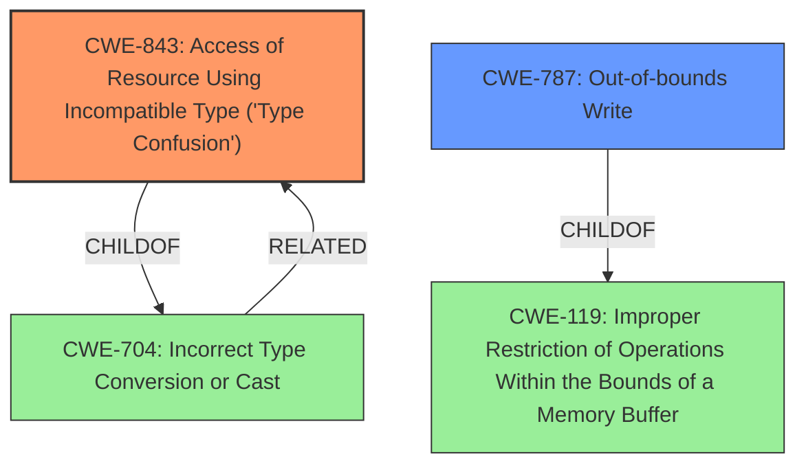

# Raw Analyzer Response for CVE-2024-8904

# Summary
| CWE ID | CWE Name | Confidence | CWE Abstraction Level | CWE Vulnerability Mapping Label | CWE-Vulnerability Mapping Notes |
|---|---|---|---|---|---|
| CWE-843 | Access of Resource Using Incompatible Type ('Type Confusion') | 1.0 | Base | Primary | Allowed |
| CWE-787 | Out-of-bounds Write | 0.5 | Base | Secondary Candidate | Allowed |

## Evidence and Confidence

*   **Confidence Score:** 0.8
*   **Evidence Strength:** HIGH

## Relationship Analysis
The primary relationship that influenced the decision was the direct match of the vulnerability description to the CWE-843 definition. The vulnerability description explicitly mentions "**type confusion**" as the **rootcause**, which aligns perfectly with CWE-843's description: "The product allocates or initializes a resource such as a pointer, object, or variable using one type, but it later accesses that resource using a type that is incompatible with the original type."

CWE-787 was considered as a secondary candidate due to the mention of "heap corruption" in the vulnerability description, which could potentially result from an out-of-bounds write. However, since the primary **rootcause** is **type confusion**, and the description doesn't explicitly state an out-of-bounds write, it's classified as a secondary candidate.

## Vulnerability Chain
The vulnerability chain starts with **Type Confusion** (**rootcause**), potentially leading to heap corruption.

Type Confusion -> Heap Corruption (Potential Impact)

*   **Root Cause:** **Type Confusion** (CWE-843)
*   **Potential Impact:** Heap Corruption (potentially leading to CWE-787)

## Summary of Analysis
The primary CWE, CWE-843, was selected due to the explicit mention of "**type confusion**" as the **rootcause** in the vulnerability description and CVE Reference Links Content Summary. The description states, "Type Confusion in V8... allowed a remote attacker to potentially exploit heap corruption via a crafted HTML page." This aligns directly with CWE-843: "The product allocates or initializes a resource such as a pointer, object, or variable using one type, but it later accesses that resource using a type that is incompatible with the original type."

The graph relationships show that CWE-843 is related to CWE-704 (Incorrect Type Conversion or Cast) as a child, which further reinforces the choice of CWE-843. While heap corruption is mentioned, it's an impact, not the **rootcause**.

CWE-787 was considered because heap corruption could be caused by an out-of-bounds write, but since the **rootcause** is **type confusion**, CWE-843 is more appropriate as the primary CWE.

The selection of CWE-843 as the primary CWE is at the optimal level of specificity, as it directly addresses the **rootcause** of the vulnerability.

Relevant CWE Information:
- **CWE-843: Access of Resource Using Incompatible Type ('Type Confusion')**: This is the most relevant CWE because the vulnerability description explicitly mentions "Type Confusion."
- **CWE-787: Out-of-bounds Write**: Considered as a secondary candidate because the vulnerability could potentially lead to heap corruption, which may involve out-of-bounds writes. However, it is not the primary **rootcause**.
- **CWE-704: Incorrect Type Conversion or Cast**: This is a parent of CWE-843. The type confusion could stem from an incorrect type conversion, but CWE-843 is more specific to the actual vulnerability.
- **CWE-416: Use After Free**: This was considered because heap corruption can sometimes lead to use-after-free scenarios. However, the description does not explicitly state a use-after-free condition.
- **CWE-122: Heap-based Buffer Overflow**: Heap corruption could potentially be a heap-based buffer overflow. However, the description does not specifically mention a buffer overflow.
- **CWE-123: Write-what-where Condition**: This requires more specific exploitation details than are provided.

The evidence from the vulnerability description clearly supports the classification of CWE-843 as the primary CWE.