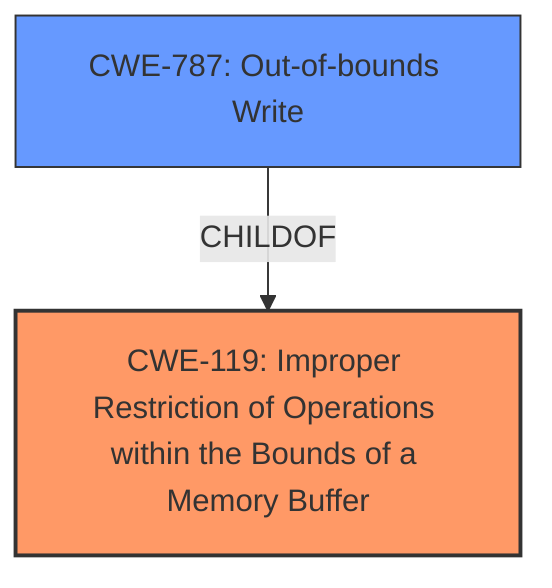

# Raw Analyzer Response for CVE-2024-8937

# Summary
| CWE ID | CWE Name | Confidence | CWE Abstraction Level | CWE Vulnerability Mapping Label | CWE-Vulnerability Mapping Notes |
|---|---|---|---|---|---|
| CWE-119 | Improper Restriction of Operations within the Bounds of a Memory Buffer | 0.9 | Class | Primary CWE | Allowed-with-Review |
| CWE-787 | Out-of-bounds Write | 0.7 | Base | Secondary Candidate | Allowed |

## Evidence and Confidence

*   **Confidence Score:** 0.8
*   **Evidence Strength:** HIGH

## Relationship Analysis
The primary CWE is CWE-119, which is a class-level CWE. While it's generally better to choose a more specific, base-level CWE, in this case, the description explicitly mentions "Improper Restriction of Operations within the Bounds of a Memory Buffer," making it a direct match. CWE-787 (Out-of-bounds Write) is a child of CWE-119 and a possible consequence, but the initial weakness is the improper restriction, not necessarily the write itself. Therefore, while an out-of-bounds write may occur, it's a consequence of the improper restriction, making CWE-119 a more accurate primary classification.

## Vulnerability Chain
The vulnerability chain starts with:
1.  **CWE-119** **Improper Restriction of Operations within the Bounds of a Memory Buffer**: The software fails to properly restrict operations within the bounds of a memory buffer.
2.  **CWE-787** Out-of-bounds Write: This can lead to writing data outside the intended buffer.
3.  **Arbitrary Code Execution**: The final impact is arbitrary code execution due to memory corruption.

The primary root cause is CWE-119, leading to a potential out-of-bounds write (CWE-787) and ultimately, arbitrary code execution.

## Summary of Analysis
The analysis is heavily based on the vulnerability description and CVE reference summary, both of which explicitly mention "Improper Restriction of Operations within the Bounds of a Memory Buffer" (CWE-119) as the root cause. The retriever results also list CWE-119 as the top candidate. While more specific CWEs like CWE-787 (Out-of-bounds Write) are considered, the primary issue is the lack of proper boundary restriction, making CWE-119 the most accurate initial classification. The description states the **rootcause** as "**Improper Restriction of Operations within the Bounds of a Memory Buffer**" and the CVE Reference Links Content Summary supports that: "**The vulnerability stems from an "Improper Restriction of Operations within the Bounds of a Memory Buffer" (CWE-119)**." The evidence is strong, leading to a high confidence score. CWE-787 is included as a possible secondary CWE since an out-of-bounds write may occur as a consequence of the improper restriction of operations.

Relevant CWE Information:

# Enhanced Context (25 CWEs)
The following CWEs were identified as potentially relevant to this vulnerability:

## CWE-131: Incorrect Calculation of Buffer Size
**Abstraction Level**: Base
**Similarity Score**: 0.77
**Source**: dense

**Description**:
The product does not correctly calculate the size to be used when allocating a buffer, which could lead to a buffer overflow.

**Mapping Guidance**:
- Usage: Allowed
- Rationale: This CWE entry is at the Base level of abstraction, which is a preferred level of abstraction for mapping to the root causes of vulnerabilities.

*Reason for not using this CWE*: The description does not mention incorrect calculation of buffer size, so this is not appropriate.

## CWE-703: Improper Check or Handling of Exceptional Conditions
**Abstraction Level**: Pillar
**Similarity Score**: 0.76
**Source**: dense

**Description**:
The product does not properly anticipate or handle exceptional conditions that rarely occur during normal operation of the product.

**Mapping Guidance**:
- Usage: Discouraged
- Rationale: This CWE entry is extremely high-level, a Pillar.

*Reason for not using this CWE*: This CWE is too general and doesn't fit the specific vulnerability.

## CWE-824: Access of Uninitialized Pointer
**Abstraction Level**: Base
**Similarity Score**: 0.76
**Source**: dense

**Description**:
The product accesses or uses a pointer that has not been initialized.

**Mapping Guidance**:
- Usage: Allowed
- Rationale: This CWE entry is at the Base level of abstraction, which is a preferred level of abstraction for mapping to the root causes of vulnerabilities.

*Reason for not using this CWE*: The description does not mention the usage of an uninitialized pointer, so this is not appropriate.

## CWE-119: Improper Restriction of Operations within the Bounds of a Memory Buffer
**Abstraction Level**: Class
**Similarity Score**: 0.76
**Source**: dense

**Description**:
The product performs operations on a memory buffer, but it reads from or writes to a memory location outside the buffer's intended boundary. This may result in read or write operations on unexpected memory locations that could be linked to other variables, data structures, or internal program data.

**Mapping Guidance**:
- Usage: Discouraged
- Rationale: CWE-119 is commonly misused in low-information vulnerability reports when lower-level CWEs could be used instead, or when more details about the vulnerability are available.

*Reason for using this CWE*: This is the primary CWE. It fits the vulnerability description and has been explicitly mentioned as the root cause.

## CWE-696: Incorrect Behavior Order
**Abstraction Level**: Class
**Similarity Score**: 0.75
**Source**: dense

**Description**:
The product performs multiple related behaviors, but the behaviors are performed in the wrong order in ways which may produce resultant weaknesses.

**Mapping Guidance**:
- Usage: Allowed-with-Review
- Rationale: This CWE entry is a Class and might have Base-level children that would be more appropriate

*Reason for not using this CWE*: The description does not mention incorrect behavior order, so this is not appropriate.

## CWE-345: Insufficient Verification of Data Authenticity
**Abstraction Level**: Class
**Similarity Score**: 0.75
**Source**: dense

**Description**:
The product does not sufficiently verify the origin or authenticity of data, in a way that causes it to accept invalid data.

**Mapping Guidance**:
- Usage: Discouraged
- Rationale: This CWE entry is a level-1 Class (i.e., a child of a Pillar). It might have lower-level children that would be more appropriate

*Reason for not using this CWE*: The vulnerability is more related to memory operations and restrictions rather than data authenticity.

## CWE-280: Improper Handling of Insufficient Permissions or Privileges
**Abstraction Level**: Base
**Similarity Score**: 0.75
**Source**: dense

**Description**:
The product does not handle or incorrectly handles when it has insufficient privileges to access resources or functionality as specified by their permissions. This may cause it to follow unexpected code paths that may leave the product in an invalid state.

**Mapping Guidance**:
- Usage: Allowed
- Rationale: This CWE entry is at the Base level of abstraction, which is a preferred level of abstraction for mapping to the root causes of vulnerabilities.

*Reason for not using this CWE*: The vulnerability is more related to memory operations and restrictions rather than permissions/privileges.

## CWE-755: Improper Handling of Exceptional Conditions
**Abstraction Level**: Class
**Similarity Score**: 0.75
**Source**: dense

**Description**:
The product does not handle or incorrectly handles an exceptional condition.

**Mapping Guidance**:
- Usage: Discouraged
- Rationale: This CWE entry is a level-1 Class (i.e., a child of a Pillar). It might have lower-level children that would be more appropriate

*Reason for not using this CWE*: This CWE is too general and doesn't fit the specific vulnerability.

## CWE-130: Improper Handling of Length Parameter Inconsistency
**Abstraction Level**: Base
**Similarity Score**: 0.75
**Source**: dense

**Description**:
The product parses a formatted message or structure, but it does not handle or incorrectly handles a length field that is inconsistent with the actual length of the associated data.

**Mapping Guidance**:
- Usage: Allowed
- Rationale: This CWE entry is at the Base level of abstraction, which is a preferred level of abstraction for mapping to the root causes of vulnerabilities.

*Reason for not using this CWE*: The description does not explicitly mention length parameter inconsistency.

## CWE-754: Improper Check for Unusual or Exceptional Conditions
**Abstraction Level**: Class
**Similarity Score**: 0.75
**Source