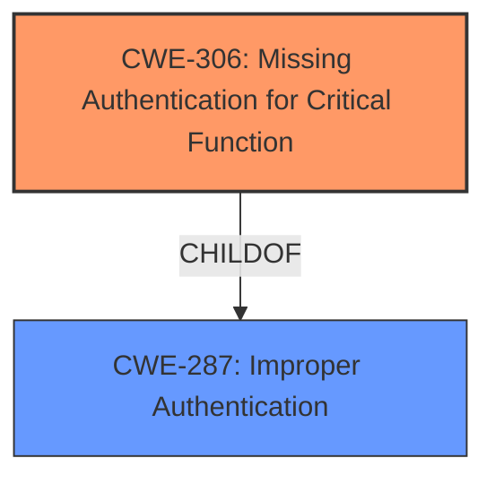

# Analysis for CVE-2024-8954

# Summary
| CWE ID | CWE Name | Confidence | CWE Abstraction Level | CWE Vulnerability Mapping Label | CWE-Vulnerability Mapping Notes |
|---|---|---|---|---|---|
| CWE-306 | Missing Authentication for Critical Function | 1.0 | Base | Primary | Allowed |
| CWE-287 | Improper Authentication | 0.5 | Class | Secondary | Discouraged |

## Evidence and Confidence

*   **Confidence Score:** 1.0
*   **Evidence Strength:** HIGH

## Relationship Analysis
The primary relationship influencing the decision is the parent-child relationship between CWE-287 (Improper Authentication) and CWE-306 (Missing Authentication for Critical Function). The vulnerability description indicates that the API **does not validate** the `x-api-key` header, which means authentication is entirely missing. CWE-306 is a more specific child of CWE-287, accurately reflecting the **lack of authentication**.

## Vulnerability Chain
The vulnerability chain is simple:
1.  **Root Cause:** **Missing validation** of the `x-api-key` header (CWE-306)
2.  **Impact:** Authentication bypass, leading to unauthorized access.

## Summary of Analysis
The analysis is based on the vulnerability description, which clearly states that the API **does not validate** the `x-api-key` header. The "Vulnerability Description Key Phrases" confirms the **rootcause:** "**API does not validate the x-api-key headers value**". This directly maps to CWE-306 (Missing Authentication for Critical Function) because the application lacks an authentication mechanism for a critical function.

The retriever results listed CWE-306 as a potential candidate. The CWE Classification Guidance section provides the following guidance:

*   "**Authentication**: Determines *who* the actor is (identity validation). This is typically the *first step* in access control."
*   "**CWE-306**: *Missing Authentication for Critical Function* – used when no identity validation is enforced for sensitive functionality (e.g., password reset, user deletion)."
*   "If you **know no login happened**, lean toward **authentication** → CWE-306."

The vulnerability description aligns perfectly with these statements. The selection of CWE-306 is at the optimal level of specificity because it directly addresses the root cause of the vulnerability: the complete absence of authentication.

CWE-287 (Improper Authentication) was considered but not selected as the primary CWE because it is a more general category. CWE-306, being a child of CWE-287, provides a more precise description of the vulnerability.