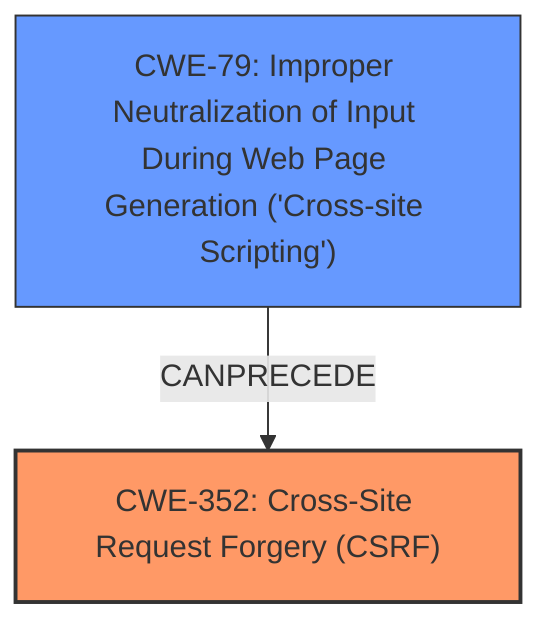

# Analysis Report for CVE-2024-8980

# Vulnerability Analysis Report: CVE-2024-8980

## Description

The Script Console in Liferay Portal 7.0.0 through 7.4.3.101, and Liferay DXP 2023.Q3.1 through 2023.Q3.4, 7.4 GA through update 92, 7.3 GA through update 35, 7.2 GA through fix pack 20, 7.1 GA through fix pack 28, 7.0 GA through fix pack 102 and 6.2 GA through fix pack 173 **does not sufficiently protect against Cross-Site Request Forgery (CSRF) attacks**, which allows remote attackers to execute arbitrary Groovy script via a crafted URL or a **XSS vulnerability**.

## Vulnerability Description Key Phrases

- **Rootcause:** does not sufficiently protect against Cross-Site Request Forgery (CSRF) attacks
- **Weakness:** ['XSS vulnerability', 'cross-site scripting']
- **Impact:** execute arbitrary Groovy script
- **Vector:** crafted URL
- **Attacker:** remote attackers
- **Product:** ["['Liferay Portal'", "'Liferay DXP']"]
- **Version:** ["['7.0.0 through 7.4.3.101'", "'2023.Q3.1 through 2023.Q3.4']"]
- **Component:** Script Console

## Analysis (with Relationship Data)

# Summary
| CWE ID | CWE Name | Confidence | CWE Abstraction Level | CWE Vulnerability Mapping Label | CWE-Vulnerability Mapping Notes |
|---|---|---|---|---|---|
| CWE-352 | Cross-Site Request Forgery (CSRF) | 1.0 | Compound | Primary | Allowed |
| CWE-79 | Improper Neutralization of Input During Web Page Generation ('Cross-site Scripting') | 0.8 | Base | Secondary | Allowed |

## Evidence and Confidence

*   **Confidence Score:** 0.9
*   **Evidence Strength:** HIGH

## Relationship Analysis
The primary weakness is CWE-352 [CWE-352: Cross-Site Request Forgery (CSRF)], which is a compound CWE representing a combination of factors that allow an attacker to induce unintended actions on a web application. The vulnerability description explicitly states that the application **does not sufficiently protect against Cross-Site Request Forgery (CSRF) attacks**. A secondary weakness is CWE-79 [CWE-79: Improper Neutralization of Input During Web Page Generation ('Cross-site Scripting')], as the vulnerability description mentions that a **XSS vulnerability** can be used to trigger the CSRF. CWE-79 [CWE-79: Improper Neutralization of Input During Web Page Generation ('Cross-site Scripting')] can precede CWE-352 [CWE-352: Cross-Site Request Forgery (CSRF)] in an attack chain.



## Vulnerability Chain
The vulnerability chain starts with either the **lack of CSRF protection** (CWE-352 [CWE-352: Cross-Site Request Forgery (CSRF)]) or an existing **XSS vulnerability** (CWE-79 [CWE-79: Improper Neutralization of Input During Web Page Generation ('Cross-site Scripting')]). The XSS vulnerability can then be exploited to perform a CSRF attack, leading to arbitrary Groovy script execution.

## Summary of Analysis
The primary CWE is CWE-352 [CWE-352: Cross-Site Request Forgery (CSRF)] because the root cause of the vulnerability is the **insufficient protection against CSRF attacks**. This is directly stated in the vulnerability description: "The Script Console in Liferay Portal ... **does not sufficiently protect against Cross-Site Request Forgery (CSRF) attacks**".
The secondary CWE is CWE-79 [CWE-79: Improper Neutralization of Input During Web Page Generation ('Cross-site Scripting')] because the vulnerability description mentions that a **XSS vulnerability** can be leveraged to perform the CSRF attack. The vulnerability description states: "which allows remote attackers to execute arbitrary Groovy script via a crafted URL or a **XSS vulnerability**."
CWE-352 [CWE-352: Cross-Site Request Forgery (CSRF)] is a compound CWE, which is appropriate here since the vulnerability requires multiple conditions to be met.
CWE-79 [CWE-79: Improper Neutralization of Input During Web Page Generation ('Cross-site Scripting')] is a Base CWE, which is the preferred level of abstraction.

Other CWEs were considered but not selected:

*   CWE-89 [CWE-89: Improper Neutralization of Special Elements used in an SQL Command ('SQL Injection')], CWE-201 [CWE-201: Insertion of Sensitive Information Into Sent Data], and CWE-918 [CWE-918: Server-Side Request Forgery (SSRF)] were not selected because the description does not provide evidence of these weaknesses.
*   CWE-94 [CWE-94: Improper Control of Generation of Code ('Code Injection')] was considered because the impact is arbitrary code execution, however, the root cause is the missing CSRF protection and/or the presence of a XSS vulnerability.


## CWE Relationship Analysis

Current CWEs represent these abstraction levels: .


### Vulnerability Chain Analysis

**Chain starting from CWE-89:**
- 89 (Improper Neutralization of Special Elements used in an SQL Command ('SQL Injection')) - ROOT


**Chain starting from CWE-94:**
- 94 (Improper Control of Generation of Code ('Code Injection')) - ROOT


### CWE Relationship Diagram

```mermaid
graph TD
    classDef primary fill:#f96,stroke:#333,stroke-width:2px
    classDef secondary fill:#69f,stroke:#333
    classDef tertiary fill:#9e9,stroke:#333
```


*Report generated on 2025-07-14 04:28:34*
