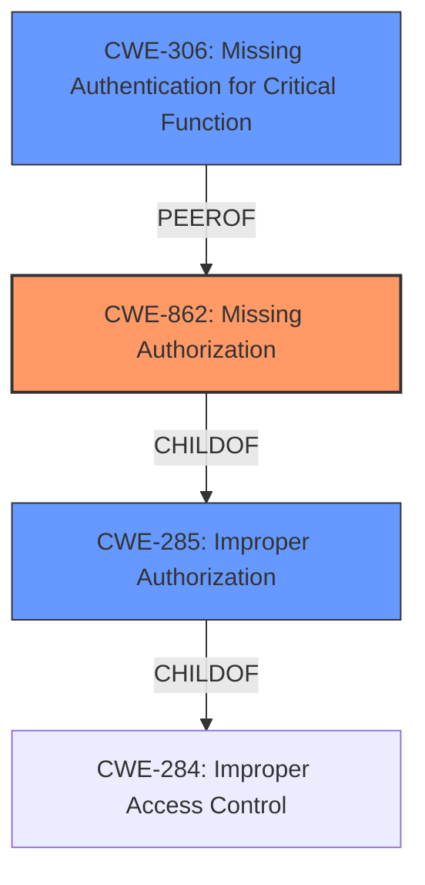

# Analysis for CVE-2024-8999

# Summary
| CWE ID  | CWE Name                                                        | Confidence | CWE Abstraction Level | CWE Vulnerability Mapping Label | CWE-Vulnerability Mapping Notes |
| :-------- | :-------------------------------------------------------------- | :--------- | :-------------------- | :------------------------------ | :-------------------------------- |
| CWE-862   | Missing Authorization                                           | 0.9        | Base                  | Allowed                       | Primary CWE                     |
| CWE-306   | Missing Authentication for Critical Function                   | 0.7        | Base                  | Allowed                       | Secondary Candidate            |
| CWE-285   | Improper Authorization                                           | 0.6        | Class                 | Discouraged                     | Secondary Candidate            |

## Evidence and Confidence

*   **Confidence Score:** 0.8
*   **Evidence Strength:** HIGH

## Relationship Analysis
The primary CWE selected is CWE-862 Missing Authorization, which is a Base level CWE and appropriately specific for the vulnerability. It is related to CWE-285 Improper Authorization at a higher Class level and CWE-306 Missing Authentication for Critical Function at the Base level. The choice of CWE-862 is based on the fact that the vulnerability involves a missing authorization check after the API key authentication has occurred. It means there is no check on the API key to authorize the export functionality.

## Vulnerability Chain
The vulnerability chain starts with the **missing authorization** check (CWE-862), leading to the ability to export the entire database (impact).

## Summary of Analysis
The initial analysis identified the **improper access control** in the POST /api/v1/data-warehouse/bigquery endpoint as the primary issue. The provided evidence indicates a **missing authorization** check, making CWE-862 the most appropriate choice.

The selection of CWE-862 is strongly supported by the vulnerability description which states "**improper access control** vulnerability in the POST /api/v1/data-warehouse/bigquery endpoint. This vulnerability allows any user to export the entire database data by creating a stream to Google BigQuery without proper authentication or authorization.". The summary states "The code previously lacked a check to ensure that data warehouse exports were allowed.".

The graph relationships influenced the selection by highlighting the connection between CWE-862 and the more general CWE-285, as well as the peer relationship with CWE-306, which represents a potential alternative if authentication was completely missing.

The selected CWEs are at the optimal level of specificity because CWE-862 directly addresses the **missing authorization** check, while CWE-306 addresses the missing authentication aspect.

Other CWEs Considered:

*   CWE-284: Improper Access Control - This is a high-level CWE that is too general. More specific CWEs like CWE-862 and CWE-306 are more appropriate.
*   CWE-285: Improper Authorization - It is a class-level CWE and might have Base-level children that would be more appropriate such as CWE-862.
*   CWE-306: Missing Authentication for Critical Function - While authentication is mentioned in the description, the primary issue is the **missing authorization** check on the exported data, so CWE-862 is more directly relevant.
*   CWE-639: Authorization Bypass Through User-Controlled Key - Although the API key can be seen as a user-controlled key, it's not the primary mechanism of the authorization bypass. The core issue is that *any* valid API key allows the export, regardless of whether the key is authorized for that action. So CWE-862 is a more direct fit.