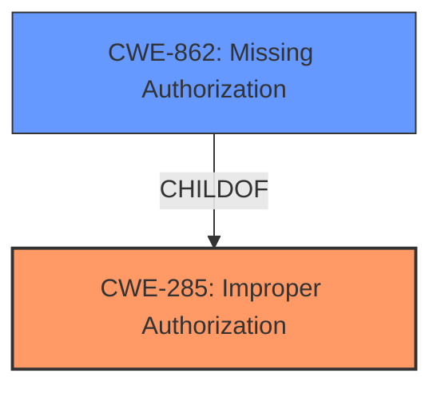

# Raw Analyzer Response for CVE-2024-9082

# Summary

| CWE ID  | CWE Name                                                                                | Confidence | CWE Abstraction Level | CWE Vulnerability Mapping Label | CWE-Vulnerability Mapping Notes |
| :-------- | :--------------------------------------------------------------------------------------- | :---------- | :---------------------- | :------------------------------ | :------------------------------ |
| CWE-285 | Improper Authorization                                                              | 0.95       | Class                   | Primary CWE                     | Discouraged                     |
| CWE-862 | Missing Authorization | 0.85       | Base                   | Secondary                     | Allowed                     |

## Evidence and Confidence

*   **Confidence Score:** 0.90
*   **Evidence Strength:** HIGH

## Relationship Analysis

The primary CWE is CWE-285, "Improper Authorization", which is a Class-level CWE. A more specific CWE that falls under CWE-285 is CWE-862 "Missing Authorization", which is a Base-level CWE. The vulnerability description indicates a lack of proper authorization checks, leading to unauthorized user creation, which aligns well with both CWEs. Selecting CWE-285 as the primary and including CWE-862 provides a more comprehensive view of the authorization issue.

## Vulnerability Chain

The vulnerability chain starts with the **improper authorization** (CWE-285), specifically the **missing authorization** check (CWE-862) during user creation. This leads to the impact of an attacker being able to create an admin account, giving them unauthorized access.

## Summary of Analysis

The initial assessment pointed towards authorization-related CWEs due to the "**improper authorization**" weakness and the ability to create admin accounts. The retriever results also highlighted CWE-285 "Improper Authorization", CWE-862 "Missing Authorization", and CWE-306 "Missing Authentication for Critical Function". However, the description explicitly mentions the **improper authorization** during user creation, indicating that authentication is likely in place but the authorization check is either missing or flawed.

Given the MITRE guidance on Authentication vs Authorization, and the vulnerability description key phrases, CWE-285 and CWE-862 are the most appropriate mappings.

The selection of CWE-285 as the primary CWE and CWE-862 as a secondary CWE provides a comprehensive representation of the authorization flaw.

Relevant CWE Information:

*   **CWE-285: Improper Authorization** - The product does not perform or incorrectly performs an authorization check when an actor attempts to access a resource or perform an action.
*   **CWE-862: Missing Authorization** - The product does not perform any authorization checks for a resource, which might allow an attacker to perform unauthorized actions.

# Enhanced Context (25 CWEs)
The following CWEs were identified as potentially relevant to this vulnerability:

## CWE-472: External Control of Assumed-Immutable Web Parameter
**Abstraction Level**: Base
**Similarity Score**: 0.78
**Source**: dense

**Description**:
The web application does not sufficiently verify inputs that are assumed to be immutable but are actually externally controllable, such as hidden form fields.

**Mapping Guidance**:
- Usage: Allowed
- Rationale: This CWE entry is at the Base level of abstraction, which is a preferred level of abstraction for mapping to the root causes of vulnerabilities.
NOT USED: Though applicable in some contexts where parameters are modified, the core issue is the authorization bypass, making this a secondary concern.

## CWE-425: Direct Request ('Forced Browsing')
**Abstraction Level**: Base
**Similarity Score**: 0.77
**Source**: dense

**Description**:
The web application does not adequately enforce appropriate authorization on all restricted URLs, scripts, or files.

**Mapping Guidance**:
- Usage: Allowed
- Rationale: This CWE entry is at the Base level of abstraction, which is a preferred level of abstraction for mapping to the root causes of vulnerabilities.
NOT USED: Though the vulnerability does involve a direct request, the root cause is the authorization bypass, making this less relevant.

## CWE-41: Improper Resolution of Path Equivalence
**Abstraction Level**: Base
**Similarity Score**: 0.77
**Source**: dense

**Description**:
The product is vulnerable to file system contents disclosure through path equivalence. Path equivalence involves the use of special characters in file and directory names. The associated manipulations are intended to generate multiple names for the same object.

**Mapping Guidance**:
- Usage: Allowed
- Rationale: This CWE entry is at the Base level of abstraction, which is a preferred level of abstraction for mapping to the root causes of vulnerabilities.
NOT USED: This vulnerability is unrelated to path equivalence.

## CWE-639: Authorization Bypass Through User-Controlled Key
**Abstraction Level**: Base
**Similarity Score**: 0.77
**Source**: dense

**Description**:
The system's authorization functionality does not prevent one user from gaining access to another user's data or record by modifying the key value identifying the data.

**Mapping Guidance**:
- Usage: Allowed
- Rationale: This CWE entry is at the Base level of abstraction, which is a preferred level of abstraction for mapping to the root causes of vulnerabilities.
NOT USED: While there's an authorization bypass, the specific mechanism isn't through a user-controlled key but a **missing authorization** check, making this less relevant than CWE-285 or CWE-862.

## CWE-74: Improper Neutralization of Special Elements in Output Used by a Downstream Component ('Injection')
**Abstraction Level**: Class
**Similarity Score**: 0.76
**Source**: dense

**Description**:
The product constructs all or part of a command, data structure, or record using externally-influenced input from an upstream component, but it does not neutralize or incorrectly neutralizes special elements that could modify how it is parsed or interpreted when it is sent to a downstream component.

**Mapping Guidance**:
- Usage: Discouraged
- Rationale: CWE-74 is high-level and often misused when lower-level weaknesses are more appropriate.
NOT USED: This vulnerability is not related to injection.

## CWE-807: Reliance on Untrusted Inputs in a Security Decision
**Abstraction Level**: Base
**Similarity Score**: 0.76
**Source**: dense

**Description**:
The product uses a protection mechanism that relies on the existence or values of an input, but the input can be modified by an untrusted actor in a way that bypasses the protection mechanism.

**Mapping Guidance**:
- Usage: Allowed
- Rationale: This CWE entry is at the Base level of abstraction, which is a preferred level of abstraction for mapping to the root causes of vulnerabilities.
NOT USED: While this could apply, the core issue is **missing authorization**, making it less relevant.

## CWE-267: Privilege Defined With Unsafe Actions
**Abstraction Level**: Base
**Similarity Score**: 0.76
**Source**: dense

**Description**:
A particular privilege, role, capability, or right can be used to perform unsafe actions that were not intended, even when it is assigned to the correct entity.

**Mapping Guidance**:
- Usage: Allowed
- Rationale: This CWE entry is at the Base level of abstraction, which is a preferred level of abstraction for mapping to the root causes of vulnerabilities.
NOT USED: The vulnerability is not about unsafe actions related to existing privileges, but more about **missing authorization** checks.

## CWE-1289: Improper Validation of Unsafe Equivalence in Input
**Abstraction Level**: Base
**Similarity Score**: 0.75
**Source**: dense

**Description**:
The product receives an input value that is used as a resource identifier or other type of reference, but it does not validate or incorrectly validates that the input is equivalent to a potentially-unsafe value.

**Mapping Guidance**:
- Usage: Allowed
- Rationale: This CWE entry is at the Base level of abstraction, which is a preferred level of abstraction for mapping to the root causes of vulnerabilities.
NOT USED: This vulnerability isn't about validating unsafe equivalence in input, but a **missing authorization** check.

## CWE-668: Exposure of Resource to Wrong Sphere
**Abstraction Level**: Class
**Similarity Score**: 0.75
**Source**: dense

**Description**:
The product exposes a resource to the wrong control sphere, providing unintended actors with inappropriate access to the resource.

**Mapping Guidance**:
- Usage: Discouraged
- Rationale: CWE-668 is high-level and is often misused as a catch-all when lower-level CWE IDs might be applicable. It is sometimes used for low-information vulnerability reports [REF-1287]. It is a level-1 Class (i.e., a child of a Pillar). It is not useful for trend analysis.
NOT USED: Too high-level. The core issue is a **missing authorization** check.

## CWE-21