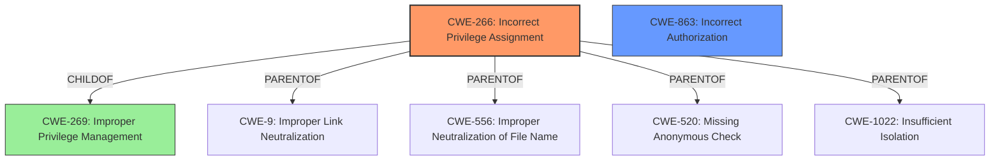

# Raw Analyzer Response for CVE-2024-9098

# Summary

| CWE ID  | CWE Name                                                            | Confidence | CWE Abstraction Level | CWE Vulnerability Mapping Label | CWE-Vulnerability Mapping Notes |
| ------- | ------------------------------------------------------------------- | ---------- | --------------------- | ------------------------------- | ------------------------------- |
| CWE-266 | Incorrect Privilege Assignment                                      | 0.9        | Base                  | Primary                         | Allowed                         |
| CWE-863 | Incorrect Authorization                                             | 0.7        | Class                 | Secondary                       | Allowed-with-Review             |

## Evidence and Confidence

*   **Confidence Score:** 0.8
*   **Evidence Strength:** HIGH

## Relationship Analysis

The primary CWE selected is CWE-266 (Incorrect Privilege Assignment), a Base level CWE. This choice is further supported by its relationships with other CWEs, particularly its parent relationship with CWE-269 (Improper Privilege Management). While CWE-269 is a broader Class-level CWE and is discouraged for direct mapping due to its generality, understanding its relationship to CWE-266 helps refine the focus on the specific error of incorrect privilege assignment.

CWE-863 (Incorrect Authorization) is considered a secondary CWE, reflecting the authorization check present but flawed. It is a class level CWE, so it's less preferred.

## Vulnerability Chain

The vulnerability chain starts with the **incorrect assignment of privileges** (CWE-266) during user creation. This leads to the **incorrect authorization** (CWE-863) because users are granted roles that provide unauthorized access to billing resources. The root cause is the **missing restriction** on admins inviting users with billing roles.

## Summary of Analysis

The initial assessment focused on identifying the root cause of the **privilege escalation vulnerability**. The evidence from the vulnerability description and the CVE Reference Links Content Summary indicates that the user creation endpoint **does not restrict admins from inviting users with billing roles**. This **incorrect privilege assignment** is best represented by CWE-266. The Retriever Results also list CWE-266, and the mapping guidance supports its usage at the Base level of abstraction.

The secondary consideration of CWE-863 acknowledges the presence of authorization checks, but they are flawed because the system allows admins to assign billing roles to new users, bypassing the intended access control.

The selected CWEs are at the optimal level of specificity because they accurately capture the root cause and the subsequent authorization issues.

Relevant CWE Information:

# Enhanced Context (25 CWEs)
The following CWEs were identified as potentially relevant to this vulnerability:

## CWE-267: Privilege Defined With Unsafe Actions
**Abstraction Level**: Base
**Similarity Score**: 0.75
**Source**: dense

**Description**:
A particular privilege, role, capability, or right can be used to perform unsafe actions that were not intended, even when it is assigned to the correct entity.

**Mapping Guidance**:
- Usage: Allowed
- Rationale: This CWE entry is at the Base level of abstraction, which is a preferred level of abstraction for mapping to the root causes of vulnerabilities.

**CWE-267 was considered but not selected:** While this CWE describes a scenario where a privilege allows unsafe actions, it doesn't directly address the root cause of the vulnerability, which is the **incorrect assignment of that privilege** in the first place.

## CWE-266: Incorrect Privilege Assignment
**Abstraction Level**: Base
**Similarity Score**: 0.74
**Source**: dense

**Description**:
A product incorrectly assigns a privilege to a particular actor, creating an unintended sphere of control for that actor.

**Mapping Guidance**:
- Usage: Allowed
- Rationale: This CWE entry is at the Base level of abstraction, which is a preferred level of abstraction for mapping to the root causes of vulnerabilities.

**CWE-266 was selected as the primary CWE:** The vulnerability description states that "admins can invite new members with billing permissions," indicating an **incorrect assignment of privileges** during user creation. This aligns perfectly with CWE-266.

## CWE-668: Exposure of Resource to Wrong Sphere
**Abstraction Level**: Class
**Similarity Score**: 0.72
**Source**: dense

**Description**:
The product exposes a resource to the wrong control sphere, providing unintended actors with inappropriate access to the resource.

**Mapping Guidance**:
- Usage: Discouraged
- Rationale: CWE-668 is high-level and is often misused as a catch-all when lower-level CWE IDs might be applicable. It is sometimes used for low-information vulnerability reports [REF-1287]. It is a level-1 Class (i.e., a child of a Pillar). It is not useful for trend analysis.

**CWE-668 was considered but not selected:** This CWE is too general and doesn't capture the specific issue of **incorrect privilege assignment**.

## CWE-274: Improper Handling of Insufficient Privileges
**Abstraction Level**: Base
**Similarity Score**: 0.72
**Source**: dense

**Description**:
The product does not handle or incorrectly handles when it has insufficient privileges to perform an operation, leading to resultant weaknesses.

**Mapping Guidance**:
- Usage: Discouraged
- Rationale: This CWE entry could be deprecated in a future version of CWE.

**CWE-274 was considered but not selected:** This CWE focuses on the product's handling of insufficient privileges, not the **incorrect assignment of privileges** that leads to the vulnerability.

## CWE-280: Improper Handling of Insufficient Permissions or Privileges
**Abstraction Level**: Base
**Similarity Score**: 0.72
**Source**: dense

**Description**:
The product does not handle or incorrectly handles when it has insufficient privileges to access resources or functionality as specified by their permissions. This may cause it to follow unexpected code paths that may leave the product in an invalid state.

**Mapping Guidance**:
- Usage: Allowed
- Rationale: This CWE entry is at the Base level of abstraction, which is a preferred level of abstraction for mapping to the root causes of vulnerabilities.

**CWE-280 was considered but not selected:** Similar to CWE-274, this CWE focuses on handling insufficient privileges rather than the **incorrect assignment of privileges**.

## CWE-472: External Control of Assumed-Immutable Web Parameter
**Abstraction Level**: Base
**Similarity Score**: 0.71
**Source**: dense

**Description**:
The web application does not sufficiently verify inputs that are assumed to be immutable but are actually externally controllable, such as hidden form fields.

**Mapping Guidance**:
- Usage: Allowed
- Rationale: This CWE entry is at the Base level of abstraction, which is a preferred level of abstraction for mapping to the root causes of vulnerabilities.

**CWE-472 was considered but not selected:** This CWE is not applicable because the vulnerability does not involve externally controlled parameters.

## CWE-59: Improper Link Resolution Before File Access ('Link Following')
**Abstraction Level**: Base
**Similarity Score**: 0.71
**Source**: dense

**Description**:
The product attempts to access a file based on the filename, but it does not properly prevent that filename from identifying a link or shortcut that resolves to an unintended resource.

**Mapping Guidance**:
- Usage: Allowed
- Rationale: This CWE entry is at the Base level of abstraction, which is a preferred level of abstraction for mapping to the root causes of vulnerabilities.

**CWE-59 was considered but not selected:** This CWE is not related to the vulnerability, as it deals with file access and link resolution.

## CWE-41: Improper Resolution of Path Equivalence
**Abstraction Level**: Base
**Similarity Score**: 0.71
**Source**: dense

**Description**:
The product is vulnerable to file system contents disclosure through path equivalence. Path equivalence involves the use of special characters in file and directory names. The associated manipulations are intended to generate multiple names for the same object.

**Mapping Guidance**:
- Usage: Allowed