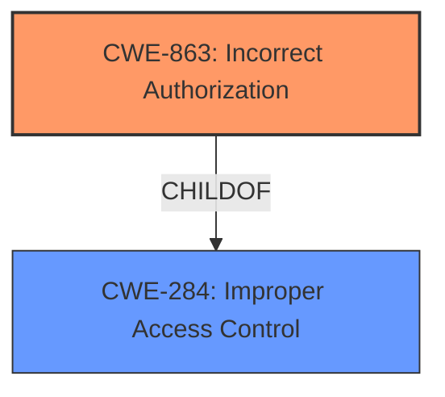

# Analysis for CVE-2024-9133

# Summary

| CWE ID  | CWE Name                                          | Confidence | CWE Abstraction Level | CWE Vulnerability Mapping Label | CWE-Vulnerability Mapping Notes |
| :-------- | :------------------------------------------------ | :--------- | :-------------------- | :------------------------------ | :------------------------------ |
| CWE-863   | Incorrect Authorization                         | 0.85       | Class                  | Primary CWE                     | Allowed-with-Review             |
| CWE-284   | Improper Access Control                           | 0.65       | Pillar                 | Secondary                       | Discouraged                    |

## Evidence and Confidence

*   **Confidence Score:** 0.75
*   **Evidence Strength:** MEDIUM

## Relationship Analysis

The primary relationship impacting the decision is the parent-child relationship between CWE-284 (Improper Access Control) and CWE-863 (Incorrect Authorization). Since the vulnerability description indicates that a user with administrator privileges can retrieve authentication tokens, it implies that an authorization check is in place but is **incorrectly** allowing this action. Therefore, CWE-863, being a more specific child of CWE-284, is a more appropriate classification. The other relationships, while present, do not directly influence the mapping in this case.

## Vulnerability Chain

The vulnerability chain is as follows:

1.  **Root Cause:** **Improper Access Control** (Specifically, **Incorrect Authorization**) - The system is performing an authorization check, but it's doing it incorrectly, allowing administrators to retrieve authentication tokens.
2.  **Impact:** Retrieval of Authentication Tokens - A user with administrator privileges is able to retrieve authentication tokens.

## Summary of Analysis

The initial analysis, based on the vulnerability description and the provided guidance, points to an authorization issue rather than an authentication issue. The key phrase "user with administrator privileges is able to retrieve authentication tokens" indicates that the user is authenticated and has some level of authorization, but that authorization is not correctly restricting access to the authentication tokens. The guidance on Authentication vs Authorization vs Access Control clearly distinguishes between the three, and the scenario described falls squarely into the authorization domain. The **improper access control** as a root cause is the key indicator.

CWE-863 (Incorrect Authorization) is chosen as the primary CWE because it specifically addresses the scenario where an authorization check is present but flawed. CWE-284 (Improper Access Control) is considered as a secondary CWE because it's a broader category that encompasses various access control failures, but CWE-863 provides a more precise classification given the available information.

The selection of CWE-863 is also supported by the "Retriever Results," which lists it as a potential candidate, although its score is not the highest. However, given the specific nature of the vulnerability and the guidance provided, it's the most appropriate choice.

The evidence for this assessment is primarily based on the vulnerability description, which states that "A user with administrator privileges is able to retrieve authentication tokens." This statement implies that the administrator has some level of authorization but is exceeding their intended privileges, leading to the retrieval of sensitive information.

Other CWEs were considered but ultimately not chosen as primary:

*   CWE-306 (Missing Authentication for Critical Function) - This was ruled out because the description indicates that the user has "administrator privileges," implying successful authentication.
*   CWE-285 (Improper Authorization) - While similar to CWE-863, CWE-863 is slightly more specific, indicating that the authorization check exists but is flawed.
*   CWE-522 (Insufficiently Protected Credentials) - This is related to how the credentials are stored or protected, and the current description focuses on the authorization aspect of accessing those credentials.
*   CWE-1220 (Insufficient Granularity of Access Control) - This could be a contributing factor, but the primary issue is the incorrect authorization logic.
*   CWE-284 (Improper Access Control) - This is a high-level category and is less specific than CWE-863.

The selected CWEs are at the optimal level of specificity because they accurately represent the weakness based on the available evidence. CWE-863 captures the core issue of incorrect authorization, while CWE-284 provides a broader context of improper access control.