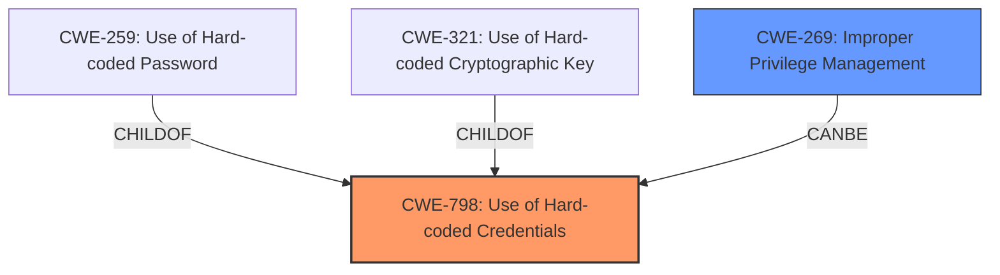

# Analysis Report for CVE-2024-9138

# Vulnerability Analysis Report: CVE-2024-9138

## Description

Moxas cellular routers, secure routers, and network security appliances are affected by a high-severity vulnerability, CVE-2024-9138. This vulnerability involves **hard-coded credentials**, enabling an authenticated user to escalate privileges and gain root-level access to the system, posing a significant security risk.

## Vulnerability Description Key Phrases

- **Rootcause:** hard-coded credentials
- **Impact:** escalate privileges and gain root-level access
- **Attacker:** authenticated user
- **Product:** Moxas cellular routers, secure routers, and network security appliances

## Analysis (with Relationship Data)

# Summary
| CWE ID  | CWE Name                        | Confidence | CWE Abstraction Level | CWE Vulnerability Mapping Label | CWE-Vulnerability Mapping Notes |
|---------|---------------------------------|------------|-----------------------|---------------------------------|---------------------------------|
| CWE-798 | Use of Hard-coded Credentials   | 1          | Base                  | Primary CWE                     | Allowed                         |
| CWE-269 | Improper Privilege Management | 0.5        | Class                 | Secondary Candidate             | Discouraged                     |

## Evidence and Confidence

*   **Confidence Score:** 0.9
*   **Evidence Strength:** HIGH

## Relationship Analysis

The primary relationship influencing the decision is the hierarchical structure with CWE-798 as a Base level weakness, which is preferred. CWE-798 has children like CWE-259 (Use of Hard-coded Password) and CWE-321 (Use of Hard-coded Cryptographic Key), but the description doesn't specify the type of credential, so the Base CWE is more appropriate. The description also discusses privilege escalation as a consequence, which relates to CWE-269 (Improper Privilege Management), but this is a higher-level Class and less specific to the root cause.



## Vulnerability Chain

The vulnerability chain starts with the **hard-coded credentials** (CWE-798). This allows an authenticated user to escalate privileges, potentially leading to a broader issue of **improper privilege management** (CWE-269), although that is more of a consequence than a root cause. The final impact is root-level access, which enables system compromise, unauthorized modifications, data exposure, and service disruption.

## Summary of Analysis

The initial assessment strongly points to **CWE-798 (Use of Hard-coded Credentials)** as the primary weakness. The vulnerability description explicitly states "**hard-coded credentials**, enabling an authenticated user to escalate privileges and gain root-level access". The CVE Reference Links Content Summary reinforces this by stating: "The vulnerability stems from the presence of hard-coded credentials within the affected Moxa devices". This aligns directly with the definition of CWE-798.

While privilege escalation is mentioned, it's a consequence of the **hard-coded credentials**, not the root cause itself. Therefore, CWE-269 (Improper Privilege Management), while related, is not the most accurate primary mapping.

The graph relationships and retriever results support this decision. CWE-798 is a Base level CWE, offering a good balance between specificity and broad applicability. The mitigation of upgrading firmware aligns with removing the **hard-coded credentials**.

CWE-798 is at the optimal level of specificity because the exact type of **hard-coded credential** (password, key, etc.) is not specified. If the type was known, a more specific variant like CWE-259 or CWE-321 would be more appropriate.

Relevant CWE Information:

*   **CWE-259: Use of Hard-coded Password**: Considered as a more specific variant of CWE-798, but the description doesn't explicitly mention a password.
*   **CWE-321: Use of Hard-coded Cryptographic Key**: Similarly, a more specific variant, but the description doesn't specify a cryptographic key.
*   **CWE-269: Improper Privilege Management**: Considered as a potential secondary weakness related to the privilege escalation impact, but it's a Class level and less specific to the root cause.
*   **CWE-656: Reliance on Security Through Obscurity**: The "CVE Reference Links Content Summary" mentions this, but it seems to be based on the idea that hardcoded credentials should not be present in a production environment, which is more of an indirect observation.


## CWE Relationship Analysis

Current CWEs represent these abstraction levels: .


### Vulnerability Chain Analysis

**Chain starting from CWE-321:**
- 321 (Use of Hard-coded Cryptographic Key) - ROOT


**Chain starting from CWE-269:**
- 269 (Improper Privilege Management) - ROOT


### CWE Relationship Diagram

```mermaid
graph TD
    classDef primary fill:#f96,stroke:#333,stroke-width:2px
    classDef secondary fill:#69f,stroke:#333
    classDef tertiary fill:#9e9,stroke:#333
```


*Report generated on 2025-07-14 04:37:16*
