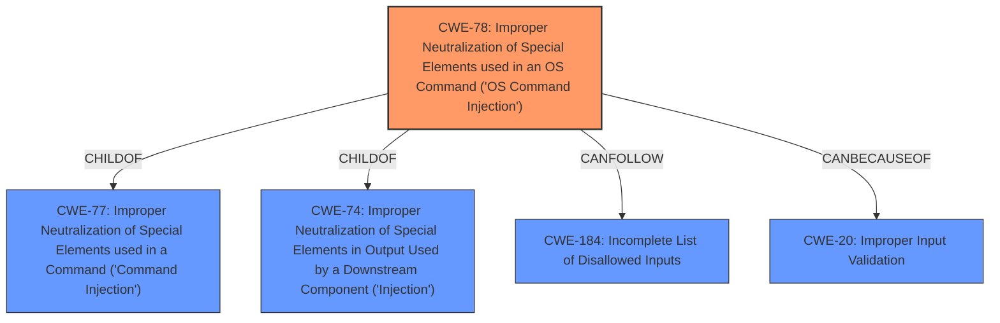

# Analysis for CVE-2024-9145

# Summary
| CWE ID | CWE Name | Confidence | CWE Abstraction Level | CWE Vulnerability Mapping Label | CWE-Vulnerability Mapping Notes |
|---|---|---|---|---|---|
| CWE-78 | Improper Neutralization of Special Elements used in an OS Command ('OS Command Injection') | 1.0 | Base | Allowed | Primary CWE. The vulnerability stems from the application's failure to neutralize special elements in an OS command.|
| CWE-20 | Improper Input Validation | 0.7 | Class | Discouraged | Secondary candidate. The application fails to validate the input from the docker image name, which leads to command injection.|

## Evidence and Confidence

*   **Confidence Score:** 0.9
*   **Evidence Strength:** HIGH

## Relationship Analysis
The primary weakness is CWE-78, which is a base-level CWE detailing **improper neutralization** leading to OS Command Injection. CWE-78 is a child of CWE-77 and CWE-74, both Class-level CWEs, and is more specific, making it a better fit. CWE-78 can follow CWE-184 (Incomplete List of Disallowed Inputs) in a vulnerability chain. CWE-20, Improper Input Validation, is a Class-level CWE that can lead to many other vulnerabilities, including CWE-78. The relationship to CWE-20 is that **improper input validation** could be a cause for the **improper neutralization** that leads to the OS command injection.

## Vulnerability Chain
1.  The chain starts with **improper input validation** (CWE-20), specifically related to the Docker image name.
2.  Due to the **lack of input sanitization**, special elements in the Docker image name are not properly neutralized.
3.  This leads to **improper neutralization of special elements** used in constructing an OS command (CWE-78).
4.  The final impact is the **execution of arbitrary commands** on the developer's workstation.

## Summary of Analysis
The analysis indicates a **command injection** vulnerability (CWE-78) in the Wiz Code Visual Studio Code extension. The extension fails to properly sanitize the docker image name, allowing an attacker to inject and execute arbitrary commands. The primary CWE is CWE-78, as the vulnerability stems from the application's failure to neutralize special elements in an OS command. The description states the extension is vulnerable to local **command injection** if a user opens a maliciously crafted Dockerfile. The CVE Reference Links Content Summary confirms the **root cause** is due to the extension's failure to sanitize input related to the docker image name before passing it to a command execution context. "The vulnerability stems from a local command injection flaw...This flaw is triggered when the extension processes a maliciously crafted Docker image file...the extension fails to properly sanitize or validate the input related to the docker image name before passing it to a command execution context."

CWE-77 was considered but not chosen as it is a Class-level CWE, and CWE-78 is a more specific Base-level CWE. CWE-20 was considered as a contributing factor due to the **lack of input validation**, but it is a Class-level CWE and is only tangentially related to the **command injection**. The primary cause is the **improper neutralization** of special elements, which is best represented by CWE-78. Other CWEs such as CWE-121, CWE-119, CWE-427, CWE-1336, and CWE-138 were also considered, but they are not directly related to the **command injection** vulnerability.