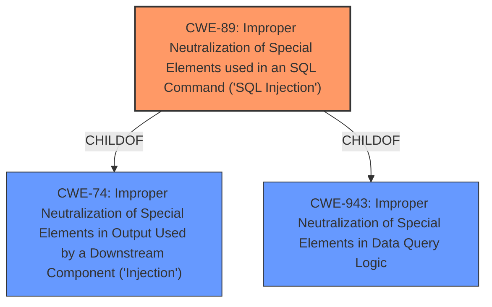

# Enhanced Analysis for CVE-2024-9156

# Summary
| CWE ID | CWE Name | Confidence | CWE Abstraction Level | CWE Vulnerability Mapping Label | CWE-Vulnerability Mapping Notes |
|---|---|---|---|---|---|
| CWE-89 | Improper Neutralization of Special Elements used in an SQL Command ('SQL Injection') | 1.0 | Base | Primary | Allowed |

## Evidence and Confidence

*   **Confidence Score:** 1.0
*   **Evidence Strength:** HIGH

## Relationship Analysis
The primary relationship that influenced the decision was the CHILDOF relationship between CWE-89 and CWE-74 (Improper Neutralization of Special Elements in Output Used by a Downstream Component ('Injection')). While CWE-74 is a broader class, CWE-89 specifically addresses SQL injection, which aligns precisely with the vulnerability description. The retriever results also highlight this with a high score for CWE-89. The CANFOLLOW relationship to CWE-456 (Missing Initialization) and CANPRECEDE from CWE-564 (SQL Injection: Hibernate) was not relevant.



## Vulnerability Chain
The vulnerability chain starts with **insufficient escaping on the user supplied parameter and lack of sufficient preparation on the existing SQL query**, leading to **SQL Injection**, which ultimately allows an attacker to **extract sensitive information from the database**.

## Summary of Analysis
The analysis is heavily based on the provided evidence, specifically the vulnerability description, which clearly states that the "TI WooCommerce Wishlist WordPress plugin through 2.8.2 is vulnerable to **SQL Injection** due to **insufficient escaping on the user supplied parameter and lack of sufficient preparation on the existing SQL query**." The CVE Reference Links Content Summary further reinforces this by stating that the "Root Cause of Vulnerability" is due to "insufficient escaping of user-supplied input and a lack of proper preparation in the existing SQL query" and the "primary vulnerability is **SQL injection** (SQLI)."

The graph relationships helped confirm the specificity of CWE-89 as the most appropriate choice. While other CWEs like CWE-74 (Improper Neutralization of Special Elements in Output Used by a Downstream Component ('Injection')) were considered, CWE-89 is a more specific and accurate representation of the vulnerability, focusing directly on **SQL Injection**. The retriever results also provided high confidence in selecting CWE-89.

The selection of CWE-89 is at the optimal level of specificity because it directly addresses the root cause (improper neutralization leading to SQL injection) and aligns with the provided evidence.


## CWE Relationship Analysis

Current CWEs represent these abstraction levels: .


### Vulnerability Chain Analysis

**Chain starting from CWE-89:**
- 89 (Improper Neutralization of Special Elements used in an SQL Command ('SQL Injection')) - ROOT


**Chain starting from CWE-564:**
- 564 (SQL Injection: Hibernate) - ROOT


### CWE Relationship Diagram

```mermaid
graph TD
    classDef primary fill:#f96,stroke:#333,stroke-width:2px
    classDef secondary fill:#69f,stroke:#333
    classDef tertiary fill:#9e9,stroke:#333
```