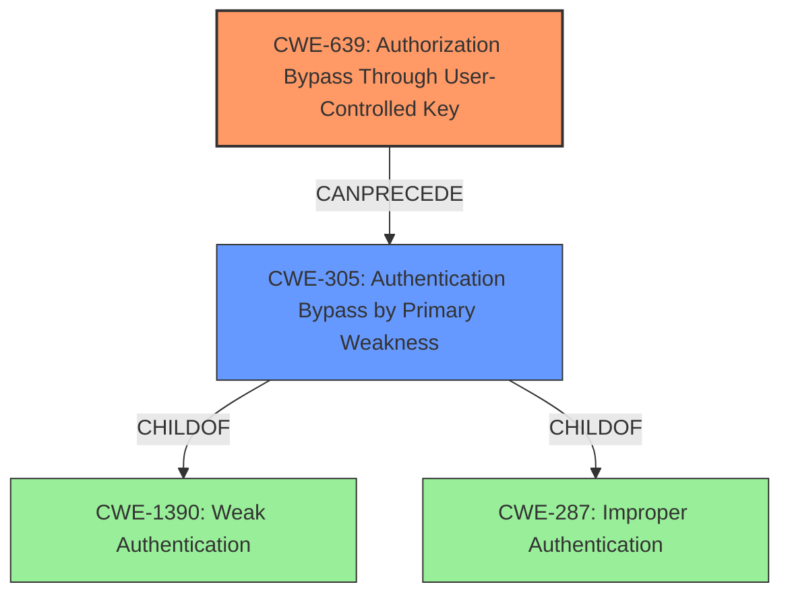

# Analysis Report for CVE-2024-9216

# Vulnerability Analysis Report: CVE-2024-9216

## Description

An **authentication bypass** vulnerability exists in gaizhenbiao/ChuanhuChatGPT, as of commit 3856d4f, allowing any user to read and delete other users chat history. The vulnerability arises because the username is provided via an HTTP request from the client side, rather than being read from a secure source like a cookie. This allows an attacker to pass another users username to the get_model function, thereby gaining unauthorized access to that users chat history.

## Vulnerability Description Key Phrases

- **Weakness:** authentication bypass
- **Impact:** read and delete other users chat history
- **Attacker:** any user
- **Product:** gaizhenbiao/ChuanhuChatGPT
- **Version:** as of commit 3856d4f

## Analysis (with Relationship Data)

# Summary
| CWE ID | CWE Name | Confidence | CWE Abstraction Level | CWE Vulnerability Mapping Label | CWE-Vulnerability Mapping Notes |
|---|---|---|---|---|---|
| CWE-639 | Authorization Bypass Through User-Controlled Key | 0.9 | Base | Allowed | Primary CWE. The vulnerability occurs because the username is provided via an HTTP request from the client side, allowing an attacker to pass another user's username and gain unauthorized access. |
| CWE-305 | Authentication Bypass by Primary Weakness | 0.7 | Base | Allowed | Secondary Candidate. The **authentication bypass** is a symptom of the **authorization bypass**, where the primary weakness is the user-controlled key. |

## Evidence and Confidence

*   **Confidence Score:** 0.9
*   **Evidence Strength:** HIGH

## Relationship Analysis
The primary weakness is CWE-639, where the system's authorization functionality fails to prevent one user from accessing another user's data by modifying the key value. CWE-305, Authentication Bypass by Primary Weakness, is related but less specific; it describes a scenario where an authentication mechanism is bypassed due to a separate underlying weakness. In this case, the primary weakness (CWE-639) leads to the authentication bypass.



## Vulnerability Chain
The vulnerability chain starts with the user-controlled key (username via HTTP request), leading to the authorization bypass and ultimately allowing unauthorized access to other users' chat history.

1.  **Root Cause:** CWE-639 Authorization Bypass Through User-Controlled Key (username provided via HTTP request)
2.  **Weakness:** Authorization bypass, allowing access to other users' data.
3.  **Impact:** Read and delete other users chat history

## Summary of Analysis
The initial assessment identified several potential CWEs, including CWE-1390, CWE-287, CWE-201, CWE-863, CWE-639, CWE-306, and CWE-305. The final decision focused on CWE-639 because the vulnerability's root cause lies in the system's failure to properly authorize access based on a user-controlled key (the username provided via HTTP request). This leads to an **authentication bypass**, but the primary weakness is the **authorization bypass**.

The evidence supporting this decision is:
*   "The vulnerability arises because the username is provided via an HTTP request from the client side, rather than being read from a secure source like a cookie."

CWE-639 best represents this root cause because it specifically addresses the scenario where one user can gain access to another user's data by modifying the key value identifying the data. CWE-305 is considered a secondary weakness since the authentication bypass is a consequence of the authorization issue.

Other CWEs Considered:
*   CWE-287 (Improper Authentication) was considered but deemed less specific than CWE-639, as the issue is not primarily with the authentication process itself, but rather with the authorization process that relies on a user-provided value.
*   CWE-306 (Missing Authentication for Critical Function) was also considered, but the application does have authentication; the problem is that the authorization relies on an insecure input, making CWE-639 more appropriate.
*   CWE-863 (Incorrect Authorization) was also considered, but CWE-639 is more specific because the authorization bypass is happening because the user controls the key, so CWE-639 is more descriptive.
*   CWE-285 (Improper Authorization) was considered but deemed too general.
Relevant CWE Information:

# Enhanced Context (25 CWEs)
The following CWEs were identified as potentially relevant to this vulnerability:

## CWE-305: Authentication Bypass by Primary Weakness
**Abstraction Level**: Base
**Similarity Score**: 0.75
**Source**: dense

**Description**:
The authentication algorithm is sound, but the implemented mechanism can be bypassed as the result of a separate weakness that is primary to the authentication error.

**Mapping Guidance**:
- Usage: Allowed
- Rationale: This CWE entry is at the Base level of abstraction, which is a preferred level of abstraction for mapping to the root causes of vulnerabilities.


## CWE-1391: Use of Weak Credentials
**Abstraction Level**: Class
**Similarity Score**: 0.74
**Source**: dense

**Description**:
The product uses weak credentials (such as a default key or hard-coded password) that can be calculated, derived, reused, or guessed by an attacker.

**Mapping Guidance**:
- Usage: Allowed-with-Review
- Rationale: This CWE entry is a Class and might have Base-level children that would be more appropriate


## CWE-288: Authentication Bypass Using an Alternate Path or Channel
**Abstraction Level**: Base
**Similarity Score**: 0.74
**Source**: dense

**Description**:
The product requires authentication, but the product has an alternate path or channel that does not require authentication.

**Mapping Guidance**:
- Usage: Allowed
- Rationale: This CWE entry is at the Base level of abstraction, which is a preferred level of abstraction for mapping to the root causes of vulnerabilities.


## CWE-1390: Weak Authentication
**Abstraction Level**: Class
**Similarity Score**: 0.74
**Source**: dense

**Description**:
The product uses an authentication mechanism to restrict access to specific users or identities, but the mechanism does not sufficiently prove that the claimed identity is correct.

**Mapping Guidance**:
- Usage: Allowed-with-Review
- Rationale: This CWE entry is a Class and might have Base-level children that would be more appropriate


## CWE-303: Incorrect Implementation of Authentication Algorithm
**Abstraction Level**: Base
**Similarity Score**: 0.74
**Source**: dense

**Description**:
The requirements for the product dictate the use of an established authentication algorithm, but the implementation of the algorithm is incorrect.

**Mapping Guidance**:
- Usage: Allowed
- Rationale: This CWE entry is at the Base level of abstraction, which is a preferred level of abstraction for mapping to the root causes of vulnerabilities.


## CWE-472: External Control of Assumed-Immutable Web Parameter
**Abstraction Level**: Base
**Similarity Score**: 0.73
**Source**: dense

**Description**:
The web application does not sufficiently verify inputs that are assumed to be immutable but are actually externally controllable, such as hidden form fields.

**Mapping Guidance**:
- Usage: Allowed
- Rationale: This CWE entry is at the Base level of abstraction, which is a preferred level of abstraction for mapping to the root causes of vulnerabilities.


## CWE-807: Reliance on Untrusted Inputs in a Security Decision
**Abstraction Level**: Base
**Similarity Score**: 0.73
**Source**: dense

**Description**:
The product uses a protection mechanism that relies on the existence or values of an input, but the input can be modified by an untrusted actor in a way that bypasses the protection mechanism.

**Mapping Guidance**:
- Usage: Allowed
- Rationale: This CWE entry is at the Base level of abstraction, which is a preferred level of abstraction for mapping to the root causes of vulnerabilities.


## CWE-290: Authentication Bypass by Spoofing
**Abstraction Level**: Base
**Similarity Score**: 0.73
**Source**: dense

**Description**:
This attack-focused weakness is caused by incorrectly implemented authentication schemes that are subject to spoofing attacks.

**Mapping Guidance**:
- Usage: Allowed
- Rationale: This CWE entry is at the Base level of abstraction, which is a preferred level of abstraction for mapping to the root causes of vulnerabilities.


## CWE-204: Observable Response Discrepancy
**Abstraction Level**: Base
**Similarity Score**: 0.72
**Source**: dense

**Description**:
The product provides different responses to incoming requests in a way that reveals internal state information to an unauthorized actor outside of the intended control sphere.

**Mapping Guidance**:
- Usage: Allowed
- Rationale: This CWE entry is at the Base level of abstraction, which is a preferred level of abstraction for mapping to the root causes of vulnerabilities.


## CWE-451: User Interface (UI) Misrepresentation of Critical Information
**Abstraction Level**: Class
**Similarity Score**: 0.72
**Source**: dense

**


## CWE Relationship Analysis

Current CWEs represent these abstraction levels: .


### Vulnerability Chain Analysis

**Chain starting from CWE-1390:**
- 1390 (Weak Authentication) - ROOT


**Chain starting from CWE-863:**
- 863 (Incorrect Authorization) - ROOT


### CWE Relationship Diagram

```mermaid
graph TD
    classDef primary fill:#f96,stroke:#333,stroke-width:2px
    classDef secondary fill:#69f,stroke:#333
    classDef tertiary fill:#9e9,stroke:#333
```


*Report generated on 2025-07-14 04:39:40*
