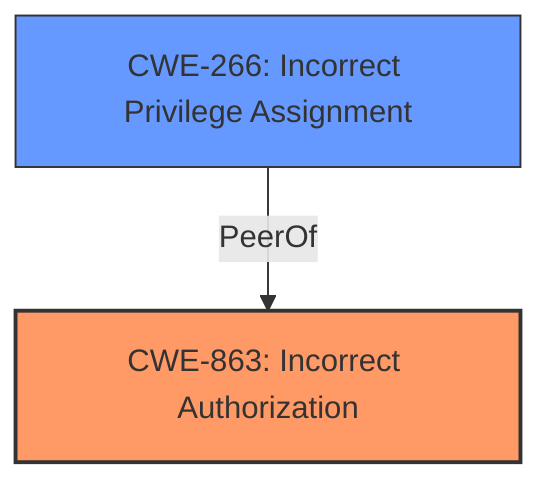

# Enhanced Analysis for CVE-2024-9235

# Summary
| CWE ID    | CWE Name                                                                  | Confidence | CWE Abstraction Level | CWE Vulnerability Mapping Label | CWE-Vulnerability Mapping Notes |
| --------- | ------------------------------------------------------------------------- | ---------- | --------------------- | ------------------------------- | ------------------------------- |
| CWE-863   | Incorrect Authorization                                                     | 0.9        | Class                 | Allowed-with-Review             | Authorization logic present but flawed |
| CWE-266 | Incorrect Privilege Assignment                                                     | 0.7        | Base                 | Allowed             | Privilege escalation via role manipulation |

## Evidence and Confidence

*   **Confidence Score:** 0.8
*   **Evidence Strength:** HIGH

## Relationship Analysis
The primary relationship influencing the CWE selection is the parent-child relationship. CWE-863 is a Class-level CWE, while more specific Base-level CWEs exist. However, based on the provided information, the authorization logic is present but flawed, aligning with CWE-863's definition. CWE-266 is a Base level CWE and is a good secondary candidate since the vulnerability leads to a privilege escalation.



## Vulnerability Chain
The vulnerability chain starts with an **insufficient capability check** (authorization). This leads to the ability to update arbitrary options. The chain culminates in privilege escalation and potential complete site takeover.

## Summary of Analysis
The initial analysis focused on identifying the root cause of the vulnerability. The description clearly states that the vulnerability stems from an **insufficient capability check**. This aligns with the definition of CWE-863, which describes a situation where authorization logic is present but flawed. The ability to update arbitrary options and the resulting privilege escalation are consequences of this **incorrect authorization**.

The selection of CWE-863 is also supported by the "Mapping Discussion – CWE Usage for Privileges vs Permissions" section, specifically the line, *"Authorization logic is present but flawed"*

The evidence from the "CVE Reference Links Content Summary" section further solidifies this choice: *"The core issue is that the `mapster_wp_maps_set_option_from_js()` function lacks proper authorization checks."* Also: *"It only verifies if the user has `edit_posts` capability, which is granted to Contributor-level users and above and is not enough to protect options from modification."*

CWE-266 is a good secondary candidate because the attacker is able to assign incorrect privileges to a user by manipulating the default role option.

Relevant CWE Information:

# Enhanced Context (25 CWEs)
The following CWEs were identified as potentially relevant to this vulnerability:

## CWE-266: Incorrect Privilege Assignment
**Abstraction Level**: Base
**Similarity Score**: 0.79
**Source**: dense

**Description**:
A product incorrectly assigns a privilege to a particular actor, creating an unintended sphere of control for that actor.

**Mapping Guidance**:
- Usage: Allowed
- Rationale: This CWE entry is at the Base level of abstraction, which is a preferred level of abstraction for mapping to the root causes of vulnerabilities.

## CWE-863: Incorrect Authorization
**Abstraction Level**: Class
**Similarity Score**: 2164.99
**Source**: sparse

**Description**:
The product performs an authorization check when an actor attempts to access a resource or perform an action, but it does not correctly perform the check.

**Mapping Guidance**:
- Usage: Allowed-with-Review
- Rationale: This CWE entry is a Class and might have Base-level children that would be more appropriate


## CWE Relationship Analysis

Current CWEs represent these abstraction levels: .


### Vulnerability Chain Analysis

**Chain starting from CWE-863:**
- 863 (Incorrect Authorization) - ROOT


**Chain starting from CWE-266:**
- 266 (Incorrect Privilege Assignment) - ROOT


### CWE Relationship Diagram

```mermaid
graph TD
    classDef primary fill:#f96,stroke:#333,stroke-width:2px
    classDef secondary fill:#69f,stroke:#333
    classDef tertiary fill:#9e9,stroke:#333
```