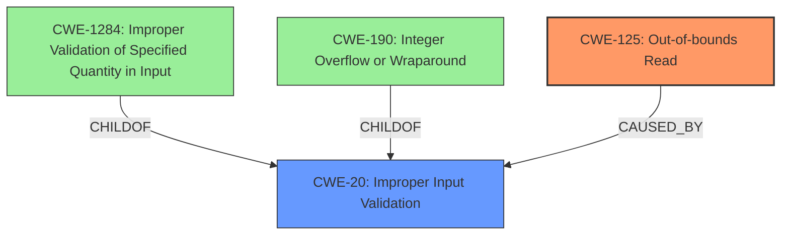

# Analysis Report for CVE-2024-9249

# Vulnerability Analysis Report: CVE-2024-9249

## Description

Foxit PDF Reader PDF File Parsing **Out-Of-Bounds Read** Remote Code Execution Vulnerability. This vulnerability allows remote attackers to execute arbitrary code on affected installations of Foxit PDF Reader. User interaction is required to exploit this vulnerability in that the target must visit a malicious page or open a malicious file. The specific flaw exists within the parsing of PDF files. The issue results from the **lack of proper validation of user-supplied data**, which can result in a read past the end of an allocated buffer. An attacker can leverage this vulnerability to execute code in the context of the current process. Was ZDI-CAN-24301.

## Vulnerability Description Key Phrases

- **Rootcause:** lack of proper validation of user-supplied data
- **Weakness:** Out-Of-Bounds Read
- **Impact:** ['execute arbitrary code', 'execute code in the context of the current process', 'remote code execution']
- **Attacker:** remote attackers
- **Product:** Foxit PDF Reader
- **Component:** PDF File Parsing

## Analysis (with Relationship Data)

# Summary
| CWE ID | CWE Name | Confidence | CWE Abstraction Level | CWE Vulnerability Mapping Label | CWE-Vulnerability Mapping Notes |
|---|---|---|---|---|---|
| CWE-125 | Out-of-bounds Read | 1.0 | Base | Allowed | Primary CWE. The vulnerability results in a read past the end of an allocated buffer. |
| CWE-20 | Improper Input Validation | 0.7 | Class | Discouraged | Secondary CWE. The **root cause** is a **lack of proper validation of user-supplied data**. |

## Evidence and Confidence

*   **Confidence Score:** 0.9
*   **Evidence Strength:** HIGH

## Relationship Analysis
The primary CWE is CWE-125, which is a Base level CWE. The root cause is the **lack of proper validation of user-supplied data** (CWE-20). CWE-20 is a class-level CWE and is a parent of CWE-1284 (Improper Validation of Specified Quantity in Input) and CWE-190 (Integer Overflow or Wraparound). CWE-125 can be caused by a number of different weaknesses including CWE-129 (Improper Validation of Array Index), CWE-822 (Untrusted Pointer Dereference), CWE-823 (Use of Out-of-range Pointer Offset), and CWE-825 (Expired Pointer Dereference).



## Vulnerability Chain
The vulnerability chain starts with the **lack of proper validation of user-supplied data** (CWE-20). This leads to an **out-of-bounds read** (CWE-125), which allows a remote attacker to execute arbitrary code on affected installations of Foxit PDF Reader.

## Summary of Analysis
The vulnerability description states that the vulnerability is an **Out-Of-Bounds Read** and the root cause is a **lack of proper validation of user-supplied data**. The description states that the issue results from the **lack of proper validation of user-supplied data**, which can result in a read past the end of an allocated buffer.

CWE-125 (Out-of-bounds Read) is the most appropriate primary CWE because the vulnerability results in a read past the end of an allocated buffer. CWE-20 (Improper Input Validation) is a reasonable secondary CWE because the root cause is a **lack of proper validation of user-supplied data**.

The retriever results identified CWE-787 (Out-of-bounds Write) as the top match, but this is incorrect because the vulnerability is an out-of-bounds read, not an out-of-bounds write.

The evidence from the vulnerability description is strong and supports the classification of CWE-125 as the primary CWE and CWE-20 as a secondary CWE.

Relevant CWE Information:
- CWE-125: Out-of-bounds Read
- CWE-20: Improper Input Validation


## CWE Relationship Analysis

Current CWEs represent these abstraction levels: .


### Vulnerability Chain Analysis

**Chain starting from CWE-1284:**
- 1284 (Improper Validation of Specified Quantity in Input) - ROOT


**Chain starting from CWE-823:**
- 823 (Use of Out-of-range Pointer Offset) - ROOT


### CWE Relationship Diagram

```mermaid
graph TD
    classDef primary fill:#f96,stroke:#333,stroke-width:2px
    classDef secondary fill:#69f,stroke:#333
    classDef tertiary fill:#9e9,stroke:#333
```


*Report generated on 2025-07-14 04:41:23*
