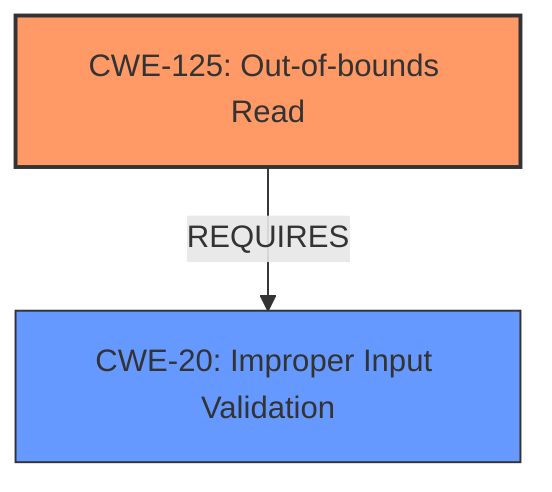

# Analysis Report for CVE-2024-9256

# Vulnerability Analysis Report: CVE-2024-9256

## Description

Foxit PDF Reader AcroForm **Out-Of-Bounds Read** **Information Disclosure Vulnerability**. This vulnerability allows remote attackers to disclose sensitive information on affected installations of Foxit PDF Reader. User interaction is required to exploit this vulnerability in that the target must visit a malicious page or open a malicious file. The specific flaw exists within the handling of AcroForms. The issue results from the **lack of proper validation of user-supplied data**, which can result in a read past the end of an allocated buffer. An attacker can leverage this in conjunction with other vulnerabilities to execute arbitrary code in the context of the current process. Was ZDI-CAN-25267.

## Vulnerability Description Key Phrases

- **Rootcause:** lack of proper validation of user-supplied data
- **Weakness:** ['Information Disclosure Vulnerability', 'Out-Of-Bounds Read']
- **Impact:** ['Information Disclosure', 'disclose sensitive information', 'execute arbitrary code']
- **Vector:** malicious page or file
- **Attacker:** remote attackers
- **Product:** Foxit PDF Reader
- **Component:** AcroForms

## Analysis (with Relationship Data)

# Summary
| CWE ID | CWE Name | Confidence | CWE Abstraction Level | CWE Vulnerability Mapping Label | CWE-Vulnerability Mapping Notes |
|---|---|---|---|---|---|
| **CWE-125** | **Out-of-bounds Read** | 1.0 | Base | Primary CWE | Allowed |
| CWE-20 | Improper Input Validation | 0.9 | Base | Secondary | Allowed |

## Evidence and Confidence

*   **Confidence Score:** 0.95
*   **Evidence Strength:** HIGH

## Relationship Analysis
The primary relationship that influenced the decision was the direct identification of an "Out-of-Bounds Read" in the vulnerability description. CWE-125 directly addresses this. CWE-20 is a parent that highlights the **lack of proper validation**, which is the root cause that allows the **out-of-bounds read** to occur.



## Vulnerability Chain
The vulnerability chain starts with **improper input validation** (CWE-20), which allows for an **out-of-bounds read** (CWE-125) to occur, leading to **information disclosure**.

## Summary of Analysis
The initial analysis identified CWE-125 as the primary weakness due to the explicit mention of "**Out-Of-Bounds Read**" in the vulnerability description. The **lack of proper validation of user-supplied data** is the root cause that enables this. CWE-20 is included as a secondary weakness because it highlights the **root cause** leading to the **out-of-bounds read**.

The selection of CWE-125 is based on direct evidence from the vulnerability description: "The issue results from the **lack of proper validation of user-supplied data**, which can result in a read past the end of an allocated buffer." This statement clearly indicates an **out-of-bounds read** condition.

The retriever results also list CWE-125 with a high similarity score, further supporting its selection. The relationship analysis confirms that CWE-20 is a prerequisite for CWE-125, as **improper input validation** allows the **out-of-bounds read** to occur.

The selected CWEs are at the optimal level of specificity because they directly address the identified weakness and its root cause.


## CWE Relationship Analysis

Current CWEs represent these abstraction levels: .


### Vulnerability Chain Analysis

**Chain starting from CWE-20:**
- 20 (Improper Input Validation) - ROOT


**Chain starting from CWE-125:**
- 125 (Out-of-bounds Read) - ROOT


### CWE Relationship Diagram

```mermaid
graph TD
    classDef primary fill:#f96,stroke:#333,stroke-width:2px
    classDef secondary fill:#69f,stroke:#333
    classDef tertiary fill:#9e9,stroke:#333
```


*Report generated on 2025-07-14 04:41:54*
