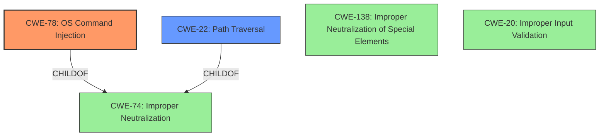

# Analysis Report for CVE-2024-9264

# Vulnerability Analysis Report: CVE-2024-9264

## Description

The SQL Expressions experimental feature of Grafana allows for the evaluation of `duckdb` queries containing user input. These queries are insufficiently sanitized before being passed to `duckdb`, leading to a **command injection** and ****local file inclusion** vulnerability**. Any user with the VIEWER or higher permission is capable of executing this attack. The `duckdb` binary must be present in Grafanas $PATH for this attack to function by default, this binary is not installed in Grafana distributions.

## Vulnerability Description Key Phrases

- **Rootcause:** ['insufficient input sanitization', 'local file inclusion vulnerability']
- **Weakness:** ['command injection', 'local file inclusion']
- **Impact:** arbitrary code execution
- **Vector:** SQL expressions
- **Attacker:** user with VIEWER or higher permission
- **Product:** Grafana

## Analysis (with Relationship Data)

# Summary

| CWE ID  | CWE Name                                                                        | Confidence | CWE Abstraction Level | CWE Vulnerability Mapping Label | CWE-Vulnerability Mapping Notes |
| :-------- | :------------------------------------------------------------------------------ | :--------- | :---------------------- | :------------------------------ | :------------------------------ |
| CWE-78  | Improper Neutralization of Special Elements used in an OS Command ('OS Command Injection') | 0.9        | Base                    | Primary                         | Allowed                       |
| CWE-22  | Improper Limitation of a Pathname to a Restricted Directory ('Path Traversal') | 0.9        | Base                    | Secondary                       | Allowed                       |
| CWE-138 | Improper Neutralization of Special Elements | 0.6        | Class                    | Secondary                       | Discouraged                    |
| CWE-20  | Improper Input Validation | 0.6        | Class                    | Secondary                       | Discouraged                    |

## Evidence and Confidence

*   **Confidence Score:** 0.9
*   **Evidence Strength:** HIGH

## Relationship Analysis

The primary weakness is **CWE-78**, which represents the **command injection** vulnerability. **CWE-22** is a secondary weakness representing the **local file inclusion** vulnerability. Both CWE-78 and CWE-22 are children of **CWE-74**, which is a discouraged CWE due to its high-level nature. **CWE-138** is a general class of improper neutralization, and **CWE-20** is a general class of improper input validation.



## Vulnerability Chain

The vulnerability chain starts with **insufficient input sanitization**, leading to both a **command injection** (**CWE-78**) and a **local file inclusion** (**CWE-22**) vulnerability. A user with VIEWER or higher permissions can exploit this chain because of the **insufficient input sanitization**.

## Summary of Analysis

The analysis is based on the provided vulnerability description. The primary weakness is **CWE-78**, as the vulnerability allows for **command injection** due to **insufficient input sanitization** of `duckdb` queries. This is further supported by the description stating the queries are "insufficiently sanitized before being passed to `duckdb`." **CWE-22** is the secondary weakness, as the vulnerability also allows for **local file inclusion** due to the same **insufficient input sanitization**. These two weaknesses are distinct and stem from the same root cause.

The relationship graph shows how the more general **CWE-74** relates to the more specific **CWE-78** and **CWE-22**, but **CWE-74** is discouraged.
The other general classes of **CWE-138** and **CWE-20** could be considered, but again are discouraged.

The selected CWEs are at the optimal level of specificity because they directly represent the two distinct vulnerabilities (**command injection** and **local file inclusion**) that arise from the **insufficient input sanitization**.

Relevant CWE Information:
*   The vulnerability description explicitly states that the queries are "insufficiently sanitized before being passed to `duckdb`", indicating a lack of proper input validation or neutralization.
*   The vulnerability allows for both "command injection" and "local file inclusion".

I considered CWE-89 ('SQL Injection'), but it is not the best fit as the queries are passed to `duckdb`, not directly to an SQL database.
I considered CWE-94 ('Code Injection'), but it is not the best fit as the vulnerability allows command injection in the operating system.
I considered CWE-138 ('Improper Neutralization of Special Elements') as it is the highest scoring CWE, but it is discouraged and is too general of a class.
I considered CWE-20 ('Improper Input Validation') as it is mentioned in the rootcause analysis, but it is discouraged and is too general of a class.


## CWE Relationship Analysis

Current CWEs represent these abstraction levels: .


### Vulnerability Chain Analysis

**Chain starting from CWE-89:**
- 89 (Improper Neutralization of Special Elements used in an SQL Command ('SQL Injection')) - ROOT


**Chain starting from CWE-94:**
- 94 (Improper Control of Generation of Code ('Code Injection')) - ROOT


### CWE Relationship Diagram

```mermaid
graph TD
    classDef primary fill:#f96,stroke:#333,stroke-width:2px
    classDef secondary fill:#69f,stroke:#333
    classDef tertiary fill:#9e9,stroke:#333
```


*Report generated on 2025-07-14 04:42:43*
