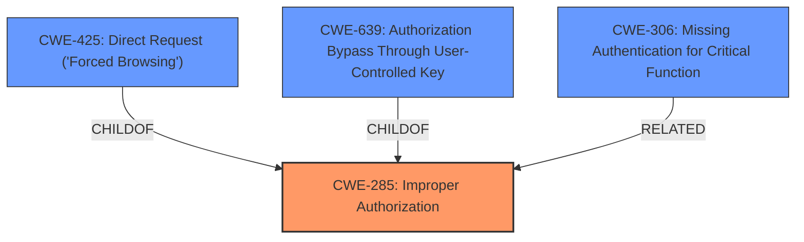

# Analysis Report for CVE-2024-9297

# Vulnerability Analysis Report: CVE-2024-9297

## Description

A vulnerability was found in SourceCodester Online Railway Reservation System 1.0. It has been declared as critical. Affected by this vulnerability is an unknown functionality of the file /admin/. The manipulation of the argument page with the input trains/schedules/system_info leads to **improper authorization**. The attack can be launched remotely. The exploit has been disclosed to the public and may be used.

## Vulnerability Description Key Phrases

- **Rootcause:** improper authorization
- **Vector:** manipulation of page argument
- **Product:** SourceCodester Online Railway Reservation System
- **Version:** 1
- **Component:** /admin/

## Analysis (with Relationship Data)

# Summary
| CWE ID    | CWE Name                                                                        | Confidence | CWE Abstraction Level | CWE Vulnerability Mapping Label | CWE-Vulnerability Mapping Notes |
| :---------- | :------------------------------------------------------------------------------ | :--------- | :---------------------- | :------------------------------ | :------------------------------ |
| CWE-285     | Improper Authorization                                                        | 0.9        | Class                   | Primary                         | Discouraged                   |
| CWE-425     | Direct Request ('Forced Browsing')                                            | 0.7        | Base                    | Secondary                       | Allowed                         |
| CWE-639     | Authorization Bypass Through User-Controlled Key                               | 0.6        | Base                    | Secondary                       | Allowed                         |
| CWE-306     | Missing Authentication for Critical Function                                  | 0.5        | Base                    | Secondary                       | Allowed                         |

## Evidence and Confidence

*   **Confidence Score:** 0.8
*   **Evidence Strength:** HIGH

## Relationship Analysis
The primary weakness is categorized as **improper authorization**, with CWE-285 being a general classification. More specific CWEs such as CWE-425 (Direct Request) and CWE-639 (Authorization Bypass) offer additional context. CWE-306 (Missing Authentication) is also considered as the vulnerability allows bypassing authentication for administrative functions. The relationships show a hierarchy where CWE-285 is a parent to more specific authorization issues. The abstraction levels are considered to choose the most accurate representation, favoring base-level CWEs when applicable.



## Vulnerability Chain
The vulnerability chain starts with the **improper authorization** (**CWE-285**), leading to the ability to directly request administrative pages (**CWE-425**) and potentially bypass authorization through user-controlled keys (**CWE-639**). In some cases, authentication is completely missing (**CWE-306**), exacerbating the issue. The root cause is the **improper authorization**, which allows attackers to gain unauthorized access and control.

## Summary of Analysis
The initial analysis identified **improper authorization** as the primary issue, supported by the vulnerability description and CVE reference. The retriever results and complete CWE specifications were reviewed to refine the classification. While CWE-285 is a class-level CWE, it accurately represents the general authorization failure. The additional CWEs (CWE-425, CWE-639, and CWE-306) provide a more detailed understanding of the attack vectors and underlying causes. The graph relationships influenced the decision by illustrating how the vulnerabilities are connected. The selected CWEs are at an optimal level of specificity, balancing accuracy and clarity.

The primary evidence is: "Affected by this vulnerability is an unknown functionality of the file /admin/. The manipulation of the argument page with the input trains/schedules/system_info leads to **improper authorization**."

Relevant CWE Information:

*   **CWE-285: Improper Authorization**
    *   **Technical Explanation:** The application fails to properly validate the privileges of the user attempting to access certain functionalities. In this case, a low-privileged user (staff) can access administrative pages by manipulating the 'page' parameter.
    *   **Security Implications:** Unauthorized access to sensitive administrative functionalities, potentially leading to data manipulation or system compromise.
    *   **Parent-Child Relationships:** CWE-285 is a class-level CWE.
    *   **Mapping Guidance Influence:** The CWE guidance suggests using more specific CWEs when available, but CWE-285 is a reasonable starting point given the information. Usage is Discouraged, but there are no more specific children that are a better fit.
*   **CWE-425: Direct Request ('Forced Browsing')**
    *   **Technical Explanation:** The application allows direct access to administrative URLs without enforcing proper authorization checks. This means that if a user knows the URL of an administrative page, they can access it regardless of their privileges.
    *   **Security Implications:** Circumvention of access controls, potentially leading to unauthorized access to sensitive data or functionalities.
    *   **Parent-Child Relationships:** CWE-425 is a child of CWE-285.
    *   **Mapping Guidance Influence:** The CWE guidance suggests that CWE-425 is appropriate when the application does not adequately enforce authorization on restricted URLs. Usage is Allowed.
*   **CWE-639: Authorization Bypass Through User-Controlled Key**
    *   **Technical Explanation:** The system's authorization mechanism is flawed, allowing an attacker to modify key values (e.g., URL parameters) to access another user's data or functionality.
    *   **Security Implications:** Unauthorized access to sensitive data or functionalities, potentially leading to privilege escalation or data manipulation.
    *   **Parent-Child Relationships:** CWE-639 is a child of CWE-285.
    *   **Mapping Guidance Influence:** The CWE guidance suggests that CWE-639 is appropriate when the authorization bypass is achieved through manipulating user-controlled keys. Usage is Allowed.
*   **CWE-306: Missing Authentication for Critical Function**
    *   **Technical Explanation:** The application lacks any authentication checks for critical administrative functions, allowing anyone to access them.
    *   **Security Implications:** Complete bypass of access controls, potentially leading to full system compromise.
    *   **Parent-Child Relationships:** None.
    *   **Mapping Guidance Influence:** The CWE guidance suggests that CWE-306 is appropriate when no authentication is performed for sensitive functionality. Usage is Allowed.

CWEs Considered but Not Used:

*   CWE-284: Improper Access Control - While this is a high-level category for access control issues, CWE-285 is a more specific classification for **improper authorization**, making it a better fit.
*   CWE-862: Missing Authorization - While relevant, CWE-285 is a more general and suitable classification as the description doesn't explicitly state that authorization checks are completely missing, but rather **improper**.
*   CWE-863: Incorrect Authorization - Similar to CWE-862, CWE-285 is more appropriate since the description doesn't detail how the authorization checks are incorrectly performed.
*   CWE-74: Improper Neutralization of Special Elements in Output Used by a Downstream Component ('Injection') - Injection is not the primary issue; the core problem is **improper authorization**.
*   CWE-668: Exposure of Resource to Wrong Sphere - Too high-level; the specific issue is **improper authorization**.
*   CWE-807: Reliance on Untrusted Inputs in a Security Decision - While inputs are used in the decision, the core issue is that the authorization logic is flawed.
*   CWE-472: External Control of Assumed-Immutable Web Parameter - This is a possible contributing factor, but not the root cause. The **improper authorization** is the primary issue.
*   CWE-471: Modification of Assumed-Immutable Data (MAID) - Not applicable; the issue is not about modifying data assumed to be immutable.
*   CWE-89: Improper Neutralization of Special Elements used in an SQL Command ('SQL Injection') and CWE-79: Improper Neutralization of Input During Web Page Generation ('Cross-site Scripting') and CWE-434: Unrestricted Upload of File with Dangerous Type - These are all input validation issues and not related to the **improper authorization** issue.


## CWE Relationship Analysis

Current CWEs represent these abstraction levels: .


### Vulnerability Chain Analysis

**Chain starting from CWE-863:**
- 863 (Incorrect Authorization) - ROOT


**Chain starting from CWE-471:**
- 471 (Modification of Assumed-Immutable Data (MAID)) - ROOT


### CWE Relationship Diagram

```mermaid
graph TD
    classDef primary fill:#f96,stroke:#333,stroke-width:2px
    classDef secondary fill:#69f,stroke:#333
    classDef tertiary fill:#9e9,stroke:#333
```


*Report generated on 2025-07-14 04:44:21*
