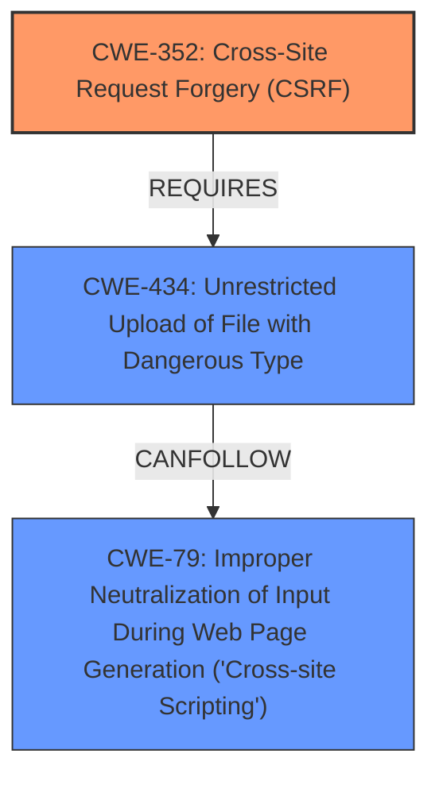

# Analysis Report for CVE-2024-9311

# Vulnerability Analysis Report: CVE-2024-9311

## Description

A Cross-Site Request Forgery (CSRF) vulnerability in haotian-liu/llava v1.2.0 (LLaVA-1.6) allows an attacker to upload files with malicious content without authentication or user interaction. The uploaded file is stored in a predictable path, enabling the attacker to execute arbitrary JavaScript code in the context of the victims browser by visiting the crafted file URL. This can lead to theft of sensitive information, session hijacking, or other actions compromising the security and privacy of the victim.

## Vulnerability Description Key Phrases

- **Rootcause:** improper CSRF protection
- **Impact:** ['execute arbitrary JavaScript code', 'theft of sensitive information', 'session hijacking', 'upload files']
- **Vector:** Cross-Site Request Forgery
- **Attacker:** attacker
- **Product:** haotian-liu/llava
- **Version:** v1.2.0 (LLaVA-1.6)

## Analysis (with Relationship Data)

# Summary
| CWE ID | CWE Name | Confidence | CWE Abstraction Level | CWE Vulnerability Mapping Label | CWE-Vulnerability Mapping Notes |
|---|---|---|---|---|---|
| CWE-352 | Cross-Site Request Forgery (CSRF) | 1.0 | Compound | Primary | Allowed |
| CWE-434 | Unrestricted Upload of File with Dangerous Type | 0.8 | Base | Secondary | Allowed |
| CWE-79 | Improper Neutralization of Input During Web Page Generation ('Cross-site Scripting') | 0.7 | Base | Secondary | Allowed |

## Evidence and Confidence

*   **Confidence Score:** 0.9
*   **Evidence Strength:** HIGH

## Relationship Analysis
The primary CWE is CWE-352, which is a compound weakness describing Cross-Site Request Forgery. The vulnerability allows an attacker to upload files with malicious content without authentication or user interaction. This leads to the ability to execute arbitrary JavaScript code. CWE-434, Unrestricted Upload of File with Dangerous Type, is related because the CSRF vulnerability allows an attacker to upload a file without restriction. The uploaded file then leads to CWE-79, Improper Neutralization of Input During Web Page Generation ('Cross-site Scripting'), because the uploaded file contains malicious Javascript that is executed by the victim's browser.



## Vulnerability Chain
The vulnerability chain starts with the **improper CSRF protection** (CWE-352), which allows an attacker to upload files without restriction (CWE-434). The uploaded file contains malicious content, enabling the attacker to execute arbitrary JavaScript code in the victim's browser (CWE-79), leading to potential theft of sensitive information, session hijacking, or other actions.

## Summary of Analysis
The analysis strongly supports the classification of this vulnerability as CWE-352 (Cross-Site Request Forgery) due to the **rootcause** of **improper CSRF protection**. The vulnerability description explicitly states that an attacker can upload files with malicious content without authentication or user interaction, which aligns with the characteristics of CWE-352. The retriever results also list CWE-352 as the top candidate. CWE-434 and CWE-79 are included as secondary weaknesses because they are components of the attack chain. The confidence is high because the vulnerability description includes direct evidence of the weakness. The selection of CWEs is at the optimal level of specificity, as they accurately represent the nature of the vulnerability and its impact.

CWEs considered but not used:
* CWE-862 (Missing Authorization) and related CWEs were considered, but authentication isn't the primary issue. While the upload occurs without user interaction, the core problem is the lack of CSRF protection, not a general authorization failure.
* CWE-918 (Server-Side Request Forgery) and CWE-89 (SQL Injection) were considered due to their presence in the retriever results. However, the vulnerability description does not provide evidence of server-side requests or SQL injection.
* CWE-116 (Improper Encoding or Escaping of Output) was considered, but there is no direct evidence of improper encoding or escaping.


## CWE Relationship Analysis

Current CWEs represent these abstraction levels: .


### Vulnerability Chain Analysis

**Chain starting from CWE-89:**
- 89 (Improper Neutralization of Special Elements used in an SQL Command ('SQL Injection')) - ROOT


**Chain starting from CWE-116:**
- 116 (Improper Encoding or Escaping of Output) - ROOT


### CWE Relationship Diagram

```mermaid
graph TD
    classDef primary fill:#f96,stroke:#333,stroke-width:2px
    classDef secondary fill:#69f,stroke:#333
    classDef tertiary fill:#9e9,stroke:#333
```


*Report generated on 2025-07-14 04:45:17*
