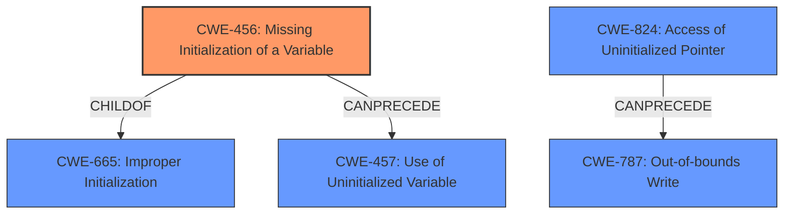

# Raw Analyzer Response for CVE-2024-9355

# Summary
| CWE ID | CWE Name | Confidence | CWE Abstraction Level | CWE Vulnerability Mapping Label | CWE-Vulnerability Mapping Notes |
|---|---|---|---|---|---|
| CWE-456 | Missing Initialization of a Variable | 0.85 | Variant | Allowed | Primary CWE |
| CWE-824 | Access of Uninitialized Pointer | 0.70 | Base | Allowed | Secondary Candidate |
| CWE-787 | Out-of-bounds Write | 0.60 | Base | Allowed | Secondary Candidate |

## Evidence and Confidence

*   **Confidence Score:** 0.80
*   **Evidence Strength:** MEDIUM

## Relationship Analysis
The primary relationship that influenced the CWE selection is the hierarchical relationship. CWE-456 (Missing Initialization of a Variable) is a variant of CWE-665 (Improper Initialization), providing a more specific classification. The CANPRECEDE relationship between CWE-456 and CWE-457 (Use of Uninitialized Variable) indicates a potential chain of events where a missing initialization leads to the use of an uninitialized variable. This helped solidify the choice of CWE-456 as the root cause.

## Vulnerability Chain
The vulnerability chain starts with **CWE-456 (Missing Initialization of a Variable)**, which leads to the **uninitialized buffer length variable**. This can lead to **CWE-824 (Access of Uninitialized Pointer)** if the uninitialized length is used as a pointer. This can lead to **CWE-787 (Out-of-bounds Write)** if the pointer is dereferenced and used to write data. This ultimately results in a zeroed buffer being returned, potentially leading to a false positive match or a derived key of all zeros.

## Summary of Analysis
The initial analysis focused on identifying the root cause of the vulnerability, which was determined to be the **uninitialized buffer length variable**. The evidence from the vulnerability description and CVE details strongly supports this conclusion. The relationship analysis further reinforced the choice of CWE-456 as the primary CWE, as it is a specific variant of improper initialization. The chain of events from missing initialization to the final impact was also considered.

The selection of CWE-456 is based on the following evidence:
- "This flaw allows a malicious user to randomly cause an **uninitialized buffer length variable** with a zeroed buffer to be returned in FIPS mode"
- "The vulnerability stems from an **uninitialized buffer length variable** in the CGO bindings of the golang-fips package"
- "The primary weakness is the presence of an **uninitialized buffer length variable.**"

The choice of CWE-456 is at the optimal level of specificity because it directly addresses the root cause of the vulnerability, which is the missing initialization of a variable, rather than a more general improper initialization. The MITRE mapping guidance allows for the use of Variant level CWEs when they accurately represent the weakness.

Relevant CWE Information:

*   **CWE-456 (Missing Initialization of a Variable):** The product does not initialize a variable, which can lead to unexpected behavior or vulnerabilities. In this case, the **uninitialized buffer length variable** leads to a zeroed buffer being returned, potentially causing false positive matches or derived keys of all zeros.
*   **CWE-824 (Access of Uninitialized Pointer):** The product accesses or uses a pointer that has not been initialized. The **uninitialized buffer length variable** can be interpreted as a pointer that has not been initialized.
*   **CWE-787 (Out-of-bounds Write):** The product writes data past the end, or before the beginning, of the intended buffer. If the **uninitialized buffer length variable** is used, it can cause out-of-bounds writes to the buffer and cause it to zero out.