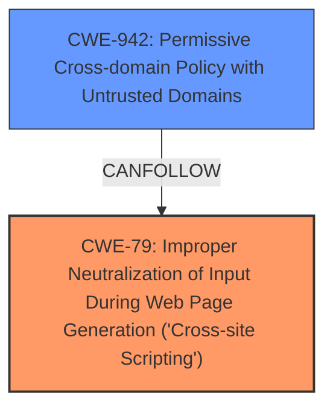

# Analysis Report for CVE-2024-9393

# Vulnerability Analysis Report: CVE-2024-9393

## Description

An attacker could, via a specially crafted multipart response, execute arbitrary JavaScript under the `resource//pdf.js` origin. This could allow them to access cross-origin PDF content. This access is limited to same site documents by the Site Isolation feature on desktop clients, but full cross-origin access is possible on Android versions. This vulnerability affects Firefox < 131, Firefox ESR < 128.3, Firefox ESR < 115.16, Thunderbird < 128.3, and Thunderbird < 131.

## Vulnerability Description Key Phrases

- **Impact:** execute arbitrary JavaScript
- **Vector:** specially crafted multipart response
- **Attacker:** attacker
- **Product:** ['Firefox', 'Firefox ESR', 'Thunderbird']
- **Version:** ['< 131', '< 128.3', '< 115.16', '< 128.3', '< 131']

## Analysis (with Relationship Data)

# Summary
| CWE ID    | CWE Name                                                                           | Confidence | CWE Abstraction Level | CWE Vulnerability Mapping Label | CWE-Vulnerability Mapping Notes |
| :--------- | :--------------------------------------------------------------------------------- | :--------- | :---------------------- | :------------------------------ | :------------------------------ |
| CWE-79     | Improper Neutralization of Input During Web Page Generation ('Cross-site Scripting') | 0.75       | Base                    | Allowed                         | Primary CWE                     |
| CWE-942    | Permissive Cross-domain Policy with Untrusted Domains                               | 0.50       | Variant                 | Allowed                         | Secondary Candidate             |

## Evidence and Confidence

*   **Confidence Score:** 0.70
*   **Evidence Strength:** MEDIUM

## Relationship Analysis
The primary CWE is CWE-79, which focuses on improper neutralization of input leading to Cross-Site Scripting (XSS). The description indicates that an attacker can execute arbitrary JavaScript, aligning with the impact of CWE-79. CWE-942 is considered as a secondary candidate because the vulnerability allows cross-origin access, which is a direct result of a permissive cross-domain policy.



## Vulnerability Chain
The vulnerability chain starts with a specially crafted multipart response leading to the execution of arbitrary JavaScript.

1.  **Root Cause:** The application does not properly neutralize input within a multipart response.
2.  **Weakness:** **Improper Neutralization of Input During Web Page Generation ('Cross-site Scripting') (CWE-79)**
3.  **Impact:** Arbitrary JavaScript execution under the `resource//pdf.js` origin, potentially leading to cross-origin PDF content access.
4.  **Secondary Weakness:** The possibility of **Permissive Cross-domain Policy with Untrusted Domains (CWE-942)** allows broader access on some platforms.

## Summary of Analysis
The primary assessment is based on the ability to execute arbitrary JavaScript, which strongly aligns with CWE-79. The evidence for this is found in the "Vulnerability Description" which states "execute arbitrary JavaScript under the `resource//pdf.js` origin".

CWE-942 is a secondary consideration because the vulnerability allows cross-origin access, especially on Android, but the primary issue is the **improper neutralization** that leads to the XSS.

The selection of CWE-79 is at the optimal level of specificity because it directly addresses the **root cause** of the vulnerability: the **lack of proper neutralization of input** before web page generation, leading to XSS.

Relevant CWE Information:

# Enhanced Context (25 CWEs)
The following CWEs were identified as potentially relevant to this vulnerability:

## CWE-451: User Interface (UI) Misrepresentation of Critical Information
**Abstraction Level**: Class
**Similarity Score**: 0.77

## CWE-610: Externally Controlled Reference to a Resource in Another Sphere
**Abstraction Level**: Class
**Similarity Score**: 0.75

## CWE-346: Origin Validation Error
**Abstraction Level**: Class
**Similarity Score**: 0.75

## CWE-116: Improper Encoding or Escaping of Output
**Abstraction Level**: Class
**Similarity Score**: 0.74

## CWE-923: Improper Restriction of Communication Channel to Intended Endpoints
**Abstraction Level**: Class
**Similarity Score**: 0.74

## CWE-113: Improper Neutralization of CRLF Sequences in HTTP Headers ('HTTP Request/Response Splitting')
**Abstraction Level**: Variant
**Similarity Score**: 0.73

## CWE-80: Improper Neutralization of Script-Related HTML Tags in a Web Page (Basic XSS)
**Abstraction Level**: Variant
**Similarity Score**: 0.72

## CWE-125: Out-of-bounds Read
**Abstraction Level**: Base
**Similarity Score**: 0.72

## CWE-942: Permissive Cross-domain Policy with Untrusted Domains
**Abstraction Level**: Variant
**Similarity Score**: 0.72

## CWE-203: Observable Discrepancy
**Abstraction Level**: Base
**Similarity Score**: 0.72

## CWE-116: Improper Encoding or Escaping of Output
**Abstraction Level**: Class
**Similarity Score**: 734.43

## CWE-942: Permissive Cross-domain Policy with Untrusted Domains
**Abstraction Level**: Variant
**Similarity Score**: 703.33

## CWE-79: Improper Neutralization of Input During Web Page Generation ('Cross-site Scripting')
**Abstraction Level**: Base
**Similarity Score**: 688.53

## CWE-346: Origin Validation Error
**Abstraction Level**: Class
**Similarity Score**: 682.42

## CWE-451: User Interface (UI) Misrepresentation of Critical Information
**Abstraction Level**: Class
**Similarity Score**: 674.98

## CWE-79: Improper Neutralization of Input During Web Page Generation ('Cross-site Scripting')
**Abstraction Level**: base
**Similarity Score**: 4.33

## CWE-494: Download of Code Without Integrity Check
**Abstraction Level**: base
**Similarity Score**: 4.33

## CWE-1007: Insufficient Visual Distinction of Homoglyphs Presented to User
**Abstraction Level**: base
**Similarity Score**: 2.47

## CWE-1021: Improper Restriction of Rendered UI Layers or Frames
**Abstraction Level**: base
**Similarity Score**: 2.47

## CWE-1275: Sensitive Cookie with Improper SameSite Attribute
**Abstraction Level**: variant
**Similarity Score**: 2.27

## CWE-825: Expired Pointer Dereference
**Abstraction Level**: base
**Similarity Score**: 2.21

## CWE-824: Access of Uninitialized Pointer
**Abstraction Level**: base
**Similarity Score**: 2.21

## CWE-823: Use of Out-of-range Pointer Offset
**Abstraction Level**: base
**Similarity Score**: 2.21

## CWE-822: Untrusted Pointer Dereference
**Abstraction Level**: base
**Similarity Score**: 2.21

## CWE-322: Key Exchange without Entity Authentication
**Abstraction Level**: base
**Similarity Score**: 2.21

**CWE Exclusion Rationale:**

*   CWE-451, CWE-610, CWE-346, CWE-116, CWE-923, CWE-113, CWE-80, CWE-125, CWE-203, CWE-494, CWE-1007, CWE-1021, CWE-1275, CWE-825, CWE-824, CWE-823, CWE-822, CWE-322: These CWEs are less directly relevant to the **root cause** of the vulnerability, which centers around the **improper handling of input** that leads to arbitrary JavaScript execution. While some of these (like CWE-346, CWE-116) could be contributing factors, CWE-79 captures the core issue more accurately.


## CWE Relationship Analysis

Current CWEs represent these abstraction levels: .


### Vulnerability Chain Analysis

**Chain starting from CWE-494:**
- 494 (Download of Code Without Integrity Check) - ROOT


**Chain starting from CWE-80:**
- 80 (Improper Neutralization of Script-Related HTML Tags in a Web Page (Basic XSS)) - ROOT


### CWE Relationship Diagram

```mermaid
graph TD
    classDef primary fill:#f96,stroke:#333,stroke-width:2px
    classDef secondary fill:#69f,stroke:#333
    classDef tertiary fill:#9e9,stroke:#333
```


*Report generated on 2025-07-14 04:48:07*
