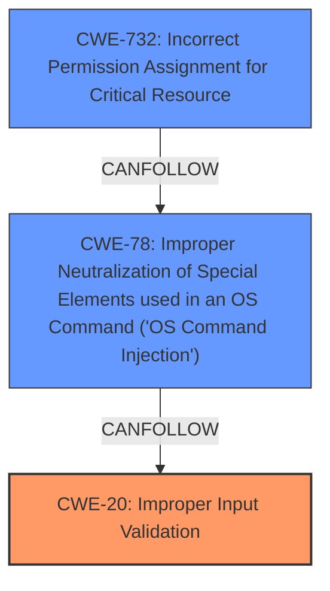

# Analysis Report for CVE-2024-9407

# Vulnerability Analysis Report: CVE-2024-9407

## Description

A vulnerability exists in the bind-propagation option of the Dockerfile RUN --mount instruction. The system does not properly validate the input passed to this option, allowing users to pass arbitrary parameters to the mount instruction. This issue can be exploited to mount sensitive directories from the host into a container during the build process and, in some cases, modify the contents of those mounted files. Even if SELinux is used, this vulnerability can bypass its protection by allowing the source directory to be relabeled to give the container access to host files.

## Vulnerability Description Key Phrases

- **Rootcause:** improper input validation
- **Impact:** ['mount sensitive directories from host into container', 'modify contents of mounted files', 'bypass SELinux protection']
- **Product:** Docker
- **Component:** bind-propagation option of RUN --mount instruction

## Analysis (with Relationship Data)

# Summary
| CWE ID | CWE Name | Confidence | CWE Abstraction Level | CWE Vulnerability Mapping Label | CWE-Vulnerability Mapping Notes |
|---|---|---|---|---|---|
| CWE-20 | Improper Input Validation | 0.9 | Base | Primary | Allowed |
| CWE-78 | Improper Neutralization of Special Elements used in an OS Command ('OS Command Injection') | 0.7 | Base | Secondary | Allowed |
| CWE-732 | Incorrect Permission Assignment for Critical Resource | 0.5 | Class | Secondary | Allowed-with-Review |

## Evidence and Confidence

*   **Confidence Score:** 0.8
*   **Evidence Strength:** HIGH

## Relationship Analysis
The primary relationship is that **improper input validation** (CWE-20) can lead to **OS Command Injection** (CWE-78). The vulnerability description explicitly mentions **improper input validation** as the root cause, allowing arbitrary parameters to be passed to the mount instruction. This aligns with CWE-20's description of failing to validate input. The ability to inject parameters into the `mount` command directly corresponds to the OS Command Injection. CWE-732 is included as a potential secondary weakness, since the exploitation allows bypassing of SELinux protections. The relationship is that of parent-child and CANPRECEDE relationships. CWE-20 is the base level weakness.



## Vulnerability Chain
The vulnerability chain starts with **improper input validation** (CWE-20) in the `bind-propagation` option of the Dockerfile `RUN --mount` instruction. This leads to the ability to inject arbitrary parameters into the `mount` command, which is **OS Command Injection** (CWE-78). The impact is that sensitive directories from the host can be mounted into the container, and their contents modified. Bypassing SELinux can also be achieved (**Incorrect Permission Assignment for Critical Resource** (CWE-732)).

## Summary of Analysis
The analysis is based on the provided evidence, especially the vulnerability description and CVE Reference Links Content Summary. The root cause is clearly stated as **improper input validation**, which directly maps to CWE-20. The ability to inject arbitrary parameters into the `mount` command leading to the mounting of sensitive host directories into containers maps to OS Command Injection (CWE-78). The vulnerability description also mentions bypassing SELinux.

The vulnerability description states: "The system does not properly validate the input passed to this option, allowing users to pass arbitrary parameters to the mount instruction."

The CVE Reference Links Content Summary states: "The vulnerability stems from **improper input validation** in the `bind-propagation` option of the Dockerfile `RUN --mount` instruction within Buildah and Podman. This **lack of validation allows arbitrary parameters to be passed to the underlying `mount` command**."

The selection of CWE-20 and CWE-78 is at the optimal level of specificity, as they directly represent the root cause and the immediate consequence of the vulnerability.

**CWE Considerations:**

*   CWE-22 (Improper Limitation of a Pathname to a Restricted Directory ('Path Traversal')) was considered because the vulnerability allows mounting of sensitive directories. However, the root cause is not related to path traversal, but rather the ability to pass arbitrary parameters to the mount command due to **improper input validation**.
*   CWE-59 (Improper Link Resolution Before File Access ('Link Following')) was considered but not selected because the vulnerability does not involve following symbolic links.
*   CWE-732 (Incorrect Permission Assignment for Critical Resource) was considered and included as a secondary weakness since the ability to bypass SELinux is present.
*   CWE-78 (Improper Neutralization of Special Elements used in an OS Command ('OS Command Injection')) was considered and included as the ability to inject parameters into the mount command leading to the mounting of sensitive host directories into containers.
*   CWE-88 (Improper Neutralization of Argument Delimiters in a Command ('Argument Injection')) was considered but not selected because CWE-78 is more descriptive.
*   CWE-434 (Unrestricted Upload of File with Dangerous Type) was not selected as the vulnerability is unrelated to file uploads.
*   CWE-184 (Incomplete List of Disallowed Inputs) was considered but not selected because there is no specific mention of an incomplete list of disallowed inputs, but rather a general lack of input validation.


## CWE Relationship Analysis

Current CWEs represent these abstraction levels: .


### Vulnerability Chain Analysis

**Chain starting from CWE-732:**
- 732 (Incorrect Permission Assignment for Critical Resource) - ROOT


**Chain starting from CWE-88:**
- 88 (Improper Neutralization of Argument Delimiters in a Command ('Argument Injection')) - ROOT


### CWE Relationship Diagram

```mermaid
graph TD
    classDef primary fill:#f96,stroke:#333,stroke-width:2px
    classDef secondary fill:#69f,stroke:#333
    classDef tertiary fill:#9e9,stroke:#333
```


*Report generated on 2025-07-14 04:50:01*
