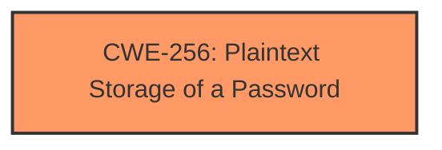

# Enhanced Analysis for CVE-2024-9418

# Summary
| CWE ID | CWE Name | Confidence | CWE Abstraction Level | CWE Vulnerability Mapping Label | CWE-Vulnerability Mapping Notes |
|---|---|---|---|---|---|
| CWE-256 | Plaintext Storage of a Password | 1.0 | Base | Allowed | Primary CWE. The password is being stored in plaintext. |

## Evidence and Confidence

*   **Confidence Score:** 1.0
*   **Evidence Strength:** HIGH

## Relationship Analysis
The primary relationship is that CWE-256 is a base level CWE. There are no child CWEs of CWE-256 that are more specific.



## Vulnerability Chain
The vulnerability chain consists of the **Plaintext Storage of a Password** (CWE-256), which leads to the potential retrieval of the password by an attacker, and then account takeover.

## Summary of Analysis
The vulnerability description states that the API endpoint `/api/users/get/{id}` returns the user's password in plaintext. The weakness is the **plaintext storage of the password**. The direct evidence supports the selection of CWE-256 as the primary CWE.

The following CWEs were considered but not used:

*   CWE-639: Authorization Bypass Through User-Controlled Key - While this could be a contributing factor, the primary issue is the storage of the password in plaintext.
*   CWE-532: Insertion of Sensitive Information into Log File - This is not about logging, but about returning the password via an API endpoint.
*   CWE-306: Missing Authentication for Critical Function - Authentication may or may not be present, but the key issue is the plaintext storage.
*   CWE-522: Insufficiently Protected Credentials - CWE-256 is a more specific case of this class.
*   CWE-620: Unverified Password Change - This CWE is not relevant to the vulnerability description.
*   CWE-863: Incorrect Authorization - While authorization might be a factor, the core issue is the plaintext password.
*   CWE-287: Improper Authentication - This is not about improper authentication, but about how the password is stored.
*   CWE-260: Password in Configuration File - The password is not in a configuration file.
*   CWE-549: Missing Password Field Masking - This is not about masking the password during entry.

The selected CWE is at the optimal level of specificity, as it directly addresses the root cause of the vulnerability.


## CWE Relationship Analysis

Current CWEs represent these abstraction levels: .


### Vulnerability Chain Analysis

**Chain starting from CWE-863:**
- 863 (Incorrect Authorization) - ROOT


**Chain starting from CWE-260:**
- 260 (Password in Configuration File) - ROOT


### CWE Relationship Diagram

```mermaid
graph TD
    classDef primary fill:#f96,stroke:#333,stroke-width:2px
    classDef secondary fill:#69f,stroke:#333
    classDef tertiary fill:#9e9,stroke:#333
```