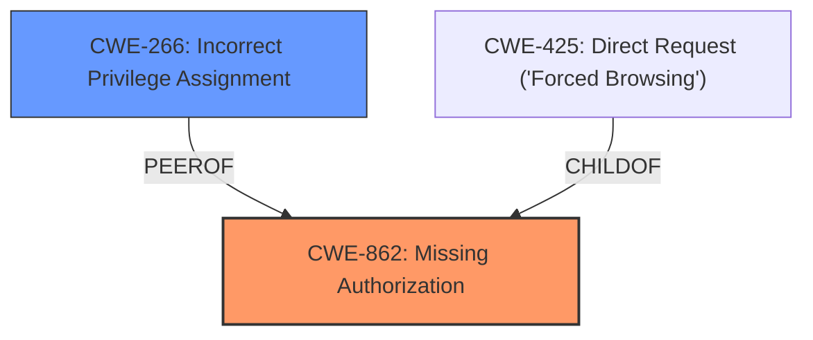

# Analysis Report for CVE-2024-9503

# Vulnerability Analysis Report: CVE-2024-9503

## Description

The Maintenance & Coming Soon Redirect Animation plugin for WordPress is vulnerable to unauthorized modification of data due to a **missing capability check** on the wploti_add_whitelisted_roles_option, wploti_remove_whitelisted_roles_option, wploti_add_whitelisted_users_option, wploti_remove_whitelisted_users_option, and wploti_uploaded_animation_save_option functions in all versions up to, and including, 2.1.3. This makes it possible for authenticated attackers, with Subscriber-level access and above, to modify certain plugin settings.

## Vulnerability Description Key Phrases

- **Component:** wploti_add_whitelisted_roles_option, wploti_remove_whitelisted_roles_option, wploti_add_whitelisted_users_option, wploti_remove_whitelisted_users_option, and wploti_uploaded_animation_save_option functions
- **Rootcause:** missing capability check
- **Product:** Maintenance & Coming Soon Redirect Animation WordPress plugin
- **Impact:** unauthorized modification of data
- **Attacker:** authenticated attackers
- **Version:** up to and including 2.1.3

## Analysis (with Relationship Data)

# Summary
| CWE ID | CWE Name | Confidence | CWE Abstraction Level | CWE Vulnerability Mapping Label | CWE-Vulnerability Mapping Notes |
|---|---|---|---|---|---|
| CWE-862 | Missing Authorization | 1.0 | Class | Primary | Allowed-with-Review |
| CWE-266 | Incorrect Privilege Assignment | 0.6 | Base | Secondary | Allowed |

## Evidence and Confidence

*   **Confidence Score:** 0.8
*   **Evidence Strength:** HIGH

## Relationship Analysis
The primary relationship that influenced the decision was the ChildOf relationship between CWE-862 (Missing Authorization) and its potential Base-level children. While a more specific CWE might exist, the provided information focuses on the **missing capability check**, which is the core issue addressed by CWE-862. CWE-266 (Incorrect Privilege Assignment) was considered as a related issue, given that the vulnerability allows lower-privileged users to modify settings they shouldn't be able to, but it is a less direct representation of the **missing check**.



## Vulnerability Chain
The vulnerability chain starts with the **missing capability check** (CWE-862), which allows authenticated users with insufficient privileges to access and modify plugin settings. This leads to unauthorized modification of data.

## Summary of Analysis
The initial analysis focused on identifying the root cause of the vulnerability, which is the **missing capability check**. The evidence from the vulnerability description and CVE reference links clearly indicates that the plugin functions lack proper authorization checks, allowing unauthorized access and modification of plugin settings.

The most relevant evidence is:
- "The Maintenance & Coming Soon Redirect Animation plugin for WordPress is vulnerable to unauthorized modification of data due to a **missing capability check**"
- "The plugin lacks capability checks on several functions that modify plugin settings, allowing unauthorized access."

CWE-862 (Missing Authorization) directly addresses this root cause. While CWE-266 (Incorrect Privilege Assignment) is also relevant, it describes a slightly different scenario where privileges are incorrectly assigned. In this case, the issue is not about incorrect assignment but the complete absence of an authorization check.

CWE-425 (Direct Request) was also considered, but it describes a situation where authorization is not adequately enforced on restricted URLs, which is not the primary issue here. The main problem is the **missing check**, regardless of how the request is made.

The selected CWEs are at the optimal level of specificity because they directly represent the root cause (CWE-862) and a related consequence (CWE-266) of the vulnerability.

Relevant CWE Information:

# Enhanced Context (25 CWEs)
The following CWEs were identified as potentially relevant to this vulnerability:

## CWE-352: Cross-Site Request Forgery (CSRF)
**Abstraction Level**: Compound
**Similarity Score**: 0.74
**Source**: dense

**Description**:
The web application does not, or can not, sufficiently verify whether a well-formed, valid, consistent request was intentionally provided by the user who submitted the request.

**Mapping Guidance**:
- Usage: Allowed
- Rationale: This is a well-known Composite of multiple weaknesses that must all occur simultaneously, although it is attack-oriented in nature.

*This CWE was not selected as CSRF is not indicated in the description. There is no mention of request forgery.*

## CWE-425: Direct Request ('Forced Browsing')
**Abstraction Level**: Base
**Similarity Score**: 0.71
**Source**: dense

**Description**:
The web application does not adequately enforce appropriate authorization on all restricted URLs, scripts, or files.

**Mapping Guidance**:
- Usage: Allowed
- Rationale: This CWE entry is at the Base level of abstraction, which is a preferred level of abstraction for mapping to the root causes of vulnerabilities.

*This CWE was not selected because it's more about not enforcing authorization on URLs, while the core issue is the **missing capability check**.*

## CWE-472: External Control of Assumed-Immutable Web Parameter
**Abstraction Level**: Base
**Similarity Score**: 0.71
**Source**: dense

**Description**:
The web application does not sufficiently verify inputs that are assumed to be immutable but are actually externally controllable, such as hidden form fields.

**Mapping Guidance**:
- Usage: Allowed
- Rationale: This CWE entry is at the Base level of abstraction, which is a preferred level of abstraction for mapping to the root causes of vulnerabilities.

*This CWE was not selected as there is no information to suggest external control of immutable parameters.*

## CWE-862: Missing Authorization
**Abstraction Level**: Class
**Similarity Score**: 0.69
**Source**: dense

**Description**:
The product does not perform an authorization check when an actor attempts to access a resource or perform an action.

**Mapping Guidance**:
- Usage: Allowed-with-Review
- Rationale: This CWE entry is a Class and might have Base-level children that would be more appropriate

*This CWE was selected as the primary CWE because the product does not perform an authorization check.*

## CWE-639: Authorization Bypass Through User-Controlled Key
**Abstraction Level**: Base
**Similarity Score**: 0.69
**Source**: dense

**Description**:
The system's authorization functionality does not prevent one user from gaining access to another user's data or record by modifying the key value identifying the data.

**Mapping Guidance**:
- Usage: Allowed
- Rationale: This CWE entry is at the Base level of abstraction, which is a preferred level of abstraction for mapping to the root causes of vulnerabilities.

*This CWE was not selected as there is no mention of a user-controlled key being modified to bypass authorization.*

## CWE-434: Unrestricted Upload of File with Dangerous Type
**Abstraction Level**: Base
**Similarity Score**: 0.68
**Source**: dense

**Description**:
The product allows the upload or transfer of dangerous file types that are automatically processed within its environment.

**Mapping Guidance**:
- Usage: Allowed
- Rationale: This CWE entry is at the Base level of abstraction, which is a preferred level of abstraction for mapping to the root causes of vulnerabilities.

*This CWE was not selected as there is no mention of unrestricted file uploads.*

## CWE-266: Incorrect Privilege Assignment
**Abstraction Level**: Base
**Similarity Score**: 0.67
**Source**: dense

**Description**:
A product incorrectly assigns a privilege to a particular actor, creating an unintended sphere of control for that actor.

**Mapping Guidance**:
- Usage: Allowed
- Rationale: This CWE entry is at the Base level of abstraction, which is a preferred level of abstraction for mapping to the root causes of vulnerabilities.

*This CWE was selected as a secondary CWE because the lower level users are able to access functions they should not be able to.*

## CWE-201: Insertion of Sensitive Information Into Sent Data
**Abstraction Level**: Base
**Similarity Score**: 0.67
**Source**: dense

**Description**:
The code transmits data to another actor, but a portion of the data includes sensitive information that should not be accessible to that actor.

**Mapping Guidance**:
- Usage: Allowed
- Rationale: This CWE entry is at the Base level of abstraction, which is a preferred level of abstraction for mapping to the root causes of vulnerabilities.

*This CWE was not selected as there is no evidence that sensitive information is being sent.*

## CWE-116: Improper Encoding or Escaping of Output
**Abstraction Level**: Class
**Similarity Score**: 0.66
**Source**: dense

**Description**:
The product prepares a structured message for communication with another component, but encoding or escaping of the data is either missing or done incorrectly. As a result, the intended structure of the message is not preserved.

**Mapping Guidance**:
- Usage: Allowed-with-Review
- Rationale: This CWE entry is a Class and might have Base-level children that would be more appropriate

*This CWE was not selected as there is no mention of encoding or escaping issues.*

## CWE-306: Missing Authentication for Critical Function
**Abstraction Level**: Base
**Similarity Score**: 0.66
**Source**: dense

**Description**:
The product does not perform any authentication for functionality that requires a provable user identity or consumes a significant amount of resources.

**Mapping Guidance**:
- Usage: Allowed
- Rationale: This CWE entry is at the Base level of abstraction, which is a preferred level of abstraction for mapping to the root causes of vulnerabilities.

*This CWE was not selected because the vulnerability description indicated that the


## CWE Relationship Analysis

Current CWEs represent these abstraction levels: .


### Vulnerability Chain Analysis

**Chain starting from CWE-116:**
- 116 (Improper Encoding or Escaping of Output) - ROOT


**Chain starting from CWE-862:**
- 862 (Missing Authorization) - ROOT


### CWE Relationship Diagram

```mermaid
graph TD
    classDef primary fill:#f96,stroke:#333,stroke-width:2px
    classDef secondary fill:#69f,stroke:#333
    classDef tertiary fill:#9e9,stroke:#333
```


*Report generated on 2025-07-14 04:56:33*
