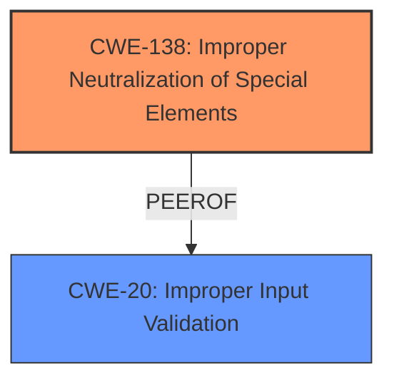

# Enhanced Analysis for CVE-2024-9579

# Summary
| CWE ID | CWE Name | Confidence | CWE Abstraction Level | CWE Vulnerability Mapping Label | CWE-Vulnerability Mapping Notes |
|---|---|---|---|---|---|
| CWE-138 | Improper Neutralization of Special Elements | 0.75 | Class | Allowed-with-Review | Primary CWE. The vulnerability description mentions **improper input sanitization**, which aligns with the concept of improper neutralization. Though a Class, it is the best fit based on the limited information. |
| CWE-20 | Improper Input Validation | 0.6 | Class | Discouraged | Secondary candidate. While **improper input sanitization** is a form of input validation, CWE-138 more closely captures the essence of the weakness as neutralization of special elements. |

## Evidence and Confidence

*   **Confidence Score:** 0.7
*   **Evidence Strength:** MEDIUM

## Relationship Analysis
The primary relationship that influenced the decision was the hierarchical relationship. While CWE-138 is a Class, and it's generally preferred to have a Base or Variant, the provided information doesn't allow for a more specific classification. CWE-20 is also a Class, making CWE-138 the more suitable choice based on keyword matching with the **rootcause**.



## Vulnerability Chain
The vulnerability chain begins with **improper input sanitization** (CWE-138). The description notes that exploitation requires a layered attack, suggesting other weaknesses may need to be present for successful exploitation. The lack of specifics prevents a more complete chain mapping.

## Summary of Analysis
The primary decision driver was the presence of the phrase "**improper input sanitization**" in the "Vulnerability Description Key Phrases," which strongly aligns with the description of CWE-138. The provided evidence is limited, relying mainly on this phrase for classification. While ideally a more specific Base or Variant CWE would be selected, the available information doesn't allow for it. The retriever results also suggest CWE-138.

CWE-20 was considered but deemed less specific than CWE-138, given the available information. Other CWEs from the Retriever Results, like CWE-78, CWE-287, CWE-1284, CWE-116, CWE-190, and CWE-22, were not selected because they lacked direct support from the provided description. CWE-770 and CWE-912 were also not considered.

Relevant CWE Information:

# Enhanced Context (25 CWEs)
The following CWEs were identified as potentially relevant to this vulnerability:

## CWE-138: Improper Neutralization of Special Elements
**Abstraction Level**: Class
**Similarity Score**: 0.75
**Source**: dense

**Description**:
The product receives input from an upstream component, but it does not neutralize or incorrectly neutralizes special elements that could be interpreted as control elements or syntactic markers when they are sent to a downstream component.

**Mapping Guidance**:
- Usage: Discouraged
- Rationale: This CWE entry is a level-1 Class (i.e., a child of a Pillar). It might have lower-level children that would be more appropriate


## CWE Relationship Analysis

Current CWEs represent these abstraction levels: .


### Vulnerability Chain Analysis

**Chain starting from CWE-1284:**
- 1284 (Improper Validation of Specified Quantity in Input) - ROOT


**Chain starting from CWE-116:**
- 116 (Improper Encoding or Escaping of Output) - ROOT


### CWE Relationship Diagram

```mermaid
graph TD
    classDef primary fill:#f96,stroke:#333,stroke-width:2px
    classDef secondary fill:#69f,stroke:#333
    classDef tertiary fill:#9e9,stroke:#333
```