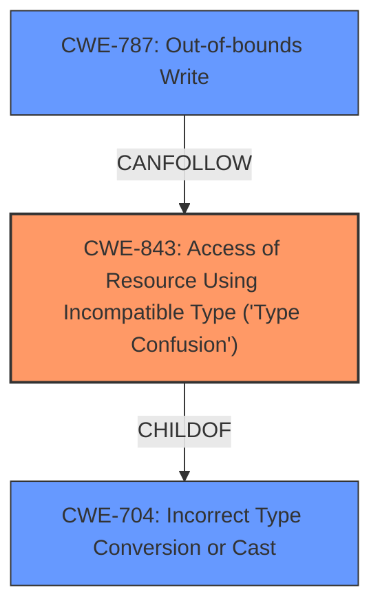

# Enhanced Analysis for CVE-2024-9603

# Summary
| CWE ID | CWE Name | Confidence | CWE Abstraction Level | CWE Vulnerability Mapping Label | CWE-Vulnerability Mapping Notes |
|---|---|---|---|---|---|
| CWE-843 | Access of Resource Using Incompatible Type ('Type Confusion') | 1.0 | Base | Primary | Allowed |
| CWE-787 | Out-of-bounds Write | 0.5 | Base | Secondary Candidate | Allowed |

## Evidence and Confidence

*   **Confidence Score:** 0.8
*   **Evidence Strength:** HIGH

## Relationship Analysis
The primary CWE is CWE-843, which directly reflects the stated **Type Confusion** vulnerability. CWE-787 is a possible consequence of type confusion leading to memory corruption. CWE-843 is a base CWE and a child of CWE-704, Incorrect Type Conversion or Cast. The other CWEs do not seem to fit the context as well.



## Vulnerability Chain
The vulnerability chain starts with a **Type Confusion** (CWE-843) in the V8 engine, which can then lead to heap corruption, and potentially an out-of-bounds write (CWE-787) if the type confusion allows writing data to incorrect memory locations.

## Summary of Analysis
The vulnerability description clearly states a **Type Confusion** vulnerability in the V8 engine of Google Chrome. The CVE Reference Links Content Summary confirms this as the root cause.

The primary CWE match, according to similar CVE descriptions, is CWE-843, "Access of Resource Using Incompatible Type ('Type Confusion')". This aligns directly with the vulnerability description.

The retriever results also list CWE-843 as the top result.

CWE-787 "Out-of-bounds Write" is included as a secondary candidate because heap corruption often leads to out-of-bounds writes.

I am confident in this assessment based on the provided evidence. The selection of CWE-843 is at the optimal level of specificity as it directly describes the **Type Confusion** issue. Other CWEs, while potentially related as consequences, do not represent the root cause as accurately.

Relevant CWE Information:
# Enhanced Context (25 CWEs)
The following CWEs were identified as potentially relevant to this vulnerability:

## CWE-843: Access of Resource Using Incompatible Type ('Type Confusion')
**Abstraction Level**: Base
**Similarity Score**: 0.81
**Source**: dense

**Description**:
The product allocates or initializes a resource such as a pointer, object, or variable using one type, but it later accesses that resource using a type that is incompatible with the original type.

**Mapping Guidance**:
- Usage: Allowed
- Rationale: This CWE entry is at the Base level of abstraction, which is a preferred level of abstraction for mapping to the root causes of vulnerabilities.

## CWE-787: Out-of-bounds Write
**Abstraction Level**: base
**Similarity Score**: 3.30
**Source**: graph

**Description**:
CWE-787: Out-of-bounds Write

**Mapping Guidance**:
- Usage: Allowed
- Rationale: This CWE entry is at the Base level of abstraction, which is a preferred level of abstraction for mapping to the root causes of vulnerabilities.

# Final Conclusion

**CWE-843: Access of Resource Using Incompatible Type ('Type Confusion')**: This is the primary CWE because the vulnerability description explicitly mentions "Type Confusion." The "CVE Reference Links Content Summary" section states, "root_cause: Type Confusion in V8." The description of CWE-843 perfectly matches the vulnerability: "The product allocates or initializes a resource such as a pointer, object, or variable using one type, but it later accesses that resource using a type that is incompatible with the original type." This **Type Confusion** is the root cause that allows the attacker to potentially exploit heap corruption. The security implication is that an attacker can manipulate the type of data being processed, leading to unexpected behavior and potential code execution.

**CWE-787: Out-of-bounds Write**: This is a secondary CWE because **Type Confusion** can lead to writing to unintended memory locations. The vulnerability description mentions "potentially exploit heap corruption," which could involve an out-of-bounds write.


## CWE Relationship Analysis

Current CWEs represent these abstraction levels: .


### Vulnerability Chain Analysis

**Chain starting from CWE-843:**
- 843 (Access of Resource Using Incompatible Type ('Type Confusion')) - ROOT


**Chain starting from CWE-787:**
- 787 (Out-of-bounds Write) - ROOT


### CWE Relationship Diagram

```mermaid
graph TD
    classDef primary fill:#f96,stroke:#333,stroke-width:2px
    classDef secondary fill:#69f,stroke:#333
    classDef tertiary fill:#9e9,stroke:#333
```