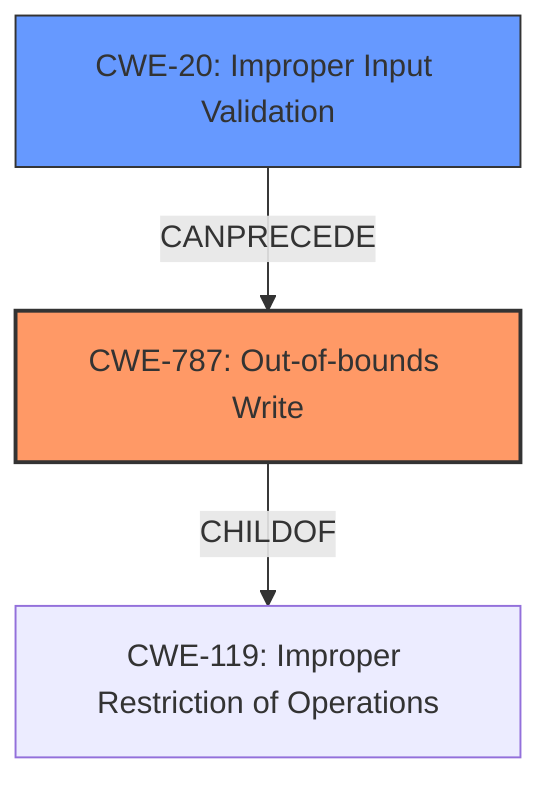

# Raw Analyzer Response for CVE-2024-9730

# Summary
| CWE ID | CWE Name | Confidence | CWE Abstraction Level | CWE Vulnerability Mapping Label | CWE-Vulnerability Mapping Notes |
|---|---|---|---|---|---|
| CWE-787 | Out-of-bounds Write | 1.0 | Base | Primary | Allowed |
| CWE-20 | Improper Input Validation | 0.7 | Class | Secondary | Discouraged |

## Evidence and Confidence

*   **Confidence Score:** 0.9
*   **Evidence Strength:** HIGH

## Relationship Analysis
The primary weakness is identified as CWE-787, which stems from a **lack of proper input validation** (CWE-20). CWE-787 is a Base level CWE, providing a specific description of the **out-of-bounds write** condition, while CWE-20 is a Class level CWE representing a more general case of **improper input validation**. The relationship between them is that **improper input validation** can lead to an **out-of-bounds write** if user-supplied data isn't properly checked before being used to write to memory. The Retriever results suggested other buffer overflow related CWEs such as CWE-121 (Stack-based Buffer Overflow) and CWE-122 (Heap-based Buffer Overflow), but the description doesn't give enough information to determine stack vs heap, so CWE-787 is more appropriate.

## Vulnerability Chain
The vulnerability chain starts with **lack of proper input validation** (CWE-20), which leads to a **memory corruption** condition due to an **out-of-bounds write** (CWE-787). This, in turn, allows a remote attacker to execute arbitrary code.

CWE-20 (Improper Input Validation) -> CWE-787 (Out-of-bounds Write) -> Arbitrary Code Execution

## Summary of Analysis
The vulnerability description clearly states that the root cause is the **lack of proper validation of user-supplied data**, leading to **memory corruption**. The primary CWE, CWE-787 (Out-of-bounds Write), accurately reflects the memory corruption condition, while CWE-20 (Improper Input Validation) describes the root cause. The evidence supporting this includes:

*   "The issue results from the **lack of proper validation of user-supplied data**, which can result in a **memory corruption** condition."
*   "An attacker can leverage this vulnerability to execute code in the context of the current process."

CWE-787 is at the Base level of abstraction, providing a specific description of the vulnerability. CWE-20 is a Class-level CWE, and while it is the root cause, it is discouraged as a primary mapping, so it is used as a secondary mapping.
CWE-119 (Improper Restriction of Operations within the Bounds of a Memory Buffer) was considered, but it's a more general case, and CWE-787 provides a more specific description of the **out-of-bounds write** condition.

Other CWEs considered but not used:

*   CWE-125 (Out-of-bounds Read): The description focuses on memory corruption, implying a write operation rather than a read.
*   CWE-94 (Improper Control of Generation of Code ('Code Injection')): The description mentions arbitrary code execution as an impact, but the root cause is **memory corruption** due to **improper input validation**, not code injection directly.
*   CWE-122 (Heap-based Buffer Overflow) and CWE-121 (Stack-based Buffer Overflow): While buffer overflows can occur on the heap or stack, the description doesn't provide enough information to specify the memory location, so the more general CWE-787 is more appropriate.