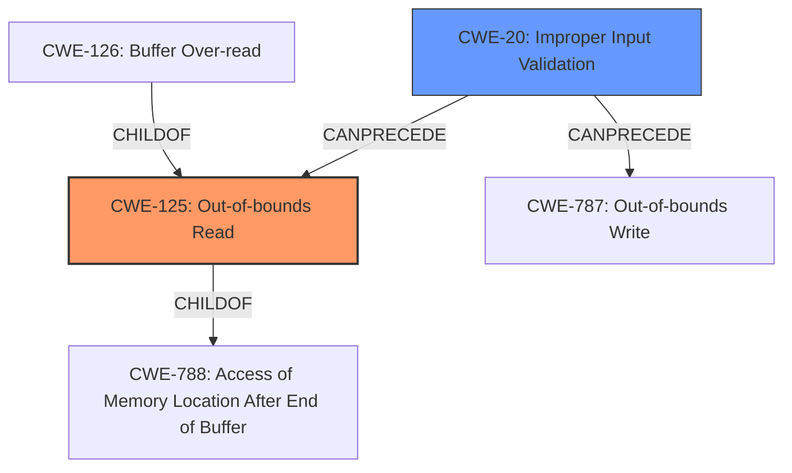

# Analysis for CVE-2024-9753

# Summary
| CWE ID  | CWE Name                                                                   | Confidence | CWE Abstraction Level | CWE Vulnerability Mapping Label | CWE-Vulnerability Mapping Notes |
| :-------- | :------------------------------------------------------------------------- | :--------- | :-------------------- | :------------------------------ | :------------------------------ |
| CWE-125   | Out-of-bounds Read                                                         | 0.9        | Base                  | Primary                         | Allowed                       |
| CWE-20    | Improper Input Validation                                                    | 0.8        | Class                 | Secondary                       | Allowed                       |

## Evidence and Confidence

*   **Confidence Score:** 0.85
*   **Evidence Strength:** HIGH

## Relationship Analysis

The primary weakness is CWE-125 [CWE-125: Out-of-bounds Read], which occurs due to **lack of proper validation of user-supplied data**. This **lack of proper validation of user-supplied data** is represented by CWE-20 [CWE-20: Improper Input Validation]. CWE-125 [CWE-125: Out-of-bounds Read] is a Base level CWE, representing a specific type of read error. CWE-20 [CWE-20: Improper Input Validation] is a Class level CWE, representing a more general weakness. CWE-20 [CWE-20: Improper Input Validation] can precede CWE-125 [CWE-125: Out-of-bounds Read], as **improper input validation** can lead to out-of-bounds reads.

## Vulnerability Chain

The vulnerability chain starts with **lack of proper validation of user-supplied data** (CWE-20 [CWE-20: Improper Input Validation]), leading to an **out-of-bounds read** (CWE-125 [CWE-125: Out-of-bounds Read]), and finally resulting in **information disclosure**.

## Summary of Analysis

The primary CWE is CWE-125 [CWE-125: Out-of-bounds Read] because the vulnerability description explicitly mentions an **out-of-bounds read**. The **root cause** is the **lack of proper validation of user-supplied data**, which is represented by CWE-20 [CWE-20: Improper Input Validation]. Therefore, CWE-20 [CWE-20: Improper Input Validation] is a secondary CWE.

The description states, "The issue results from the **lack of proper validation of user-supplied data**, which can result in a read past the end of an allocated object." This clearly indicates that the **lack of proper validation** leads to the **out-of-bounds read**. The impact of this vulnerability is **information disclosure**, as mentioned in the description: "This vulnerability allows remote attackers to disclose sensitive information..."

I considered CWE-787 [CWE-787: Out-of-bounds Write], but it is not the correct CWE because the vulnerability involves reading data past the end of an allocated object, not writing. Similarly, I considered CWE-126 [CWE-126: Buffer Over-read], but CWE-125 [CWE-125: Out-of-bounds Read] is more appropriate because the description does not explicitly mention the use of buffer access mechanisms like indexes or pointers.