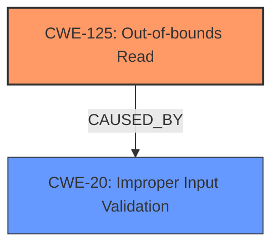

# Analysis for CVE-2024-9755

# Summary
| CWE ID  | CWE Name                                                               | Confidence | CWE Abstraction Level | CWE Vulnerability Mapping Label | CWE-Vulnerability Mapping Notes |
| :-------- | :--------------------------------------------------------------------- | :--------- | :-------------------- | :------------------------------ | :------------------------------ |
| CWE-125   | Out-of-bounds Read                                                     | 0.9        | Base                  | Primary                         | Allowed                         |
| CWE-20    | Improper Input Validation                                              | 0.7        | Class                 | Secondary                       | Discouraged                     |

## Evidence and Confidence

*   **Confidence Score:** 0.8
*   **Evidence Strength:** HIGH

## Relationship Analysis

The primary relationship is that CWE-125 [CWE-125: Out-of-bounds Read] is a base CWE that describes the specific type of memory access error. CWE-20 [CWE-20: Improper Input Validation] is a class-level CWE and represents a more general cause. The relationship is that **improper input validation** (CWE-20) can lead to an **out-of-bounds read** (CWE-125). In this case, the **lack of proper validation** is the root cause that enables the out-of-bounds read. There isn't a direct parent-child relationship between these two, but CWE-125 is often caused by missing or inadequate input validation.

## Vulnerability Chain

The vulnerability chain starts with **improper input validation** (CWE-20) when parsing JP2 files. This **lack of validation** leads to an **out-of-bounds read** (CWE-125), where the software reads data past the end of an allocated buffer. The impact of this out-of-bounds read is that it allows a remote attacker to execute arbitrary code within the context of the current process.

CWE-20 (Improper Input Validation) -> CWE-125 (Out-of-bounds Read) -> Remote Code Execution

## Summary of Analysis

The initial assessment identified CWE-125 [CWE-125: Out-of-bounds Read] as the primary weakness, directly supported by the vulnerability description and the CVE reference summary. The description explicitly mentions an "Out-Of-Bounds Read" and that the vulnerability is due to a **lack of proper validation of user-supplied data** when parsing JP2 files, leading to a read past the end of an allocated object.

The Retriever Results and graph-based analysis reinforced this assessment by highlighting the relationship between input validation and out-of-bounds read vulnerabilities. While CWE-787 [CWE-787: Out-of-bounds Write] was suggested by the Primary CWE Match and Top CWEs, the vulnerability description specifies an "Out-of-Bounds Read", making CWE-125 the more accurate choice.

CWE-20 [CWE-20: Improper Input Validation] was considered as a secondary CWE, as it represents the root cause that enables the out-of-bounds read. While CWE-20 is a class-level CWE and is generally discouraged when more specific CWEs are available, in this case, it accurately describes the **lack of proper validation** that leads to the vulnerability.

The selected CWEs are at the optimal level of specificity, with CWE-125 being a base-level CWE that directly describes the type of memory access error, and CWE-20 being a class-level CWE that describes the root cause of the vulnerability.

Relevant CWE Information:
# Enhanced Context (25 CWEs)
## CWE-125: Out-of-bounds Read
**Abstraction Level**: Base
**Similarity Score**: 0.71
**Source**: dense

**Description**:
The product reads data past the end, or before the beginning, of the intended buffer.

**Mapping Guidance**:
- Usage: Allowed
- Rationale: This CWE entry is at the Base level of abstraction, which is a preferred level of abstraction for mapping to the root causes of vulnerabilities.

## CWE-20: Improper Input Validation
**Abstraction Level**: Class
**Similarity Score**: 915.25
**Source**: sparse

**Description**:
The product receives input or data, but it does
        not validate or incorrectly validates that the input has the
        properties that are required to process the data safely and
        correctly.

**Mapping Guidance**:
- Usage: Discouraged
- Rationale: CWE-20 is commonly misused in low-information vulnerability reports when lower-level CWEs could be used instead, or when more details about the vulnerability are available [REF-1287]. It is not useful for trend analysis. It is also a level-1 Class (i.e., a child of a Pillar).