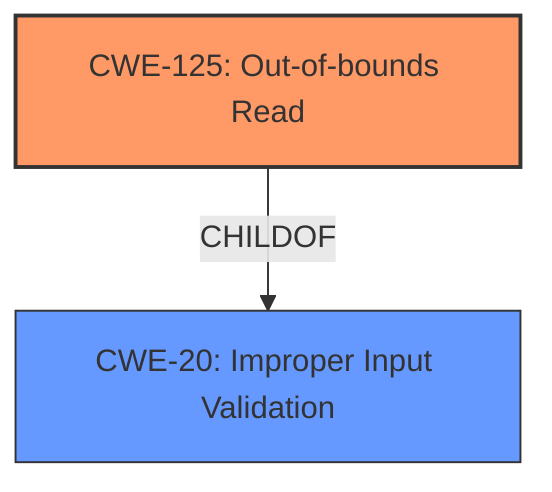

# Analysis Report for CVE-2024-9758

# Vulnerability Analysis Report: CVE-2024-9758

## Description

Tungsten Automation Power PDF AcroForm Annotation **Out-Of-Bounds Read** **Information Disclosure Vulnerability**. This vulnerability allows remote attackers to disclose sensitive information on affected installations of Tungsten Automation Power PDF. User interaction is required to exploit this vulnerability in that the target must visit a malicious page or open a malicious file. The specific flaw exists within the handling of Annotation objects. The issue results from the **lack of proper validation of user-supplied data**, which can result in a read past the end of an allocated buffer. An attacker can leverage this in conjunction with other vulnerabilities to execute arbitrary code in the context of the current process. Was ZDI-CAN-24474.

## Vulnerability Description Key Phrases

- **Rootcause:** lack of proper validation of user-supplied data
- **Weakness:** ['Information Disclosure Vulnerability', 'Out-Of-Bounds Read']
- **Impact:** ['disclose sensitive information', 'execute arbitrary code', 'information disclosure']
- **Vector:** malicious page or open a malicious file
- **Attacker:** remote attackers
- **Product:** Tungsten Automation Power PDF
- **Component:** AcroForm Annotation

## Analysis (with Relationship Data)

# Summary
| CWE ID  | CWE Name                                                                    | Confidence | CWE Abstraction Level | CWE Vulnerability Mapping Label | CWE-Vulnerability Mapping Notes |
| :-------- | :-------------------------------------------------------------------------- | :--------- | :---------------------- | :------------------------------ | :------------------------------ |
| CWE-125   | Out-of-bounds Read                                                        | 0.9        | Base                    | Primary                         | Allowed                       |
| CWE-20    | Improper Input Validation                                                 | 0.7        | Base                    | Secondary                       | Allowed                       |

## Evidence and Confidence

*   **Confidence Score:** 0.8
*   **Evidence Strength:** HIGH

## Relationship Analysis
The primary weakness is CWE-125 [Out-of-bounds Read], which can occur when input validation is missing or insufficient. CWE-20 [Improper Input Validation] is a parent of CWE-125. Therefore, the vulnerability chain starts with **improper input validation** and results in an **out-of-bounds read**. The base level CWEs are preferred because they are more specific.



## Vulnerability Chain
The vulnerability chain starts with **lack of proper validation of user-supplied data** (CWE-20 [Improper Input Validation]), which leads to an **out-of-bounds read** (CWE-125 [Out-of-bounds Read]) and results in **information disclosure**.

## Summary of Analysis
The primary issue is that the **lack of proper validation of user-supplied data** leads to an **out-of-bounds read**. The vulnerability description states that the issue results from the **lack of proper validation of user-supplied data**, which can result in a read past the end of an allocated buffer.

CWE-125 [Out-of-bounds Read] is a more accurate and specific description of the vulnerability than CWE-20 [Improper Input Validation]. CWE-20 [Improper Input Validation] is a general weakness, while CWE-125 [Out-of-bounds Read] describes the specific type of memory access violation that occurs.

Relevant CWE Information:

**CWE-125: Out-of-bounds Read**: The product reads data past the end, or before the beginning, of the intended buffer.
**CWE-20: Improper Input Validation**: The product receives input or data, but it does not validate or incorrectly validates that the input has the properties that are required to process the data safely and correctly.


## CWE Relationship Analysis

Current CWEs represent these abstraction levels: .


### Vulnerability Chain Analysis

**Chain starting from CWE-20:**
- 20 (Improper Input Validation) - ROOT


**Chain starting from CWE-125:**
- 125 (Out-of-bounds Read) - ROOT


### CWE Relationship Diagram

```mermaid
graph TD
    classDef primary fill:#f96,stroke:#333,stroke-width:2px
    classDef secondary fill:#69f,stroke:#333
    classDef tertiary fill:#9e9,stroke:#333
```


*Report generated on 2025-07-14 05:09:23*
