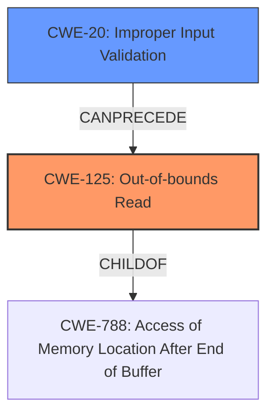

# Analysis Report for CVE-2024-9761

# Vulnerability Analysis Report: CVE-2024-9761

## Description

Tungsten Automation Power PDF PDF File Parsing **Out-Of-Bounds Read** **Information Disclosure Vulnerability**. This vulnerability allows remote attackers to disclose sensitive information on affected installations of Tungsten Automation Power PDF. User interaction is required to exploit this vulnerability in that the target must visit a malicious page or open a malicious file. The specific flaw exists within the parsing of PDF files. The issue results from the **lack of proper validation of user-supplied data**, which can result in a read past the end of an allocated buffer. An attacker can leverage this in conjunction with other vulnerabilities to execute arbitrary code in the context of the current process. Was ZDI-CAN-24477.

## Vulnerability Description Key Phrases

- **Rootcause:** lack of proper validation of user-supplied data
- **Weakness:** ['Information Disclosure Vulnerability', 'Out-Of-Bounds Read']
- **Impact:** ['disclose sensitive information', 'execute arbitrary code', 'information disclosure']
- **Vector:** malicious page or file
- **Attacker:** remote attackers
- **Product:** Tungsten Automation Power PDF
- **Component:** PDF file parsing

## Analysis (with Relationship Data)

# Summary
| CWE ID | CWE Name | Confidence | CWE Abstraction Level | CWE Vulnerability Mapping Label | CWE-Vulnerability Mapping Notes |
|---|---|---|---|---|---|
| CWE-125 | Out-of-bounds Read | 1.0 | Base | Primary | Allowed |
| CWE-20 | Improper Input Validation | 0.8 | Class | Secondary | Allowed |

## Evidence and Confidence

*   **Confidence Score:** 0.9
*   **Evidence Strength:** HIGH

## Relationship Analysis
The primary relationship is that **CWE-20** Improper Input Validation can precede **CWE-125** Out-of-bounds Read. **CWE-125** is a child of **CWE-788** Access of Memory Location After End of Buffer. **CWE-125** is a more specific Base level CWE. **CWE-20** is a higher level Class CWE.



## Vulnerability Chain
The vulnerability chain starts with **CWE-20** Improper Input Validation, which leads to **CWE-125** Out-of-bounds Read, ultimately resulting in Information Disclosure.

## Summary of Analysis
The initial assessment focused on identifying the root cause and the resulting weakness. The primary **WEAKNESS** is the **Out-Of-Bounds Read** itself, which directly leads to the **IMPACT** of information disclosure. The **ROOTCAUSE** is the **lack of proper validation of user-supplied data**.

Based on the provided evidence: "The issue results from the **lack of proper validation of user-supplied data**, which can result in a read past the end of an allocated buffer."

**CWE-125** Out-of-bounds Read is the most accurate representation of the vulnerability because the description explicitly states that the issue results in a read past the end of an allocated buffer.

**CWE-20** Improper Input Validation is included as a secondary CWE because the root cause is the **lack of proper validation of user-supplied data**.

The graph relationships support this selection by showing how **CWE-20** can precede **CWE-125**. The selected CWEs are at the optimal level of specificity, with **CWE-125** being a Base level CWE and **CWE-20** being a Class level CWE that describes the root cause.

# Relevant CWE Information:

## CWE-125: Out-of-bounds Read
The product reads data past the end, or before the beginning, of the intended buffer. This aligns directly with the vulnerability description: "The issue results from the **lack of proper validation of user-supplied data**, which can result in a read past the end of an allocated buffer." The security implication is information disclosure, as sensitive data outside the intended buffer can be accessed. This is the primary **WEAKNESS**.

## CWE-20: Improper Input Validation
The product receives input or data, but it does not validate or incorrectly validates that the input has the properties that are required to process the data safely and correctly. This is the root cause of the vulnerability, as the **lack of proper validation of user-supplied data** allows the out-of-bounds read to occur. This is the primary **ROOTCAUSE**.

### Considered but not used:

*   CWE-787: Out-of-bounds Write - This CWE was considered but not selected as the primary CWE because the vulnerability description specifically mentions a read past the end of the buffer, not a write.
*   CWE-1284: Improper Validation of Specified Quantity in Input - While input validation is a factor, this CWE is more specific to quantity, and the description doesn't indicate that quantity is the primary issue.
*   CWE-122: Heap-based Buffer Overflow and CWE-121: Stack-based Buffer Overflow - These CWEs describe buffer overflows, but the description only mentions an out-of-bounds read, not an overflow.


## CWE Relationship Analysis

Current CWEs represent these abstraction levels: .


### Vulnerability Chain Analysis

**Chain starting from CWE-1284:**
- 1284 (Improper Validation of Specified Quantity in Input) - ROOT


**Chain starting from CWE-121:**
- 121 (Stack-based Buffer Overflow) - ROOT


### CWE Relationship Diagram

```mermaid
graph TD
    classDef primary fill:#f96,stroke:#333,stroke-width:2px
    classDef secondary fill:#69f,stroke:#333
    classDef tertiary fill:#9e9,stroke:#333
```


*Report generated on 2025-07-14 05:10:09*
