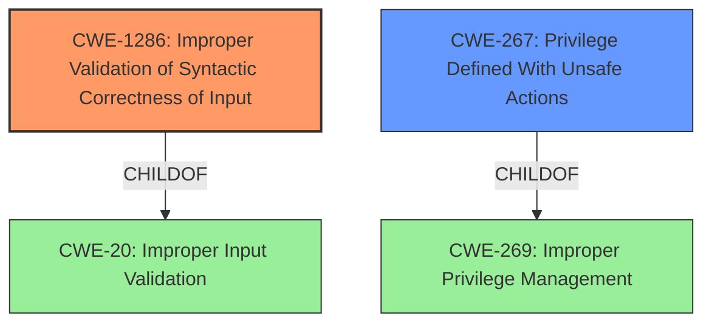

# Analysis Report for CVE-2024-9773

# Vulnerability Analysis Report: CVE-2024-9773

## Description

An issue was discovered in GitLab EE affecting all versions starting from 14.9 before 17.8.6, all versions starting from 17.9 before 17.8.3, all versions starting from 17.10 before 17.10.1. An **input validation issue** in the Harbor registry integration could have allowed a maintainer to add malicious code to the CLI commands shown in the UI.

## Vulnerability Description Key Phrases

- **Rootcause:** input validation issue
- **Impact:** add malicious code
- **Attacker:** maintainer
- **Product:** GitLab EE
- **Version:** all versions from 14.9 to 17.8.6, all versions from 17.9 to 17.8.3, all versions from 17.10 to 17.10.1
- **Component:** Harbor registry integration

## Analysis (with Relationship Data)

# Summary
| CWE ID | CWE Name | Confidence | CWE Abstraction Level | CWE Vulnerability Mapping Label | CWE-Vulnerability Mapping Notes |
|---|---|---|---|---|---|
| CWE-1286 | Improper Validation of Syntactic Correctness of Input | 0.8 | Base | Primary | Allowed |
| CWE-267 | Privilege Defined With Unsafe Actions | 0.5 | Base | Secondary | Allowed |

## Evidence and Confidence

*   **Confidence Score:** 0.7
*   **Evidence Strength:** MEDIUM

## Relationship Analysis
The primary CWE is CWE-1286 which is a base level CWE. There are no parent-child relationships that influence this decision. CWE-1286 is related to CWE-20, Improper Input Validation, but the vulnerability description is specific to syntactic correctness. CWE-267 is related to CWE-269, Improper Privilege Management, which is a child.



## Vulnerability Chain
The vulnerability chain starts with **improper input validation** (CWE-1286). This leads to the ability to add malicious code to CLI commands, potentially exploiting **unsafe actions** associated with maintainer privileges (CWE-267).

## Summary of Analysis
The primary weakness is the **input validation issue** which allows an attacker to add malicious code. The report states "An **input validation issue** in the Harbor registry integration could have allowed a maintainer to add malicious code to the CLI commands shown in the UI."

CWE-1286, Improper Validation of Syntactic Correctness of Input, is chosen as the primary CWE because the description explicitly mentions an **input validation issue**. This aligns with the CWE's focus on validating that input complies with a certain syntax.
CWE-267, Privilege Defined With Unsafe Actions, is chosen as a secondary CWE because the maintainer role is being used to add malicious code which could be construed as an unsafe action.

Other CWEs Considered:

*   CWE-863, Incorrect Authorization, CWE-285, Improper Authorization: These were considered but deemed less relevant than CWE-1286 because the core issue is about validating the input, not the authorization itself.
*   CWE-400, Uncontrolled Resource Consumption, and CWE-1333, Inefficient Regular Expression Complexity: These are related to performance and complexity, which are not mentioned in the vulnerability description.
*   CWE-88, Improper Neutralization of Argument Delimiters in a Command ('Argument Injection'): This is related to command injection, but the vulnerability description does not explicitly state that the malicious code is being injected into a command.
*   CWE-22, Improper Limitation of a Pathname to a Restricted Directory ('Path Traversal'): This is not relevant as pathnames are not mentioned.


## CWE Relationship Analysis

Current CWEs represent these abstraction levels: .


### Vulnerability Chain Analysis

**Chain starting from CWE-863:**
- 863 (Incorrect Authorization) - ROOT


**Chain starting from CWE-400:**
- 400 (Uncontrolled Resource Consumption) - ROOT


### CWE Relationship Diagram

```mermaid
graph TD
    classDef primary fill:#f96,stroke:#333,stroke-width:2px
    classDef secondary fill:#69f,stroke:#333
    classDef tertiary fill:#9e9,stroke:#333
```


*Report generated on 2025-07-14 05:11:18*
