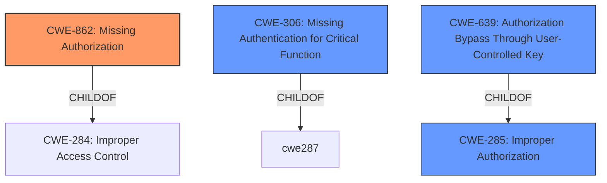

# Raw Analyzer Response for CVE-2024-9821

# Summary
| CWE ID | CWE Name | Confidence | CWE Abstraction Level | CWE Vulnerability Mapping Label | CWE-Vulnerability Mapping Notes |
|---|---|---|---|---|---|
| CWE-862 | Missing Authorization | 1.0 | Class |  | Allowed-with-Review, Primary CWE |
| CWE-306 | Missing Authentication for Critical Function | 0.7 | Base |  | Allowed, Secondary Candidate |
| CWE-639 | Authorization Bypass Through User-Controlled Key | 0.6 | Base |  | Allowed, Secondary Candidate |
| CWE-285 | Improper Authorization | 0.5 | Class |  | Discouraged, Secondary Candidate |

## Evidence and Confidence

*   **Confidence Score:** 0.9
*   **Evidence Strength:** HIGH

## Relationship Analysis
The primary CWE is CWE-862, indicating a **missing authorization** check. CWE-862 is a class-level CWE. Although the vulnerability description indicates that an authenticated user needs to be present, the core issue is that there's no check to ensure the user has the necessary privileges to access the `stm_wpcfto_get_settings` AJAX action. The other CWEs considered were CWE-306, CWE-639, and CWE-285.

## Vulnerability Chain
The vulnerability chain begins with the **missing authorization check** (CWE-862) on the `stm_wpcfto_get_settings` AJAX action. This leads to sensitive information disclosure (the Telegram Bot Token), which can then be used to bypass authentication and log in as any existing user, resulting in complete account takeover and full compromise of the WordPress site.

## Summary of Analysis
The initial assessment focused on the **missing authorization check** as the root cause, aligning with CWE-862. The retriever results and the provided context both support this classification. The vulnerability description explicitly mentions "**missing authorization checks**" on the AJAX action, which directly corresponds to CWE-862. The information provided is sufficient to make a confident decision. The other CWEs considered were rejected or marked as secondary candidates because they did not fit the description as well as CWE-862. Specifically, while CWE-306 (Missing Authentication) was considered, the presence of an authenticated user already excludes that as the primary weakness; it is the **lack of authorization** after authentication that is the core issue. The selection of CWE-862 is at the optimal level of specificity because it directly addresses the **missing authorization** problem without being overly broad or abstract. The "**missing authorization checks**" vulnerability description key phrase supports this.

Relevant CWE Information:

# Enhanced Context (25 CWEs)
The following CWEs were identified as potentially relevant to this vulnerability:

## CWE-862: Missing Authorization
**Abstraction Level**: Class
**Similarity Score**: 1993.96
**Source**: sparse

**Description**:
The product does not perform an authorization check when an actor attempts to access a resource or perform an action.

**Mapping Guidance**:
- Usage: Allowed-with-Review
- Rationale: This CWE entry is a Class and might have Base-level children that would be more appropriate

## CWE-306: Missing Authentication for Critical Function
**Abstraction Level**: Base
**Similarity Score**: 1965.29
**Source**: sparse

**Description**:
The product does not perform any authentication for functionality that requires a provable user identity or consumes a significant amount of resources.

**Mapping Guidance**:
- Usage: Allowed
- Rationale: This CWE entry is at the Base level of abstraction, which is a preferred level of abstraction for mapping to the root causes of vulnerabilities.

## CWE-639: Authorization Bypass Through User-Controlled Key
**Abstraction Level**: Base
**Similarity Score**: 2030.87
**Source**: sparse

**Description**:
The system's authorization functionality does not prevent one user from gaining access to another user's data or record by modifying the key value identifying the data.

**Mapping Guidance**:
- Usage: Allowed
- Rationale: This CWE entry is at the Base level of abstraction, which is a preferred level of abstraction for mapping to the root causes of vulnerabilities.

## CWE-285: Improper Authorization
**Abstraction Level**: Class
**Similarity Score**: 2039.35
**Source**: sparse

**Description**:
The product does not perform or incorrectly performs an authorization check when an actor attempts to access a resource or perform an action.

**Mapping Guidance**:
- Usage: Discouraged
- Rationale: CWE-285 is high-level and lower-level CWEs can frequently be used instead. It is a level-1 Class (i.e., a child of a Pillar).