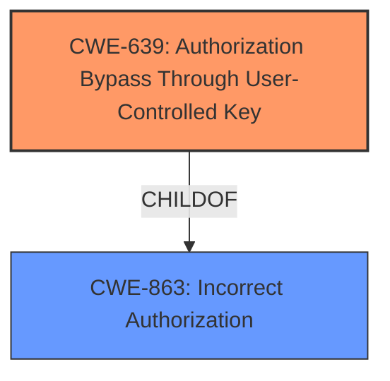

# Analysis Report for CVE-2024-9825

# Vulnerability Analysis Report: CVE-2024-9825

## Description

The Chef Habitat builder-api on-prem-builder package with any version lower than habitat/builder-api/10315/20240913162802 is vulnerable to **indirect object reference (IDOR)** by un-authorized deletion of personal token. Habitat builder consumes builder-api habitat package as a dependency and the vulnerability was specifically due to builder-api habitat package. The fix was made available in habitat/builder-api/10315/20240913162802 and all the subsequent versions after that. We would recommend user to always use on-prem stable channel.

## Vulnerability Description Key Phrases

- **Weakness:** indirect object reference (IDOR)
- **Impact:** un-authorized deletion of personal token
- **Product:** Chef Habitat builder-api on-prem-builder package
- **Version:** any version lower than habitat/builder-api/10315/20240913162802

## Analysis (with Relationship Data)

# Summary
| CWE ID | CWE Name | Confidence | CWE Abstraction Level | CWE Vulnerability Mapping Label | CWE-Vulnerability Mapping Notes |
|---|---|---|---|---|---|
| CWE-639 | Authorization Bypass Through User-Controlled Key | 0.9 | Base | Allowed | Primary CWE: The system's authorization functionality does not prevent one user from gaining access to another user's data or record by modifying the key value identifying the data. |
| CWE-863 | Incorrect Authorization | 0.6 | Class | Allowed-with-Review | Secondary Candidate: The product performs an authorization check when an actor attempts to access a resource or perform an action, but it does not correctly perform the check. |

## Evidence and Confidence

*   **Confidence Score:** 0.9
*   **Evidence Strength:** MEDIUM

## Relationship Analysis
The primary CWE is CWE-639 (Authorization Bypass Through User-Controlled Key), which is a base-level CWE. CWE-863 (Incorrect Authorization) is a class-level CWE and a parent of CWE-639, representing a broader category of authorization issues. Choosing CWE-639 provides a more specific classification of the vulnerability.



## Vulnerability Chain
The vulnerability chain starts with an **indirect object reference (IDOR)** due to **improper authorization**, leading to the unauthorized deletion of personal tokens.
- **Root Cause:** **Indirect Object Reference (IDOR)** via **Authorization Bypass Through User-Controlled Key** (CWE-639)
- **Impact:** Unauthorized deletion of personal token.

## Summary of Analysis
The primary weakness is an **indirect object reference (IDOR)** that allows unauthorized deletion of personal tokens. The retriever results point to CWE-639 (Authorization Bypass Through User-Controlled Key) as the most relevant CWE. The vulnerability description states that the issue is caused by an "un-authorized deletion of personal token". CWE-639 describes a scenario where the system's authorization functionality doesn't prevent one user from gaining access to another user's data by modifying the key value identifying the data. This aligns well with the vulnerability description where an attacker could potentially modify a key to delete personal tokens they shouldn't have access to.

CWE-863 (Incorrect Authorization) is a more general class-level CWE that encompasses various authorization failures. While applicable, CWE-639 provides a more specific description of the **authorization bypass** mechanism (user-controlled key), making it a more accurate representation of the vulnerability.

I am confident in the assessment that CWE-639 is the primary weakness with a confidence score of 0.9.

Relevant CWE Information:

# Enhanced Context (25 CWEs)
The following CWEs were identified as potentially relevant to this vulnerability:

## CWE-267: Privilege Defined With Unsafe Actions
**Abstraction Level**: Base
**Similarity Score**: 0.67
**Source**: dense

**Description**:
A particular privilege, role, capability, or right can be used to perform unsafe actions that were not intended, even when it is assigned to the correct entity.

**Mapping Guidance**:
- Usage: Allowed
- Rationale: This CWE entry is at the Base level of abstraction, which is a preferred level of abstraction for mapping to the root causes of vulnerabilities.

*Not selected*: This CWE is related to privileges leading to unsafe actions. However, the identified vulnerability is a case of authorization bypass using a user-controlled key.

## CWE-212: Improper Removal of Sensitive Information Before Storage or Transfer
**Abstraction Level**: Base
**Similarity Score**: 0.66
**Source**: dense

**Description**:
The product stores, transfers, or shares a resource that contains sensitive information, but it does not properly remove that information before the product makes the resource available to unauthorized actors.

**Mapping Guidance**:
- Usage: Allowed
- Rationale: This CWE entry is at the Base level of abstraction, which is a preferred level of abstraction for mapping to the root causes of vulnerabilities.

*Not selected*: This CWE describes improper removal of sensitive information, which is not the case here.

## CWE-74: Improper Neutralization of Special Elements in Output Used by a Downstream Component ('Injection')
**Abstraction Level**: Class
**Similarity Score**: 0.66
**Source**: dense

**Description**:
The product constructs all or part of a command, data structure, or record using externally-influenced input from an upstream component, but it does not neutralize or incorrectly neutralizes special elements that could modify how it is parsed or interpreted when it is sent to a downstream component.

**Mapping Guidance**:
- Usage: Discouraged
- Rationale: CWE-74 is high-level and often misused when lower-level weaknesses are more appropriate.

*Not selected*: This CWE is about injection vulnerabilities, which is not the identified vulnerability.

## CWE-1391: Use of Weak Credentials
**Abstraction Level**: Class
**Similarity Score**: 0.66
**Source**: dense

**Description**:
The product uses weak credentials (such as a default key or hard-coded password) that can be calculated, derived, reused, or guessed by an attacker.

**Mapping Guidance**:
- Usage: Allowed-with-Review
- Rationale: This CWE entry is a Class and might have Base-level children that would be more appropriate

*Not selected*: This CWE is related to weak credentials, which is not the case here.

## CWE-497: Exposure of Sensitive System Information to an Unauthorized Control Sphere
**Abstraction Level**: Base
**Similarity Score**: 0.66
**Source**: dense

**Description**:
The product does not properly prevent sensitive system-level information from being accessed by unauthorized actors who do not have the same level of access to the underlying system as the product does.

**Mapping Guidance**:
- Usage: Allowed
- Rationale: This CWE entry is at the Base level of abstraction, which is a preferred level of abstraction for mapping to the root causes of vulnerabilities.

*Not selected*: This CWE refers to exposure of sensitive system information. While personal token deletion has security implications, the root cause isn't exposure, but rather unauthorized access.

## CWE-639: Authorization Bypass Through User-Controlled Key
**Abstraction Level**: Base
**Similarity Score**: 0.66
**Source**: dense

**Description**:
The system's authorization functionality does not prevent one user from gaining access to another user's data or record by modifying the key value identifying the data.

**Mapping Guidance**:
- Usage: Allowed
- Rationale: This CWE entry is at the Base level of abstraction, which is a preferred level of abstraction for mapping to the root causes of vulnerabilities.

*Selected*: The primary cause of the vulnerability is an authorization bypass due to the use of user-controlled keys, making this the most appropriate CWE.

## CWE-276: Incorrect Default Permissions
**Abstraction Level**: Base
**Similarity Score**: 0.66
**Source**: dense

**Description**:
During installation, installed file permissions are set to allow anyone to modify those files.

**Mapping Guidance**:
- Usage: Allowed
- Rationale: This CWE entry is at the Base level of abstraction, which is a preferred level of abstraction for mapping to the root causes of vulnerabilities.

*Not selected*: Incorrect default permissions are not the cause of the vulnerability here.

## CWE-807: Reliance on Untrusted Inputs in a Security Decision
**Abstraction Level**: Base
**Similarity Score**: 0.65
**Source**: dense

**Description**:
The product uses a protection mechanism that relies on the existence or values of an input, but the input can be modified by an untrusted actor in a way that bypasses the protection mechanism.

**Mapping Guidance**:
- Usage: Allowed
- Rationale: This CWE entry is at the Base level of abstraction, which is a preferred level of abstraction for mapping to the root causes of vulnerabilities.

*Not selected*: While user-controlled keys are untrusted inputs, CWE-639 captures the essence of authorization bypass through these keys better.

## CWE-668: Exposure of Resource to Wrong Sphere
**Abstraction Level**: Class
**Similarity Score**: 0.65
**Source**: dense

**Description**:
The product exposes a resource to the wrong control sphere, providing unintended actors with inappropriate access to the resource.

**Mapping Guidance**:
- Usage: Discouraged
- Rationale: CWE-668 is high-level and is often misused as a catch-all when lower-level CWE IDs might be applicable. It is sometimes used for low-information vulnerability reports [REF-1287]. It is a level-1 Class (i.e., a child of a Pillar). It is not useful for trend analysis.

*Not selected*: This CWE is a general case of exposing resources, but it's less specific than CWE-639.

## CWE-538: Insertion of Sensitive


## CWE Relationship Analysis

Current CWEs represent these abstraction levels: .


### Vulnerability Chain Analysis

**Chain starting from CWE-863:**
- 863 (Incorrect Authorization) - ROOT


**Chain starting from CWE-1391:**
- 1391 (Use of Weak Credentials) - ROOT


### CWE Relationship Diagram

```mermaid
graph TD
    classDef primary fill:#f96,stroke:#333,stroke-width:2px
    classDef secondary fill:#69f,stroke:#333
    classDef tertiary fill:#9e9,stroke:#333
```


*Report generated on 2025-07-14 05:12:57*
