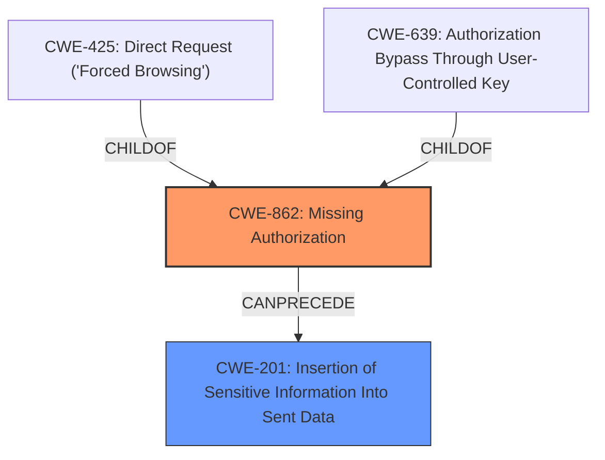

# Analysis Report for CVE-2024-9829

# Vulnerability Analysis Report: CVE-2024-9829

## Description

The Download Plugin plugin for WordPress is vulnerable to unauthorized access of data due to a **missing capability checks** on the dpwap_handle_download_user and dpwap_handle_download_comment functions in all versions up to, and including, 2.2.0. This makes it possible for authenticated attackers, with Subscriber-level access and above, to download any comment, and download metadata for any user including user PII and sensitive information including username, email, hashed passwords and application passwords, session token information and more depending on set up and additional plugins installed.

## Vulnerability Description Key Phrases

- **Rootcause:** missing capability checks
- **Impact:** unauthorized access of data
- **Attacker:** authenticated attackers with Subscriber-level access and above
- **Product:** Download Plugin plugin for WordPress
- **Version:** up to and including 2.2.0
- **Component:** ['dpwap_handle_download_user', 'dpwap_handle_download_comment functions']

## Analysis (with Relationship Data)

# Summary

| CWE ID  | CWE Name                             | Confidence | CWE Abstraction Level | CWE Vulnerability Mapping Label | CWE-Vulnerability Mapping Notes |
| ------- | ------------------------------------ | ---------- | --------------------- | ------------------------------- | ------------------------------- |
| CWE-862 | Missing Authorization                | 1          | Class                 | Primary                         | Allowed-with-Review             |
| CWE-201 | Insertion of Sensitive Information Into Sent Data | 0.7        | Base                 | Secondary                       | Allowed                         |

## Evidence and Confidence

*   **Confidence Score:** 0.9
*   **Evidence Strength:** HIGH

## Relationship Analysis

The primary CWE is CWE-862 (Missing Authorization), which is a Class-level CWE. CWE-425 (Direct Request ('Forced Browsing')) and CWE-639 (Authorization Bypass Through User-Controlled Key) are children of CWE-862, and are more specific. However, the description is primarily about the **missing** authorization check in the first place, making CWE-862 the most appropriate. CWE-201 (Insertion of Sensitive Information Into Sent Data) can occur after bypassing the authorization and exposing the sensitive information.



## Vulnerability Chain

The vulnerability chain starts with the **missing capability checks** (CWE-862), leading to unauthorized access of data, which then leads to the exposure of sensitive information (CWE-201).

## Summary of Analysis

The analysis identified the primary weakness as CWE-862 (Missing Authorization) due to the **missing capability checks** in the `dpwap_handle_download_user` and `dpwap_handle_download_comment` functions. This allows authenticated attackers with Subscriber-level access to download any comment and download metadata for any user. This corresponds directly with the definition of CWE-862: "The product does not perform an authorization check when an actor attempts to access a resource or perform an action." The code snippet confirms this, as the functions lack proper capability checks.

The vulnerability allows attackers to access user PII and sensitive information including username, email, hashed passwords and application passwords, session token information. This insertion of sensitive information is represented by CWE-201: Insertion of Sensitive Information Into Sent Data.

The selection of CWE-862 is based on the explicit statement that there are **missing capability checks**, which is the root cause of the vulnerability. The retriever results also list CWE-862 as the top candidate.

Relevant CWE Information:

# Enhanced Context (25 CWEs)
The following CWEs were identified as potentially relevant to this vulnerability:

## CWE-862: Missing Authorization
**Abstraction Level**: Class
**Similarity Score**: 0.73
**Source**: dense

**Description**:
The product does not perform an authorization check when an actor attempts to access a resource or perform an action.

**Mapping Guidance**:
- Usage: Allowed-with-Review
- Rationale: This CWE entry is a Class and might have Base-level children that would be more appropriate

## CWE-425: Direct Request ('Forced Browsing')
**Abstraction Level**: Base
**Similarity Score**: 0.73
**Source**: dense

**Description**:
The web application does not adequately enforce appropriate authorization on all restricted URLs, scripts, or files.

**Mapping Guidance**:
- Usage: Allowed
- Rationale: This CWE entry is at the Base level of abstraction, which is a preferred level of abstraction for mapping to the root causes of vulnerabilities.

## CWE-352: Cross-Site Request Forgery (CSRF)
**Abstraction Level**: Compound
**Similarity Score**: 0.73
**Source**: dense

**Description**:
The web application does not, or can not, sufficiently verify whether a well-formed, valid, consistent request was intentionally provided by the user who submitted the request.

**Mapping Guidance**:
- Usage: Allowed
- Rationale: This is a well-known Composite of multiple weaknesses that must all occur simultaneously, although it is attack-oriented in nature.

## CWE-434: Unrestricted Upload of File with Dangerous Type
**Abstraction Level**: Base
**Similarity Score**: 0.73
**Source**: dense

**Description**:
The product allows the upload or transfer of dangerous file types that are automatically processed within its environment.

**Mapping Guidance**:
- Usage: Allowed
- Rationale: This CWE entry is at the Base level of abstraction, which is a preferred level of abstraction for mapping to the root causes of vulnerabilities.

## CWE-639: Authorization Bypass Through User-Controlled Key
**Abstraction Level**: Base
**Similarity Score**: 0.72
**Source**: dense

**Description**:
The system's authorization functionality does not prevent one user from gaining access to another user's data or record by modifying the key value identifying the data.

**Mapping Guidance**:
- Usage: Allowed
- Rationale: This CWE entry is at the Base level of abstraction, which is a preferred level of abstraction for mapping to the root causes of vulnerabilities.

## CWE-201: Insertion of Sensitive Information Into Sent Data
**Abstraction Level**: Base
**Similarity Score**: 0.72
**Source**: dense

**Description**:
The code transmits data to another actor, but a portion of the data includes sensitive information that should not be accessible to that actor.

**Mapping Guidance**:
- Usage: Allowed
- Rationale: This CWE entry is at the Base level of abstraction, which is a preferred level of abstraction for mapping to the root causes of vulnerabilities.

## CWE-472: External Control of Assumed-Immutable Web Parameter
**Abstraction Level**: Base
**Similarity Score**: 0.72
**Source**: dense

**Description**:
The web application does not sufficiently verify inputs that are assumed to be immutable but are actually externally controllable, such as hidden form fields.

**Mapping Guidance**:
- Usage: Allowed
- Rationale: This CWE entry is at the Base level of abstraction, which is a preferred level of abstraction for mapping to the root causes of vulnerabilities.

## CWE-863: Incorrect Authorization
**Abstraction Level**: Class
**Similarity Score**: 0.70
**Source**: dense

**Description**:
The product performs an authorization check when an actor attempts to access a resource or perform an action, but it does not correctly perform the check.

**Mapping Guidance**:
- Usage: Allowed-with-Review
- Rationale: This CWE entry is a Class and might have Base-level children that would be more appropriate

## CWE-116: Improper Encoding or Escaping of Output
**Abstraction Level**: Class
**Similarity Score**: 0.70
**Source**: dense

**Description**:
The product prepares a structured message for communication with another component, but encoding or escaping of the data is either missing or done incorrectly. As a result, the intended structure of the message is not preserved.

**Mapping Guidance**:
- Usage: Allowed-with-Review
- Rationale: This CWE entry is a Class and might have Base-level children that would be more appropriate

## CWE-1390: Weak Authentication
**Abstraction Level**: Class
**Similarity Score**: 0.69
**Source**: dense

**Description**:
The product uses an authentication mechanism to restrict access to specific users or identities, but the mechanism does not sufficiently prove that the claimed identity is correct.

**Mapping Guidance**:
- Usage: Allowed-with-Review
- Rationale: This CWE entry is a Class and might have Base-level children that would be more appropriate

## CWE-862: Missing Authorization
**Abstraction Level**: Class
**Similarity Score**: 1484.73
**Source**: sparse

**Description**:
The product does not perform an authorization check when an actor attempts to access a resource or perform an action.

**Mapping Guidance**:
- Usage: Allowed-with-Review
- Rationale: This CWE entry is a Class and might have Base-level children that would be more appropriate

## CWE-863: Incorrect Authorization
**Abstraction Level**: Class
**Similarity Score**: 1476.49
**Source**: sparse

**Description**:
The product performs an authorization check when an actor attempts to access a resource or perform an action, but it does not correctly perform the check.

**Mapping Guidance**:
- Usage: Allowed-with-Review
- Rationale: This CWE entry is a Class and might have


## CWE Relationship Analysis

Current CWEs represent these abstraction levels: .


### Vulnerability Chain Analysis

**Chain starting from CWE-1390:**
- 1390 (Weak Authentication) - ROOT


**Chain starting from CWE-863:**
- 863 (Incorrect Authorization) - ROOT


### CWE Relationship Diagram

```mermaid
graph TD
    classDef primary fill:#f96,stroke:#333,stroke-width:2px
    classDef secondary fill:#69f,stroke:#333
    classDef tertiary fill:#9e9,stroke:#333
```


*Report generated on 2025-07-14 05:13:17*
