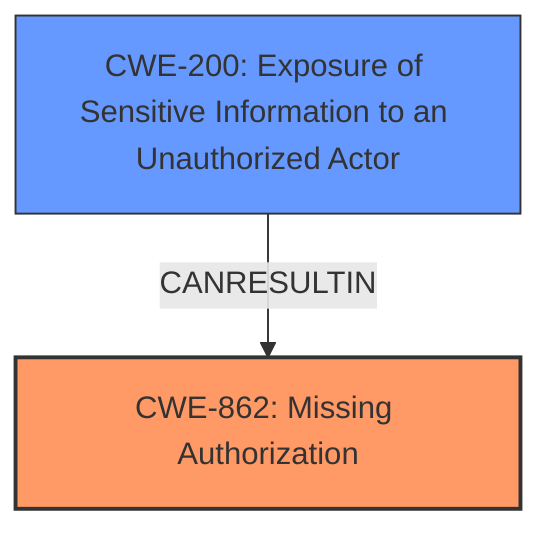

# Enhanced Analysis for CVE-2024-9889

# Summary
| CWE ID | CWE Name | Confidence | CWE Abstraction Level | CWE Vulnerability Mapping Label | CWE-Vulnerability Mapping Notes |
|---|---|---|---|---|---|
| CWE-862 | Missing Authorization | 0.9 | Class | Primary | Allowed-with-Review |
| CWE-200 | Exposure of Sensitive Information to an Unauthorized Actor | 0.7 | Base | Secondary | Allowed |

## Evidence and Confidence

*   **Confidence Score:** 0.8
*   **Evidence Strength:** HIGH

## Relationship Analysis
The primary relationship is that CWE-862 **Missing Authorization** can directly lead to CWE-200 **Exposure of Sensitive Information to an Unauthorized Actor**. CWE-862 is a Class-level CWE, while CWE-200 is a Base-level CWE. While it might seem more specific to directly map to CWE-200, the root cause is the **missing authorization** check, making CWE-862 more appropriate as the primary weakness.



## Vulnerability Chain
The vulnerability chain starts with the **missing authorization** check (CWE-862), which leads to the **exposure of sensitive information** (CWE-200). The chain is: Missing Authorization -> Information Exposure.

## Summary of Analysis
The initial analysis identified that the plugin is vulnerable to **sensitive information exposure** because it allows authenticated attackers with contributor-level access to view private/draft/password-protected posts, pages, and Elementor templates. The root cause is a **missing authorization** check. While it's tempting to directly map to CWE-200, the provided analysis highlights that the absence of authorization is the key issue.

The retriever results consistently point to CWE-862 **Missing Authorization** and CWE-863 **Incorrect Authorization** as highly relevant. However, the vulnerability description explicitly mentions that attackers can access resources they should not have access to, indicating a **missing authorization** check rather than an **incorrect** one. Therefore, CWE-862 is more appropriate.

CWE-200 is a valid secondary concern as it describes the impact of the **missing authorization**. The relationship analysis further supports this, as CWE-862 can lead to CWE-200.

The selection of CWE-862 is at the Class level, and although it's recommended to use Base or Variant levels when possible, there isn't a more specific CWE that accurately captures the **missing authorization** at a lower level.

*Evidence:*
"This makes it possible for authenticated attackers, with contributor-level access and above, to view private/draft/password protected posts, pages, and Elementor templates that they should not have access to." This quote points to resources being accessible without proper checks.

# Relevant CWE Information:
## CWE-862: Missing Authorization
**Abstraction:** Class.
The product does not perform an authorization check when an actor attempts to access a resource or perform an action.
## CWE-200: Exposure of Sensitive Information to an Unauthorized Actor
**Abstraction:** Base.
The product exposes sensitive information to an actor that is not explicitly authorized to have access to that information.


## CWE Relationship Analysis

Current CWEs represent these abstraction levels: .


### Vulnerability Chain Analysis

**Chain starting from CWE-863:**
- 863 (Incorrect Authorization) - ROOT


**Chain starting from CWE-200:**
- 200 (Exposure of Sensitive Information to an Unauthorized Actor) - ROOT


### CWE Relationship Diagram

```mermaid
graph TD
    classDef primary fill:#f96,stroke:#333,stroke-width:2px
    classDef secondary fill:#69f,stroke:#333
    classDef tertiary fill:#9e9,stroke:#333
```