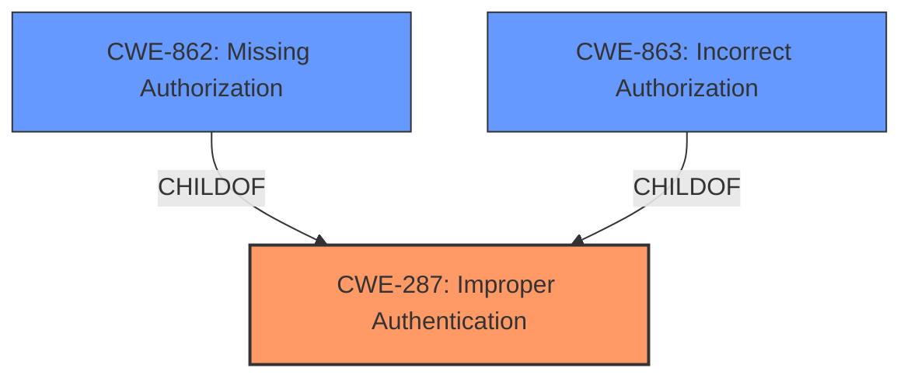

# Enhanced Analysis for CVE-2025-0070

# Summary
| CWE ID | CWE Name | Confidence | CWE Abstraction Level | CWE Vulnerability Mapping Label | CWE-Vulnerability Mapping Notes |
|---|---|---|---|---|---|
| CWE-287 | Improper Authentication | 0.9 | Class | Primary | Allowed-with-Review |
| CWE-862 | Missing Authorization | 0.7 | Class | Secondary | Allowed-with-Review |
| CWE-863 | Incorrect Authorization | 0.6 | Class | Secondary | Allowed-with-Review |

## Evidence and Confidence

*   **Confidence Score:** 0.8
*   **Evidence Strength:** MEDIUM

## Relationship Analysis
The primary CWE is CWE-287, Improper Authentication, which is a Class-level CWE. CWE-862 (Missing Authorization) and CWE-863 (Incorrect Authorization) were considered as secondary CWEs because the initial authentication **check was improper**, which could then lead to missing or incorrect authorization checks later on. The relationship between authentication and authorization is that authentication typically precedes authorization, meaning a flaw in authentication can lead to subsequent authorization issues.



## Vulnerability Chain
The vulnerability chain starts with **improper authentication checks** (CWE-287), leading to the potential for an attacker to obtain illegitimate access, potentially bypassing authorization checks or leading to **incorrect authorization** (CWE-863) or **missing authorization** (CWE-862). This results in privilege escalation and other security concerns such as impacts to confidentiality, integrity, and availability.
  - **Root Cause**: CWE-287: Improper Authentication
  - **Weakness**: CWE-862: Missing Authorization or CWE-863: Incorrect Authorization
  - **Impact**: Privilege escalation, security concerns, impacts to confidentiality, integrity, and availability.

## Summary of Analysis
The initial assessment identified the **improper authentication checks** as the primary root cause. The vulnerability description explicitly mentions this weakness, which aligns with the definition of CWE-287. The guidance on Authentication vs Authorization highlights that authentication issues should be mapped to CWE-306 or its children. However, since the issue is with the checks being **improper** rather than **missing**, CWE-287 is a better fit. The fact that an "authenticated attacker" can exploit this issue indicates that authentication is happening, but the checks are flawed.

CWE-862 and CWE-863 are included as secondary candidates since **improper authentication** can lead to subsequent authorization bypass or incorrect checks. These are at the optimal level of specificity given the information available.

The assessment is primarily based on the vulnerability description, specifically the phrase "**improper authentication checks**". The retriever results also support this by listing CWE-287 as a possible match.

Relevant CWE Information:
- CWE-287: Improper Authentication
- CWE-862: Missing Authorization
- CWE-863: Incorrect Authorization


## CWE Relationship Analysis

Current CWEs represent these abstraction levels: .


### Vulnerability Chain Analysis

**Chain starting from CWE-863:**
- 863 (Incorrect Authorization) - ROOT


**Chain starting from CWE-306:**
- 306 (Missing Authentication for Critical Function) - ROOT


### CWE Relationship Diagram

```mermaid
graph TD
    classDef primary fill:#f96,stroke:#333,stroke-width:2px
    classDef secondary fill:#69f,stroke:#333
    classDef tertiary fill:#9e9,stroke:#333
```