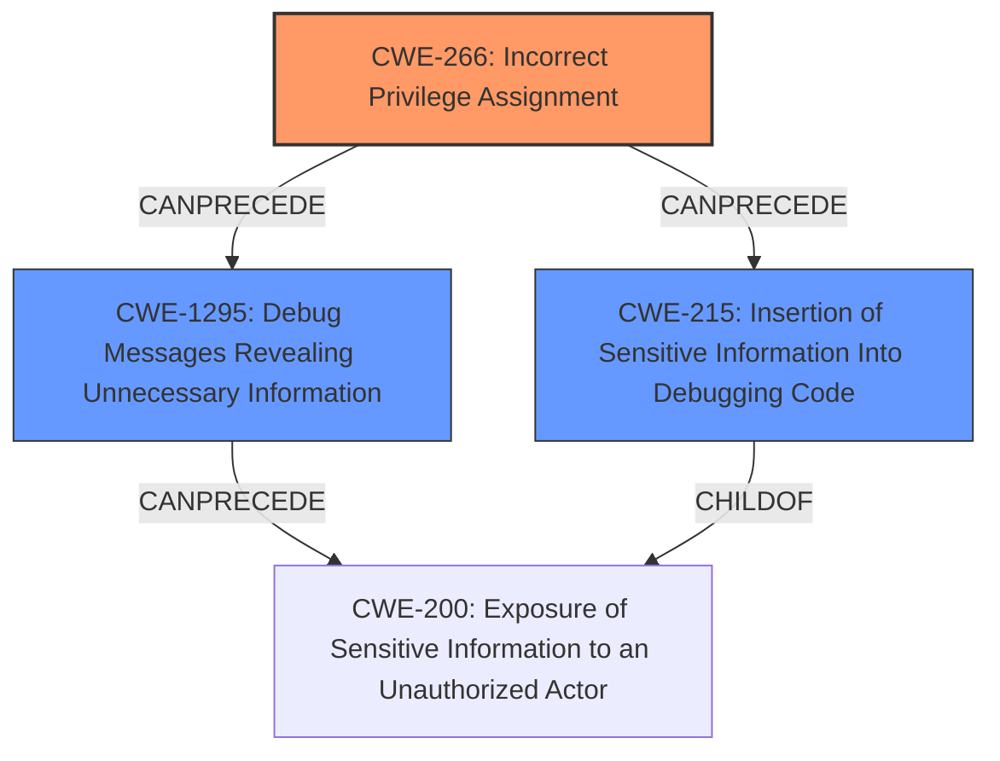

# Analysis Report for CVE-2025-0071

# Vulnerability Analysis Report: CVE-2025-0071

## Description

SAP Web Dispatcher and Internet Communication Manager allow an attacker with administrative privileges to enable debugging trace mode with a specific parameter value. This exposes unencrypted passwords in the logs, causing a high impact on the confidentiality of the application. There is no impact on integrity or availability.

## Vulnerability Description Key Phrases

- **Weakness:** lack of access control
- **Impact:** ['unencrypted passwords in logs', 'availability', 'integrity']
- **Vector:** specific parameter value
- **Attacker:** attacker with administrative privileges
- **Product:** SAP Web Dispatcher and Internet Communication Manager

## Analysis (with Relationship Data)

# Summary
| CWE ID | CWE Name | Confidence | CWE Abstraction Level | CWE Vulnerability Mapping Label | CWE-Vulnerability Mapping Notes |
|---|---|---|---|---|---|
| CWE-266 | Incorrect Privilege Assignment | 0.8 | Base | Allowed | Primary CWE |
| CWE-1295 | Debug Messages Revealing Unnecessary Information | 0.7 | Base | Allowed | Secondary Candidate |
| CWE-215 | Insertion of Sensitive Information Into Debugging Code | 0.6 | Base | Allowed | Secondary Candidate |

## Evidence and Confidence

*   **Confidence Score:** 0.8
*   **Evidence Strength:** MEDIUM

## Relationship Analysis
The primary relationship influencing the decision is the hierarchical relationship between CWE-266 (Incorrect Privilege Assignment) as a Base level CWE, and the general concept of access control. The vulnerability description indicates that an attacker with administrative privileges can enable debugging trace mode. This suggests that the attacker has been incorrectly assigned the privilege to perform this action, which leads to the exposure of sensitive information. CWE-1295 and CWE-215 are related to debugging information, and the vulnerability leads to exposing unencrypted passwords, so they are listed as secondary candidates.



## Vulnerability Chain
The vulnerability chain starts with the **incorrect assignment of privileges** (CWE-266) to an attacker. This allows the attacker to enable debugging trace mode, leading to the creation of **debug messages revealing unnecessary information** (CWE-1295) including unencrypted passwords. This ultimately results in the **exposure of sensitive information** (CWE-200) to unauthorized actors and the **insertion of sensitive information into debugging code** (CWE-215).

## Summary of Analysis
The initial assessment considered several CWEs related to access control, debugging, and information exposure. The primary weakness is the **lack of access control** that enables an attacker with administrative privileges to enable debugging trace mode. This leads to the exposure of unencrypted passwords in the logs.

The selection of CWE-266 is based on the fact that the attacker is able to perform an action (enabling debugging trace mode) that they should not be authorized to perform, suggesting an **incorrect privilege assignment**. The vulnerability description specifically mentions that the attacker has administrative privileges, which implies that the issue is not a complete lack of authentication (CWE-306) or authorization (CWE-862), but rather an incorrect assignment or management of those privileges.

CWE-1295 (Debug Messages Revealing Unnecessary Information) and CWE-215 (Insertion of Sensitive Information Into Debugging Code) are also relevant because the debugging trace mode generates logs containing sensitive information (unencrypted passwords). However, they are secondary to CWE-266, as the **incorrect privilege assignment** is the root cause that enables the generation and exposure of this information.

The chosen CWEs are at the optimal level of specificity because they directly address the root cause and the resulting impact of the vulnerability. CWE-266 accurately describes the **incorrect privilege assignment**, while CWE-1295 and CWE-215 describe the resulting exposure of sensitive information through debugging messages.

Relevant CWE Information:

**CWE-266: Incorrect Privilege Assignment**
- The product incorrectly assigns a privilege to a particular actor, creating an unintended sphere of control for that actor.
- This CWE entry is at the Base level of abstraction, which is a preferred level of abstraction for mapping to the root causes of vulnerabilities.
- *“A user created with the ‘guest’ role was assigned admin privileges due to a logic flaw.”*

**CWE-1295: Debug Messages Revealing Unnecessary Information**
- Usage: Allowed
- This CWE entry is at the Base level of abstraction, which is a preferred level of abstraction for mapping to the root causes of vulnerabilities.

**CWE-215: Insertion of Sensitive Information Into Debugging Code**
- Usage: Allowed
- This CWE entry is at the Base level of abstraction, which is a preferred level of abstraction for mapping to the root causes of vulnerabilities.


## CWE Relationship Analysis

Current CWEs represent these abstraction levels: .


### Vulnerability Chain Analysis

**Chain starting from CWE-215:**
- 215 (Insertion of Sensitive Information Into Debugging Code) - ROOT


**Chain starting from CWE-862:**
- 862 (Missing Authorization) - ROOT


### CWE Relationship Diagram

```mermaid
graph TD
    classDef primary fill:#f96,stroke:#333,stroke-width:2px
    classDef secondary fill:#69f,stroke:#333
    classDef tertiary fill:#9e9,stroke:#333
```


*Report generated on 2025-07-14 05:21:49*
