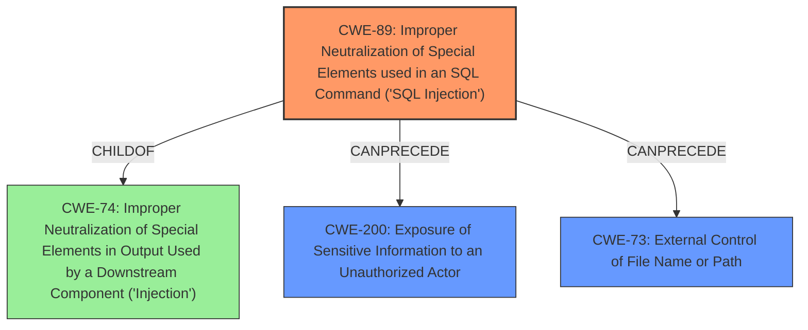

# Analysis Report for CVE-2025-0103

# Vulnerability Analysis Report: CVE-2025-0103

## Description

An **SQL injection** vulnerability in Palo Alto Networks Expedition enables an authenticated attacker to reveal Expedition database contents, such as password hashes, usernames, device configurations, and device API keys. This vulnerability also enables attackers to create and read arbitrary files on the Expedition system.

## Vulnerability Description Key Phrases

- **Weakness:** SQL injection
- **Product:** Palo Alto Networks Expedition
- **Impact:** create and read arbitrary files, read Expedition database contents
- **Attacker:** authenticated attacker

## Analysis (with Relationship Data)

# Summary
| CWE ID | CWE Name | Confidence | CWE Abstraction Level | CWE Vulnerability Mapping Label | CWE-Vulnerability Mapping Notes |
|---|---|---|---|---|---|
| CWE-89 | Improper Neutralization of Special Elements used in an SQL Command ('SQL Injection') | 1.0 | Base | Allowed | Primary CWE: The vulnerability is explicitly described as an **SQL injection** vulnerability. |
| CWE-200 | Exposure of Sensitive Information to an Unauthorized Actor | 0.7 | Class | Discouraged | Secondary Candidate: Exploiting the **SQL injection** can lead to the exposure of sensitive information like password hashes and API keys. |
| CWE-73 | External Control of File Name or Path | 0.6 | Base | Allowed | Secondary Candidate: The attacker can create and read arbitrary files on the Expedition system. |

## Evidence and Confidence

*   **Confidence Score:** 0.9
*   **Evidence Strength:** HIGH

## Relationship Analysis
The primary weakness is CWE-89, which can lead to impacts such as information exposure (CWE-200) and external control of file names or paths (CWE-73). CWE-89 is a child of CWE-74 (Improper Neutralization of Special Elements in Output Used by a Downstream Component ('Injection')). CWE-200 and CWE-73 can be consequences of successful SQL injection. I chose CWE-89 as the primary because the vulnerability description explicitly mentions "SQL injection". CWE-200 is discouraged for root cause analysis but can be a secondary impact. CWE-73 describes the ability to read or write arbitrary files, which is a direct impact.



## Vulnerability Chain
The vulnerability chain starts with the **improper neutralization of special elements in SQL commands (CWE-89)**, which allows an authenticated attacker to manipulate SQL queries. This leads to:

1.  Exposure of sensitive information (CWE-200), such as password hashes, usernames, device configurations, and API keys.
2.  External control of file name or path (CWE-73), allowing the attacker to create and read arbitrary files on the system.

The root cause is the **SQL injection**, and the impacts are information exposure and arbitrary file access.

## Summary of Analysis
The primary vulnerability is an **SQL injection (CWE-89)**, as explicitly stated in the vulnerability description. The impact of this vulnerability includes exposure of sensitive information (CWE-200) and external control of file name or path (CWE-73). The description from the CVE reference link content summary states: "**SQL injection (CVE-2025-0103):** An authenticated attacker can reveal Expedition database contents (password hashes, usernames, device configurations, device API keys). Attackers can also create and read arbitrary files on the Expedition system."

The retriever results also strongly suggest CWE-89 as the primary weakness. CWE-200 and CWE-73 were considered as secondary impacts, with the understanding that CWE-200 is generally discouraged as a primary root cause CWE. The assigned CWEs are at the optimal level of specificity.


## CWE Relationship Analysis

Current CWEs represent these abstraction levels: .


### Vulnerability Chain Analysis

**Chain starting from CWE-73:**
- 73 (External Control of File Name or Path) - ROOT


**Chain starting from CWE-89:**
- 89 (Improper Neutralization of Special Elements used in an SQL Command ('SQL Injection')) - ROOT


### CWE Relationship Diagram

```mermaid
graph TD
    classDef primary fill:#f96,stroke:#333,stroke-width:2px
    classDef secondary fill:#69f,stroke:#333
    classDef tertiary fill:#9e9,stroke:#333
```


*Report generated on 2025-07-14 05:22:03*
