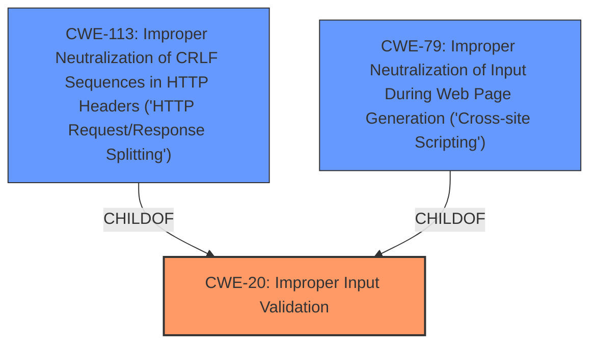

# Analysis Report for CVE-2025-0178

# Vulnerability Analysis Report: CVE-2025-0178

## Description

Improper **Input Validation vulnerability** in WatchGuard Fireware OS allows an attacker to manipulate the value of the HTTP Host header in requests sent to the Web UI. An attacker could exploit this vulnerability to redirect users to malicious websites, poison the web cache, or inject malicious JavaScript into responses sent by the Web UI. This issue affects Fireware OS from 12.0 up to and including 12.11.

## Vulnerability Description Key Phrases

- **Rootcause:** ['Input Validation vulnerability', 'Improper Input Validation']
- **Impact:** ['redirect users to malicious websites', 'inject malicious JavaScript']
- **Vector:** manipulate HTTP Host header
- **Attacker:** attacker
- **Product:** WatchGuard Fireware OS
- **Version:** 12.0 up to and including 12.11
- **Component:** Web UI

## Analysis (with Relationship Data)

# Summary
| CWE ID | CWE Name | Confidence | CWE Abstraction Level | CWE Vulnerability Mapping Label | CWE-Vulnerability Mapping Notes |
|---|---|---|---|---|---|
| CWE-20 | Improper Input Validation | 0.9 | Class | Primary CWE | Allowed-with-Review |
| CWE-113 | Improper Neutralization of CRLF Sequences in HTTP Headers ('HTTP Request/Response Splitting') | 0.7 | Variant | Secondary Candidate | Allowed |
| CWE-79 | Improper Neutralization of Input During Web Page Generation ('Cross-site Scripting') | 0.6 | Base | Secondary Candidate | Allowed |

## Evidence and Confidence

*   **Confidence Score:** 0.8
*   **Evidence Strength:** HIGH

## Relationship Analysis
The primary weakness is **Improper Input Validation**, which is a Class-level CWE. While more specific CWEs like **Improper Neutralization of CRLF Sequences in HTTP Headers ('HTTP Request/Response Splitting')** and **Improper Neutralization of Input During Web Page Generation ('Cross-site Scripting')** are considered, the initial **Input Validation vulnerability** is the key starting point. The relationships between CWE-20 and other CWEs (e.g., CWE-113, CWE-79) show how improper validation can lead to specific vulnerabilities.



## Vulnerability Chain
The vulnerability chain starts with **Improper Input Validation (CWE-20)**. Because of this **missing** validation, an attacker can manipulate the HTTP Host header. This manipulation can lead to:

1.  Redirecting users to malicious websites.
2.  Poisoning the web cache.
3.  Injecting malicious JavaScript into responses (Cross-Site Scripting).

The root cause is the **lack** of proper input validation, which then enables other attacks.

## Summary of Analysis
The initial analysis correctly identifies the **Improper Input Validation vulnerability** as the root cause. The vulnerability description explicitly states that the **input validation** is **improper**. The **manipulation of the HTTP Host header** is a direct consequence of this **improper validation**.

The evidence strongly supports **CWE-20 (Improper Input Validation)** as the primary CWE. The impact of redirecting users, poisoning the web cache, or injecting malicious JavaScript are secondary effects that arise from the initial **lack** of proper input handling.

While **CWE-74 (Improper Neutralization of Special Elements in Output Used by a Downstream Component ('Injection'))** had the highest score, it is more about how the output is handled, not the initial validation.

**CWE-113 (Improper Neutralization of CRLF Sequences in HTTP Headers ('HTTP Request/Response Splitting'))** and **CWE-79 (Improper Neutralization of Input During Web Page Generation ('Cross-site Scripting'))** are potential secondary issues, representing specific types of attacks that are possible due to the lack of input validation.

The selected CWEs are at the optimal level of specificity because **CWE-20** represents the broad **lack of input validation**, while **CWE-113** and **CWE-79** are specific consequences.

Relevant CWE Information:

# Enhanced Context (25 CWEs)

## CWE-74: Improper Neutralization of Special Elements in Output Used by a Downstream Component ('Injection')
## CWE-668: Exposure of Resource to Wrong Sphere
## CWE-451: User Interface (UI) Misrepresentation of Critical Information
## CWE-138: Improper Neutralization of Special Elements
## CWE-345: Insufficient Verification of Data Authenticity
## CWE-41: Improper Resolution of Path Equivalence
## CWE-807: Reliance on Untrusted Inputs in a Security Decision
## CWE-113: Improper Neutralization of CRLF Sequences in HTTP Headers ('HTTP Request/Response Splitting')
## CWE-1391: Use of Weak Credentials
## CWE-184: Incomplete List of Disallowed Inputs
## CWE-113: Improper Neutralization of CRLF Sequences in HTTP Headers ('HTTP Request/Response Splitting')
## CWE-444: Inconsistent Interpretation of HTTP Requests ('HTTP Request/Response Smuggling')
## CWE-93: Improper Neutralization of CRLF Sequences ('CRLF Injection')
## CWE-74: Improper Neutralization of Special Elements in Output Used by a Downstream Component ('Injection')
## CWE-138: Improper Neutralization of Special Elements
## CWE-79: Improper Neutralization of Input During Web Page Generation ('Cross-site Scripting')
## CWE-22: Improper Limitation of a Pathname to a Restricted Directory ('Path Traversal')
## CWE-290: Authentication Bypass by Spoofing
## CWE-20: Improper Input Validation
## CWE-117: Improper Output Neutralization for Logs
## CWE-494: Download of Code Without Integrity Check
## CWE-113: Improper Neutralization of CRLF Sequences in HTTP Headers ('HTTP Request/Response Splitting')
## CWE-346: Origin Validation Error
## CWE-352: Cross-Site Request Forgery (CSRF)
## CWE-93: Improper Neutralization of CRLF Sequences ('CRLF Injection')


## CWE Relationship Analysis

Current CWEs represent these abstraction levels: .


### Vulnerability Chain Analysis

**Chain starting from CWE-345:**
- 345 (Insufficient Verification of Data Authenticity) - ROOT


**Chain starting from CWE-93:**
- 93 (Improper Neutralization of CRLF Sequences ('CRLF Injection')) - ROOT


### CWE Relationship Diagram

```mermaid
graph TD
    classDef primary fill:#f96,stroke:#333,stroke-width:2px
    classDef secondary fill:#69f,stroke:#333
    classDef tertiary fill:#9e9,stroke:#333
```


*Report generated on 2025-07-14 05:25:54*
