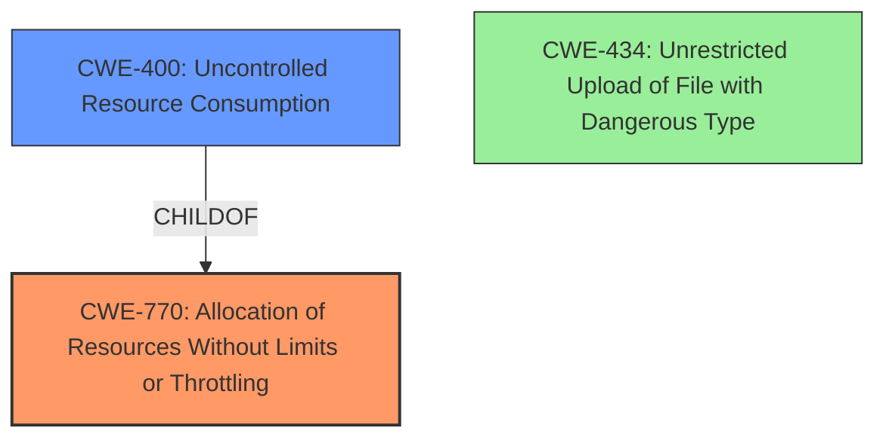

# Analysis Report for CVE-2025-0191

# Vulnerability Analysis Report: CVE-2025-0191

## Description

A Denial of Service (DoS) vulnerability exists in the file upload feature of gaizhenbiao/chuanhuchatgpt version 20240914. The vulnerability is due to **improper handling of form-data with a large filename in the file upload request**. By sending a payload with an excessively large filename, the server becomes overwhelmed and unresponsive, leading to unavailability for legitimate users.

## Vulnerability Description Key Phrases

- **Rootcause:** improper handling of form-data with a large filename in the file upload request
- **Impact:** Denial of Service
- **Vector:** sending a payload with an excessively large filename
- **Product:** gaizhenbiao/chuanhuchatgpt
- **Version:** 20240914
- **Component:** file upload feature

## Analysis (with Relationship Data)

# Summary

| CWE ID | CWE Name | Confidence | CWE Abstraction Level | CWE Vulnerability Mapping Label | CWE-Vulnerability Mapping Notes |
|---|---|---|---|---|---|
| CWE-770 | Allocation of Resources Without Limits or Throttling | 0.9 | Base | Allowed | Primary CWE. The root cause is the **allocation of resources without limits or throttling** when handling large filenames. |
| CWE-400 | Uncontrolled Resource Consumption | 0.7 | Class | Discouraged | Secondary candidate. The **improper handling** leads to excessive resource consumption, causing a DoS. |
| CWE-434 | Unrestricted Upload of File with Dangerous Type | 0.5 | Base | Allowed | Secondary candidate. While a file is being uploaded, the weakness is not inherent to the file type itself, but the size. |

## Evidence and Confidence

*   **Confidence Score:** 0.8
*   **Evidence Strength:** MEDIUM

## Relationship Analysis

The primary CWE is CWE-770 (Allocation of Resources Without Limits or Throttling), which is a base-level CWE. CWE-770 is a parent of CWE-789 (Memory Allocation with Excessive Size Value) and CWE-1325 (Improperly Controlled Sequential Memory Allocation). CWE-400 (Uncontrolled Resource Consumption) is a class-level CWE and a child of CWE-770. The relationship shows that the **uncontrolled allocation** (CWE-770) leads to **uncontrolled resource consumption** (CWE-400).



## Vulnerability Chain

The vulnerability chain starts with the **improper handling of form-data with a large filename in the file upload request**. This leads to **allocation of resources without limits or throttling** (CWE-770). The **uncontrolled allocation** results in **uncontrolled resource consumption** (CWE-400), ultimately causing a denial of service.

## Summary of Analysis

The primary weakness is the **improper handling of form-data with a large filename in the file upload request**, which leads to excessive resource allocation without limits. The evidence supports mapping this vulnerability to CWE-770 (Allocation of Resources Without Limits or Throttling) because the system **allocates resources** based on the filename size, and there is **no limit or throttling** mechanism in place. The **uncontrolled allocation** leads directly to a denial-of-service condition.

The vulnerability description states: "The vulnerability is due to **improper handling of form-data with a large filename in the file upload request**. By sending a payload with an excessively large filename, the server becomes overwhelmed and unresponsive, leading to unavailability for legitimate users."

The relationship between CWE-770 and CWE-400 (Uncontrolled Resource Consumption) further supports this analysis. CWE-400 represents the impact of the **uncontrolled resource allocation**, while CWE-770 represents the root cause.

CWE-434 (Unrestricted Upload of File with Dangerous Type) was considered because the vulnerability involves a file upload feature, but the **root cause** is not related to the file type but rather the size of the filename.

Based on the evidence and relationship analysis, CWE-770 is the most appropriate primary CWE at the base level of abstraction.

Relevant CWE Information:

# Enhanced Context (25 CWEs)
The following CWEs were identified as potentially relevant to this vulnerability:

## CWE-434: Unrestricted Upload of File with Dangerous Type
**Abstraction Level**: Base
**Similarity Score**: 0.72
**Source**: dense

**Description**:
The product allows the upload or transfer of dangerous file types that are automatically processed within its environment.

**Mapping Guidance**:
- Usage: Allowed
- Rationale: This CWE entry is at the Base level of abstraction, which is a preferred level of abstraction for mapping to the root causes of vulnerabilities.


## CWE-789: Memory Allocation with Excessive Size Value
**Abstraction Level**: Variant
**Similarity Score**: 0.68
**Source**: dense

**Description**:
The product allocates memory based on an untrusted, large size value, but it does not ensure that the size is within expected limits, allowing arbitrary amounts of memory to be allocated.

**Mapping Guidance**:
- Usage: Allowed
- Rationale: This CWE entry is at the Variant level of abstraction, which is a preferred level of abstraction for mapping to the root causes of vulnerabilities.


## CWE-134: Use of Externally-Controlled Format String
**Abstraction Level**: Base
**Similarity Score**: 0.66
**Source**: dense

**Description**:
The product uses a function that accepts a format string as an argument, but the format string originates from an external source.

**Mapping Guidance**:
- Usage: Allowed
- Rationale: This CWE entry is at the Base level of abstraction, which is a preferred level of abstraction for mapping to the root causes of vulnerabilities.


## CWE-130: Improper Handling of Length Parameter Inconsistency
**Abstraction Level**: Base
**Similarity Score**: 0.66
**Source**: dense

**Description**:
The product parses a formatted message or structure, but it does not handle or incorrectly handles a length field that is inconsistent with the actual length of the associated data.

**Mapping Guidance**:
- Usage: Allowed
- Rationale: This CWE entry is at the Base level of abstraction, which is a preferred level of abstraction for mapping to the root causes of vulnerabilities.


## CWE-425: Direct Request ('Forced Browsing')
**Abstraction Level**: Base
**Similarity Score**: 0.66
**Source**: dense

**Description**:
The web application does not adequately enforce appropriate authorization on all restricted URLs, scripts, or files.

**Mapping Guidance**:
- Usage: Allowed
- Rationale: This CWE entry is at the Base level of abstraction, which is a preferred level of abstraction for mapping to the root causes of vulnerabilities.


## CWE-552: Files or Directories Accessible to External Parties
**Abstraction Level**: Base
**Similarity Score**: 0.65
**Source**: dense

**Description**:
The product makes files or directories accessible to unauthorized actors, even though they should not be.

**Mapping Guidance**:
- Usage: Allowed
- Rationale: This CWE entry is at the Base level of abstraction, which is a preferred level of abstraction for mapping to the root causes of vulnerabilities.


## CWE-73: External Control of File Name or Path
**Abstraction Level**: Base
**Similarity Score**: 0.65
**Source**: dense

**Description**:
The product allows user input to control or influence paths or file names that are used in filesystem operations.

**Mapping Guidance**:
- Usage: Allowed
- Rationale: This CWE entry is at the Base level of abstraction, which is a preferred level of abstraction for mapping to the root causes of vulnerabilities.


## CWE-131: Incorrect Calculation of Buffer Size
**Abstraction Level**: Base
**Similarity Score**: 0.65
**Source**: dense

**Description**:
The product does not correctly calculate the size to be used when allocating a buffer, which could lead to a buffer overflow.

**Mapping Guidance**:
- Usage: Allowed
- Rationale: This CWE entry is at the Base level of abstraction, which is a preferred level of abstraction for mapping to the root causes of vulnerabilities.


## CWE-129: Improper Validation of Array Index
**Abstraction Level**: Variant
**Similarity Score**: 0.65
**Source**: dense

**Description**:
The product uses untrusted input when calculating or using an array index, but the product does not validate or incorrectly validates the index to ensure the index references a valid position within the array.

**Mapping Guidance**:
- Usage: Allowed
- Rationale: This CWE entry is at the Variant level of abstraction, which is a preferred level of abstraction for mapping to the root causes of vulnerabilities.


## CWE-790: Improper Filtering of Special Elements
**Abstraction Level**: Class
**Similarity Score**: 0.65
**Source**: dense

**Description**:
The product receives data from an upstream component, but does not filter or incorrectly filters special elements before sending it to a downstream component.

**Mapping Guidance**:
- Usage: Allowed-with-Review
- Rationale: This CWE entry is a Class and might have Base-level children that would be more appropriate


## CWE-770: Allocation of Resources Without Limits or Throttling
**Abstraction Level**: Base
**Similarity Score**: 455.26
**Source**: sparse

**Description**:
The product allocates a reusable resource or group of resources on behalf


## CWE Relationship Analysis

Current CWEs represent these abstraction levels: .


### Vulnerability Chain Analysis

**Chain starting from CWE-400:**
- 400 (Uncontrolled Resource Consumption) - ROOT


**Chain starting from CWE-130:**
- 130 (Improper Handling of Length Parameter Inconsistency) - ROOT


### CWE Relationship Diagram

```mermaid
graph TD
    classDef primary fill:#f96,stroke:#333,stroke-width:2px
    classDef secondary fill:#69f,stroke:#333
    classDef tertiary fill:#9e9,stroke:#333
```


*Report generated on 2025-07-14 05:27:54*
