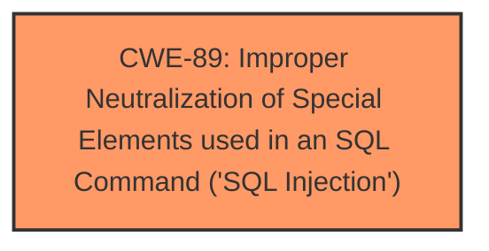

# Analysis for CVE-2025-0197

# Summary
| CWE ID | CWE Name | Confidence | CWE Abstraction Level | CWE Vulnerability Mapping Label | CWE-Vulnerability Mapping Notes |
|---|---|---|---|---|---|
| CWE-89 | Improper Neutralization of Special Elements used in an SQL Command ('SQL Injection') | 1.0 | Base | Allowed | Primary CWE: The vulnerability is caused by the **improper neutralization** of special elements used in an SQL command. |

## Evidence and Confidence

*   **Confidence Score:** 1.0
*   **Evidence Strength:** HIGH

## Relationship Analysis
The primary relationship is that of CWE-89. It is the root cause of the vulnerability. It has a clear description and strong evidence supporting its selection.

## Vulnerability Chain
The vulnerability chain starts with the **improper neutralization** of special elements in an SQL command (CWE-89).

## Summary of Analysis
The analysis focuses on the **SQL injection** vulnerability found in the Point of Sales and Inventory Management System. The primary weakness is the **improper neutralization** of input within the `/user/search.php` file, leading to CWE-89.

The selection of CWE-89 is based on the following evidence:
- The vulnerability description explicitly states that the manipulation of the `name` argument leads to **SQL injection**.
- The CVE Reference Links Content Summary confirms that the `$search` parameter is directly incorporated into an SQL query without sanitization.

The retriever results also strongly support CWE-89 as the most relevant classification.

The analysis is primarily based on the provided evidence, with a high confidence score of 1.0.

Relevant CWE Information:

# Enhanced Context (25 CWEs)
The following CWEs were identified as potentially relevant to this vulnerability:

## CWE-89: Improper Neutralization of Special Elements used in an SQL Command ('SQL Injection')
**Abstraction Level**: Base
**Similarity Score**: 1.00
**Source**: alternate_terms

**Description**:
The product constructs all or part of an SQL command using externally-influenced input from an upstream component, but it does not neutralize or incorrectly neutralizes special elements that could modify the intended SQL command when it is sent to a downstream component. Without sufficient removal or quoting of SQL syntax in user-controllable inputs, the generated SQL query can cause those inputs to be interpreted as SQL instead of ordinary user data.

**Mapping Guidance**:
- Usage: Allowed
- Rationale: This CWE entry is at the Base level of abstraction, which is a preferred level of abstraction for mapping to the root causes of vulnerabilities.