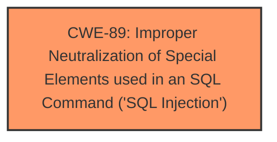

# Raw Analyzer Response for CVE-2025-0230

# Summary
| CWE ID | CWE Name | Confidence | CWE Abstraction Level | CWE Vulnerability Mapping Label | CWE-Vulnerability Mapping Notes |
|---|---|---|---|---|---|
| CWE-89 | Improper Neutralization of Special Elements used in an SQL Command ('SQL Injection') | 1.0 | Base | Primary CWE | Allowed |

## Evidence and Confidence

*   **Confidence Score:** 1.0
*   **Evidence Strength:** HIGH

## Relationship Analysis
The primary relationship that influenced my decision was the direct match of the vulnerability description to the definition of CWE-89. CWE-89 is a Base level CWE, which is the preferred level of abstraction.

## Vulnerability Chain
The vulnerability chain is simple:

1.  **Root Cause:** **SQL Injection** due to **improper neutralization** of the pid parameter.
2.  Impact: Remote attacker can manipulate SQL queries.

## Summary of Analysis
The vulnerability description clearly states that the manipulation of the `pid` argument leads to **SQL Injection**. The retriever results also list CWE-89 as the top result. The CWE description for CWE-89 perfectly matches the vulnerability description: "The product constructs all or part of an SQL command using externally-influenced input from an upstream component, but it does not neutralize or incorrectly neutralizes special elements that could modify the intended SQL command when it is sent to a downstream component."

The other CWEs listed in the retriever results were considered but were not as direct a match as CWE-89. For example, CWE-79 ('Cross-site Scripting') is about neutralizing input during web page generation, while this vulnerability is about neutralizing input to prevent SQL injection. CWE-434 ('Unrestricted Upload of File with Dangerous Type') is about uploading dangerous files, which is not relevant to this vulnerability.

The selection of CWE-89 is at the optimal level of specificity because it directly describes the **SQL Injection** **weakness** caused by **improper neutralization** of input.