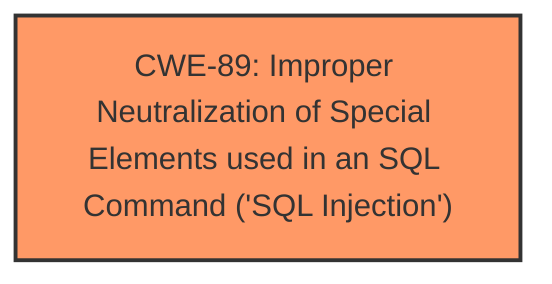

# Enhanced Analysis for CVE-2025-0333

# Summary
| CWE ID | CWE Name | Confidence | CWE Abstraction Level | CWE Vulnerability Mapping Label | CWE-Vulnerability Mapping Notes |
|---|---|---|---|---|---|
| CWE-89 | Improper Neutralization of Special Elements used in an SQL Command ('SQL Injection') | 1.0 | Base | Allowed | Primary CWE |

## Evidence and Confidence

*   **Confidence Score:** 1.0
*   **Evidence Strength:** HIGH

## Relationship Analysis
The primary relationship that influenced the decision was the direct match of the vulnerability description to the CWE-89 description. While other CWEs such as CWE-79 (Cross-site Scripting) and CWE-78 (OS Command Injection) were considered, they were deemed less relevant due to the specific mention of "**sql injection**" in the vulnerability description. CWE-89 is a Base level CWE which is the preferred level of abstraction.



## Vulnerability Chain
The vulnerability chain consists of a single step: the **improper neutralization** of special elements used in an SQL command, leading directly to **SQL injection**. There are no preceding or following steps identified in the provided information. The chain is simple and direct:

1.  **Root Cause:** **Improper neutralization** of special elements in SQL commands (CWE-89)
2.  **Impact:** **SQL Injection** vulnerability

## Summary of Analysis
The primary driver for selecting CWE-89 was the explicit mention of "**sql injection**" in the vulnerability description. The description states, "The manipulation of the argument order leads to **sql injection**." This aligns perfectly with the definition of CWE-89, which addresses scenarios where a product constructs an SQL command using externally-influenced input without properly neutralizing special elements.

The retriever results also strongly support this choice, with CWE-89 having a score of 1.0 due to the alternate terms matching the weakness. The CWE is at the Base level of abstraction which is the preferred level.

Relevant CWE Information:

# Enhanced Context (25 CWEs)
The following CWEs were identified as potentially relevant to this vulnerability:

## CWE-80: Improper Neutralization of Script-Related HTML Tags in a Web Page (Basic XSS)
**Abstraction Level**: Variant
**Similarity Score**: 0.74

## CWE-790: Improper Filtering of Special Elements
**Abstraction Level**: Class
**Similarity Score**: 0.74

## CWE-89: Improper Neutralization of Special Elements used in an SQL Command ('SQL Injection')
**Abstraction Level**: Base
**Similarity Score**: 0.73

## CWE-425: Direct Request ('Forced Browsing')
**Abstraction Level**: Base
**Similarity Score**: 0.73

## CWE-93: Improper Neutralization of CRLF Sequences ('CRLF Injection')
**Abstraction Level**: Base
**Similarity Score**: 0.72

## CWE-116: Improper Encoding or Escaping of Output
**Abstraction Level**: Class
**Similarity Score**: 0.72

## CWE-74: Improper Neutralization of Special Elements in Output Used by a Downstream Component ('Injection')
**Abstraction Level**: Class
**Similarity Score**: 0.72

## CWE-95: Improper Neutralization of Directives in Dynamically Evaluated Code ('Eval Injection')
**Abstraction Level**: Variant
**Similarity Score**: 0.72

## CWE-434: Unrestricted Upload of File with Dangerous Type
**Abstraction Level**: Base
**Similarity Score**: 0.72

## CWE-497: Exposure of Sensitive System Information to an Unauthorized Control Sphere
**Abstraction Level**: Base
**Similarity Score**: 0.72

## CWE-89: Improper Neutralization of Special Elements used in an SQL Command ('SQL Injection')
**Abstraction Level**: Base
**Similarity Score**: 618.55

## CWE-1336: Improper Neutralization of Special Elements Used in a Template Engine
**Abstraction Level**: Base
**Similarity Score**: 551.63

## CWE-117: Improper Output Neutralization for Logs
**Abstraction Level**: Base
**Similarity Score**: 540.63

## CWE-79: Improper Neutralization of Input During Web Page Generation ('Cross-site Scripting')
**Abstraction Level**: Base
**Similarity Score**: 535.04

## CWE-116: Improper Encoding or Escaping of Output
**Abstraction Level**: Class
**Similarity Score**: 533.95

## CWE-117: Improper Output Neutralization for Logs
**Abstraction Level**: base
**Similarity Score**: 4.33

## CWE-78: Improper Neutralization of Special Elements used in an OS Command ('OS Command Injection')
**Abstraction Level**: base
**Similarity Score**: 3.89

## CWE-79: Improper Neutralization of Input During Web Page Generation ('Cross-site Scripting')
**Abstraction Level**: base
**Similarity Score**: 3.30

## CWE-73: External Control of File Name or Path
**Abstraction Level**: base
**Similarity Score**: 2.91

## CWE-93: Improper Neutralization of CRLF Sequences ('CRLF Injection')
**Abstraction Level**: Base
**Similarity Score**: 2.89

## CWE-113: Improper Neutralization of CRLF Sequences in HTTP Headers ('HTTP Request/Response Splitting')
**Abstraction Level**: variant
**Similarity Score**: 2.68

## CWE-434: Unrestricted Upload of File with Dangerous Type
**Abstraction Level**: Base
**Similarity Score**: 2.62

## CWE-425: Direct Request ('Forced Browsing')
**Abstraction Level**: Base
**Similarity Score**: 2.35

## CWE-1336: Improper Neutralization of Special Elements Used in a Template Engine
**Abstraction Level**: base
**Similarity Score**: 2.33

## CWE-94: Improper Control of Generation of Code ('Code Injection')
**Abstraction Level**: base
**Similarity Score**: 2.28

CWEs Considered but Not Used:

*   CWE-79 (Improper Neutralization of Input During Web Page Generation ('Cross-site Scripting')): While potentially relevant due to the web-based nature of the application, it does not directly address the **SQL injection** aspect.
*   CWE-78 (Improper Neutralization of Special Elements used in an OS Command ('OS Command Injection')): Not applicable, as the vulnerability is specifically related to SQL commands, not OS commands.
*   CWE-1336 (Improper Neutralization of Special Elements Used in a Template Engine): Not applicable because the weakness is in SQL commands, not a template engine.
*   CWE-117 (Improper Output Neutralization for Logs): Not applicable because the weakness is in SQL commands, not in logging.


## CWE Relationship Analysis

Current CWEs represent these abstraction levels: .


### Vulnerability Chain Analysis

**Chain starting from CWE-89:**
- 89 (Improper Neutralization of Special Elements used in an SQL Command ('SQL Injection')) - ROOT


**Chain starting from CWE-116:**
- 116 (Improper Encoding or Escaping of Output) - ROOT


### CWE Relationship Diagram

```mermaid
graph TD
    classDef primary fill:#f96,stroke:#333,stroke-width:2px
    classDef secondary fill:#69f,stroke:#333
    classDef tertiary fill:#9e9,stroke:#333
```