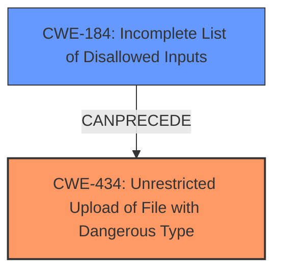

# Analysis for CVE-2025-0335

# Summary
| CWE ID | CWE Name | Confidence | CWE Abstraction Level | CWE Vulnerability Mapping Label | CWE-Vulnerability Mapping Notes |
|---|---|---|---|---|---|
| CWE-434 | Unrestricted Upload of File with Dangerous Type | 0.9 | Base | Allowed | Primary CWE. The vulnerability description explicitly mentions "unrestricted upload." |
| CWE-434 | Incomplete List of Disallowed Inputs | 0.4 | Base | Allowed | Secondary CWE. This is a possible root cause as an incomplete list of disallowed inputs can lead to unrestricted uploads. |

## Evidence and Confidence

*   **Confidence Score:** 0.9
*   **Evidence Strength:** MEDIUM

## Relationship Analysis
The primary relationship considered was the potential for CWE-184 (Incomplete List of Disallowed Inputs) to lead to CWE-434 (Unrestricted Upload of File with Dangerous Type). While this relationship exists (CWE-184 CANPRECEDE CWE-434), the provided vulnerability description focuses primarily on the impact, which is the unrestricted file upload. Thus, CWE-434 is the primary weakness.

## Vulnerability Chain
The vulnerability chain starts with a potential **incomplete list of disallowed inputs** (CWE-184), which leads to the ability to perform an **unrestricted upload** (CWE-434). The final impact of this vulnerability is not clearly specified in the provided information.

## Summary of Analysis
The initial analysis, supported by the retriever results and the vulnerability description, pointed to CWE-434 (Unrestricted Upload of File with Dangerous Type) as the primary weakness due to the explicit mention of "unrestricted upload." I considered CWE-184 (Incomplete List of Disallowed Inputs) as a potential root cause, since an incomplete list of disallowed inputs is often the reason why unrestricted uploads are possible. However, the description focuses on the unrestricted upload itself, making CWE-434 the more direct and applicable classification. My assessment relies heavily on the vulnerability description's key phrase "impact: unrestricted upload." The retriever results also list CWE-434 with a reasonably high score. I am selecting CWE-434 at the Base level as it is the most specific and accurately represents the vulnerability.

Relevant CWE Information:

# Enhanced Context (25 CWEs)

## CWE-434: Unrestricted Upload of File with Dangerous Type
**Abstraction Level**: Base
**Similarity Score**: 0.80
**Source**: dense

**Description**:
The product allows the upload or transfer of dangerous file types that are automatically processed within its environment.

**Mapping Guidance**:
- Usage: Allowed
- Rationale: This CWE entry is at the Base level of abstraction, which is a preferred level of abstraction for mapping to the root causes of vulnerabilities.

## CWE-184: Incomplete List of Disallowed Inputs
**Abstraction Level**: base
**Similarity Score**: 4.33
**Source**: graph

**Description**:
CWE-184: Incomplete List of Disallowed Inputs

**Mapping Guidance**:
- Usage: Allowed
- Rationale: This CWE entry is at the Base level of abstraction, which is a preferred level of abstraction for mapping to the root causes of vulnerabilities.

**Relationships**:
- PARENTOF -> CWE-692
- CANPRECEDE -> CWE-98
- CANPRECEDE -> CWE-434
- CANPRECEDE -> CWE-78
- CANPRECEDE -> CWE-79

I considered other CWEs from the retriever results, such as CWE-79 (Improper Neutralization of Input During Web Page Generation ('Cross-site Scripting')) and CWE-89 (Improper Neutralization of Special Elements used in an SQL Command ('SQL Injection')), but these are not directly related to the **unrestricted upload** aspect of the vulnerability. CWE-352 (Cross-Site Request Forgery (CSRF)) and CWE-306 (Missing Authentication for Critical Function) were also considered but deemed less relevant as the core issue is the **lack of restrictions on file uploads**, not the forgery of requests or the absence of authentication.