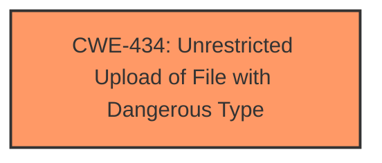

# Analysis Report for CVE-2025-0341

# Vulnerability Analysis Report: CVE-2025-0341

## Description

A vulnerability, which was classified as critical, has been found in CampCodes Computer Laboratory Management System 1.0. Affected by this issue is some unknown functionality of the file /class/edit/edit. The manipulation of the argument e_photo leads to **unrestricted upload**. The attack may be launched remotely. The exploit has been disclosed to the public and may be used.

## Vulnerability Description Key Phrases

- **Weakness:** unrestricted upload
- **Vector:** manipulation of the argument e_photo
- **Product:** CampCodes Computer Laboratory Management System
- **Version:** 1.0
- **Component:** /class/edit/edit

## Analysis (with Relationship Data)

# Summary
| CWE ID | CWE Name | Confidence | CWE Abstraction Level | CWE Vulnerability Mapping Label | CWE-Vulnerability Mapping Notes |
|---|---|---|---|---|---|
| CWE-434 | Unrestricted Upload of File with Dangerous Type | 1.0 | Base | Allowed | Primary CWE |

## Evidence and Confidence

*   **Confidence Score:** 1.0
*   **Evidence Strength:** HIGH

## Relationship Analysis
The primary CWE is CWE-434, which is a Base level CWE. The retriever results also listed several other CWEs, but those are not relevant given the evidence for **unrestricted upload**.



## Vulnerability Chain
The vulnerability chain consists of a single weakness: **unrestricted upload**. The **unrestricted upload** vulnerability is the root cause and the impact.

## Summary of Analysis
The vulnerability description clearly states that the vulnerability is an **unrestricted upload** vulnerability.
The key phrase from the vulnerability description is "**unrestricted upload**".
The vulnerability description states "The manipulation of the argument e_photo leads to **unrestricted upload**."
The evidence is explicit and directly maps to CWE-434.
CWE-434 is at the Base level of abstraction, which is a preferred level of abstraction for mapping to the root causes of vulnerabilities.
I am confident in this assessment.

Relevant CWE Information:

# Enhanced Context (25 CWEs)
The following CWEs were identified as potentially relevant to this vulnerability:

## CWE-434: Unrestricted Upload of File with Dangerous Type
**Abstraction Level**: Base
**Similarity Score**: 0.82
**Source**: dense

**Description**:
The product allows the upload or transfer of dangerous file types that are automatically processed within its environment.

**Mapping Guidance**:
- Usage: Allowed
- Rationale: This CWE entry is at the Base level of abstraction, which is a preferred level of abstraction for mapping to the root causes of vulnerabilities.

### Other CWEs Considered and Rejected:

*   CWE-89: Improper Neutralization of Special Elements used in an SQL Command ('SQL Injection') - While present in the Retriever Results, this CWE is not relevant as the vulnerability is not related to SQL injection.
*   CWE-79: Improper Neutralization of Input During Web Page Generation ('Cross-site Scripting') - While present in the Retriever Results, this CWE is not relevant as the vulnerability is not related to Cross-site Scripting.
*   CWE-1336: Improper Neutralization of Special Elements Used in a Template Engine - While present in the Retriever Results, this CWE is not relevant as the vulnerability is not related to template injection.
*   CWE-306: Missing Authentication for Critical Function - While present in the Retriever Results, this CWE is not directly indicated by the description which specifies **unrestricted upload** as the primary issue.
*   CWE-472: External Control of Assumed-Immutable Web Parameter - While present in the Retriever Results, this CWE is not relevant as the vulnerability is not related to immutable web parameter.


## CWE Relationship Analysis

Current CWEs represent these abstraction levels: .


### Vulnerability Chain Analysis

**Chain starting from CWE-89:**
- 89 (Improper Neutralization of Special Elements used in an SQL Command ('SQL Injection')) - ROOT


**Chain starting from CWE-79:**
- 79 (Improper Neutralization of Input During Web Page Generation ('Cross-site Scripting')) - ROOT


### CWE Relationship Diagram

```mermaid
graph TD
    classDef primary fill:#f96,stroke:#333,stroke-width:2px
    classDef secondary fill:#69f,stroke:#333
    classDef tertiary fill:#9e9,stroke:#333
```


*Report generated on 2025-07-14 05:42:59*
