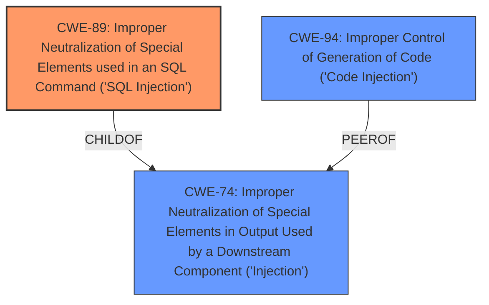

# Analysis for CVE-2025-0344

# Summary

| CWE ID | CWE Name | Confidence | CWE Abstraction Level | CWE Vulnerability Mapping Label | CWE-Vulnerability Mapping Notes |
|---|---|---|---|---|---|
| CWE-89 | Improper Neutralization of Special Elements used in an SQL Command ('SQL Injection') | 1.0 | Base | Allowed | Primary CWE |

## Evidence and Confidence

*   **Confidence Score:** 1.0
*   **Evidence Strength:** HIGH

## Relationship Analysis
The primary relationship is that CWE-89 is a Base level CWE. Other CWEs considered were higher-level Classes or were related to different types of injection or weaknesses that didn't directly match the vulnerability description.

## Vulnerability Chain
The vulnerability chain consists of:
1.  Improper handling of input (`order` argument) in the `listData` function.
2.  This leads to **SQL Injection** (CWE-89) because the input is not neutralized.
3.  The impact is potential data breach or unauthorized access.

## Summary of Analysis
The vulnerability description clearly states that manipulating the `order` argument in the `listData` function leads to **SQL Injection**. This aligns directly with CWE-89 (Improper Neutralization of Special Elements used in an SQL Command ('SQL Injection')). The Retriever results also strongly suggest CWE-89 as the primary candidate.

The evidence is strong: "manipulation of the argument order leads to **sql injection**".

The other CWEs considered were not as directly relevant:
*   CWE-79 (Cross-Site Scripting) is for web page generation, not SQL commands.
*   CWE-434 (Unrestricted Upload of File with Dangerous Type) relates to file uploads, which is not mentioned in the description.
*   CWE-117 (Improper Output Neutralization for Logs) focuses on log output, not SQL commands.

CWE-89 is the most specific and appropriate CWE for this vulnerability.