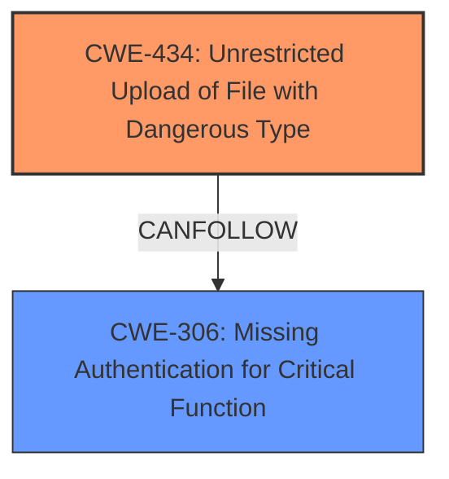

# Enhanced Analysis for CVE-2025-0346

# Summary
| CWE ID | CWE Name | Confidence | CWE Abstraction Level | CWE Vulnerability Mapping Label | CWE-Vulnerability Mapping Notes |
|---|---|---|---|---|---|
| CWE-434 | Unrestricted Upload of File with Dangerous Type | 1.0 | Base | Allowed | Primary CWE. The vulnerability description states "manipulation of the argument image leads to **unrestricted upload**". The CVE Reference Links Content Summary confirms this, stating "Unrestricted file upload/selection (allowing a PHP file to be chosen)."|
| CWE-306 | Missing Authentication for Critical Function | 0.7 | Base | Allowed | Secondary candidate. The CVE Reference Links Content Summary states: "The vulnerability stems from allowing authenticated users to select a PHP file". This implies that while authentication exists, it might be insufficient for the critical function of file selection. |

## Evidence and Confidence

*   **Confidence Score:** 0.9
*   **Evidence Strength:** HIGH

## Relationship Analysis
The primary relationship is that CWE-434 [CWE-434: Unrestricted Upload of File with Dangerous Type] can be a precursor to other vulnerabilities. CWE-306 [CWE-306: Missing Authentication for Critical Function] is included as a secondary weakness because the vulnerability description suggests that authentication exists but is insufficient to prevent the upload of dangerous file types.



## Vulnerability Chain
The vulnerability chain begins with the **unrestricted upload** (CWE-434) due to **missing or inadequate validation** which allows an attacker to upload a malicious file. This can then lead to other vulnerabilities.

## Summary of Analysis
The initial assessment focused on the **unrestricted upload** aspect of the vulnerability, which is a key element of the exploit. The final decision is primarily based on the vulnerability description and the CVE Reference Links Content Summary which both highlight the **unrestricted upload** as a central point. The CWE-434 [CWE-434: Unrestricted Upload of File with Dangerous Type] captures this vulnerability accurately.

The CVE Reference Links Content Summary states: "The vulnerability stems from allowing authenticated users to select a PHP file (`shell.php` in the example) when publishing news. Combined with the ability to manipulate the `Content-Type` header, this allows for arbitrary code execution. **Weaknesses/vulnerabilities present:** Unrestricted file upload/selection (allowing a PHP file to be chosen)."

CWE-434 [CWE-434: Unrestricted Upload of File with Dangerous Type] is at the optimal level of specificity because it directly addresses the **unrestricted upload** aspect of the vulnerability. It is a base-level CWE, which is preferred.

Other CWEs Considered but Not Used:

*   CWE-79 [CWE-79: Improper Neutralization of Input During Web Page Generation ('Cross-site Scripting')] and CWE-89 [CWE-89: Improper Neutralization of Special Elements used in an SQL Command ('SQL Injection')] were considered due to their high relevance scores. However, these CWEs are more related to injection vulnerabilities which are not the primary issue in this case. The primary issue is the **unrestricted upload** itself.
*   CWE-22 [CWE-22: Improper Limitation of a Pathname to a Restricted Directory ('Path Traversal')] was considered but it is not relevant as the vulnerability does not involve path traversal.
*   CWE-306 [CWE-306: Missing Authentication for Critical Function] was considered and included as a secondary weakness because the issue involves authenticated users being able to upload dangerous files. This suggests that the authentication, while present, does not adequately protect this critical function.


## CWE Relationship Analysis

Current CWEs represent these abstraction levels: .


### Vulnerability Chain Analysis

**Chain starting from CWE-89:**
- 89 (Improper Neutralization of Special Elements used in an SQL Command ('SQL Injection')) - ROOT


**Chain starting from CWE-22:**
- 22 (Improper Limitation of a Pathname to a Restricted Directory ('Path Traversal')) - ROOT


### CWE Relationship Diagram

```mermaid
graph TD
    classDef primary fill:#f96,stroke:#333,stroke-width:2px
    classDef secondary fill:#69f,stroke:#333
    classDef tertiary fill:#9e9,stroke:#333
```