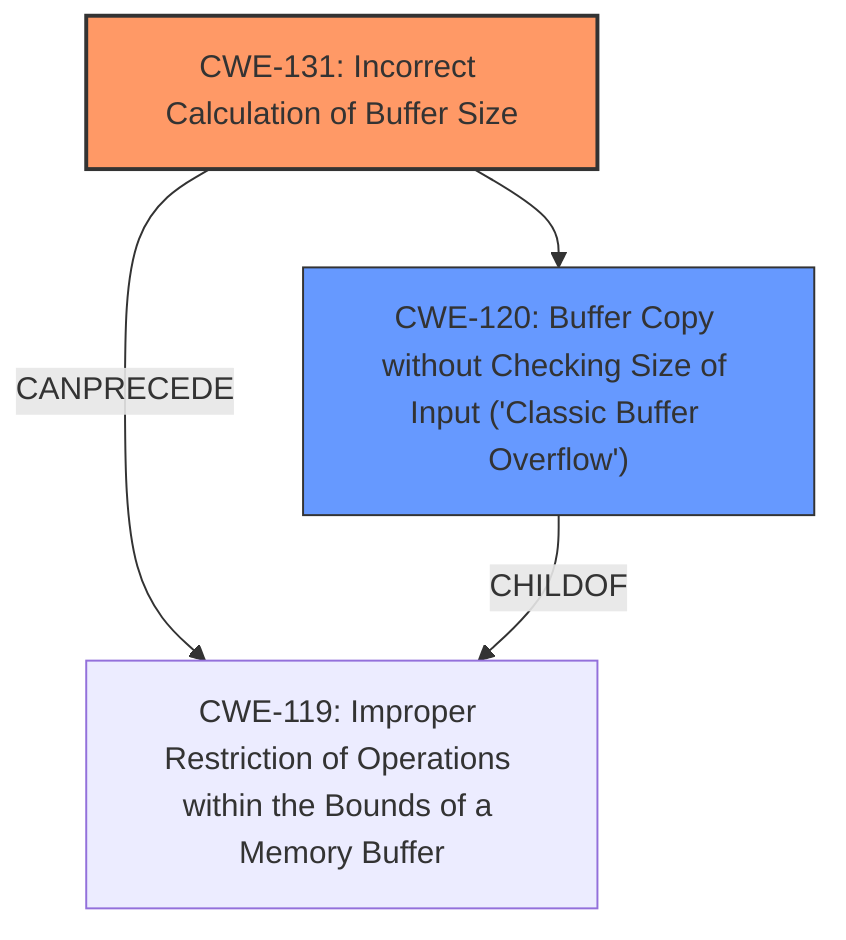

# Analysis Report for CVE-2025-0395

# Vulnerability Analysis Report: CVE-2025-0395

## Description

When the assert() function in the GNU C Library versions 2.13 to 2.40 fails, it **does not allocate enough space** for the assertion failure message string and size information, which may lead to a **buffer overflow** if the message string size aligns to page size.

## Vulnerability Description Key Phrases

- **Rootcause:** does not allocate enough space
- **Weakness:** buffer overflow
- **Product:** GNU C Library
- **Version:** 2.13 to 2.40
- **Component:** assert() function

## Analysis (with Relationship Data)

# Summary
| CWE ID | CWE Name | Confidence | CWE Abstraction Level | CWE Vulnerability Mapping Label | CWE-Vulnerability Mapping Notes |
|---|---|---|---|---|---|
| CWE-131 | Incorrect Calculation of Buffer Size | 0.9 | Base | Allowed | Primary CWE. The root cause is that the `assert()` function **does not allocate enough space**. |
| CWE-120 | Buffer Copy without Checking Size of Input ('Classic Buffer Overflow') | 0.7 | Base | Allowed-with-Review | The **buffer overflow** occurs because `strcpy()` is used without proper bounds checking. |

## Evidence and Confidence

*   **Confidence Score:** 0.8
*   **Evidence Strength:** HIGH

## Relationship Analysis
The primary weakness, CWE-131 Incorrect Calculation of Buffer Size, is directly related to the resulting buffer overflow, CWE-120 Buffer Copy without Checking Size of Input ('Classic Buffer Overflow'). CWE-131 can precede CWE-119, and CWE-120 is a child of CWE-119. The allocation issue leads to a buffer overflow during the string copy operation. This relationship influenced the selection of both CWEs to represent the complete vulnerability.



## Vulnerability Chain
The vulnerability chain starts with **incorrect calculation of buffer size** (CWE-131) which leads to a **buffer overflow** (CWE-120) due to using `strcpy()` without proper bounds checking.

## Summary of Analysis
The analysis is based on the provided evidence, which clearly indicates that the root cause is the **incorrect calculation of the buffer size** within the `assert()` function, leading to a buffer overflow.

*   **CWE-131: Incorrect Calculation of Buffer Size**
    *   The vulnerability description states that the `assert()` function **does not allocate enough space** for the assertion failure message string and size information.
    *   The CVE Reference Links Content Summary explicitly mentions "Insufficient buffer allocation for assertion failure message."
    *   This aligns directly with CWE-131, which describes a scenario where the product does not correctly calculate the size to be used when allocating a buffer.
*   **CWE-120: Buffer Copy without Checking Size of Input ('Classic Buffer Overflow')**
    *   The vulnerability description indicates that this lack of space can lead to a **buffer overflow**.
    *   The CVE Reference Links Content Summary mentions the use of `strcpy()` without proper bounds checking, which is a classic scenario for CWE-120.
    *   This confirms that the insufficient buffer allocation results in a buffer overflow during the string copy operation.

The graph relationships confirm that CWE-131 can lead to CWE-120, reinforcing the selection of these two CWEs to represent the vulnerability. The chosen CWEs are at the optimal level of specificity, as they accurately capture the root cause (CWE-131) and the immediate consequence (CWE-120) of the vulnerability.

CWEs considered but not used:

*   CWE-119: Improper Restriction of Operations within the Bounds of a Memory Buffer - While this is a broader category that includes buffer overflows, it doesn't specify the root cause, which is the incorrect buffer size calculation.
*   CWE-190: Integer Overflow or Wraparound - This is not applicable as the vulnerability is about buffer size calculation and not integer overflow.
*   CWE-789: Memory Allocation with Excessive Size Value - This is the opposite of the actual problem, where the allocated memory is insufficient.
*   CWE-1284: Improper Validation of Specified Quantity in Input - While there's a quantity (size) involved, the core issue isn't the validation of the input but the calculation of the buffer size itself.
*   CWE-770: Allocation of Resources Without Limits or Throttling - This is not applicable as the vulnerability is about buffer size calculation and not resource allocation limits.
*   CWE-193: Off-by-one Error - While there could be an off-by-one error in calculation, the main problem is the insufficient allocation of space.


## CWE Relationship Analysis

Current CWEs represent these abstraction levels: .


### Vulnerability Chain Analysis

**Chain starting from CWE-1284:**
- 1284 (Improper Validation of Specified Quantity in Input) - ROOT


**Chain starting from CWE-770:**
- 770 (Allocation of Resources Without Limits or Throttling) - ROOT


### CWE Relationship Diagram

```mermaid
graph TD
    classDef primary fill:#f96,stroke:#333,stroke-width:2px
    classDef secondary fill:#69f,stroke:#333
    classDef tertiary fill:#9e9,stroke:#333
```


*Report generated on 2025-07-14 05:45:55*
